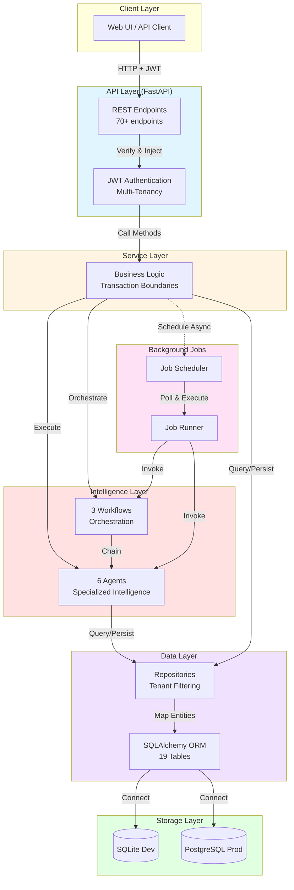
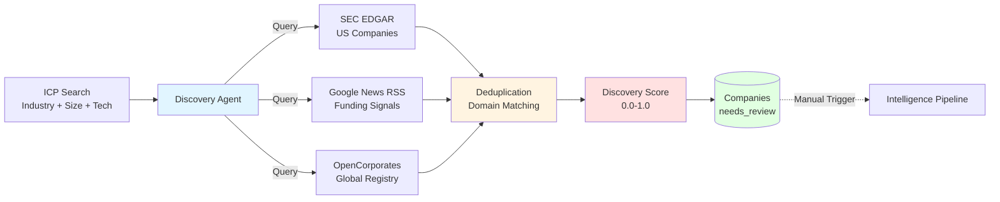
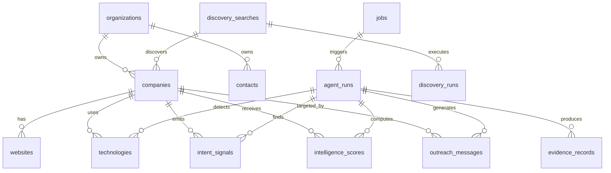
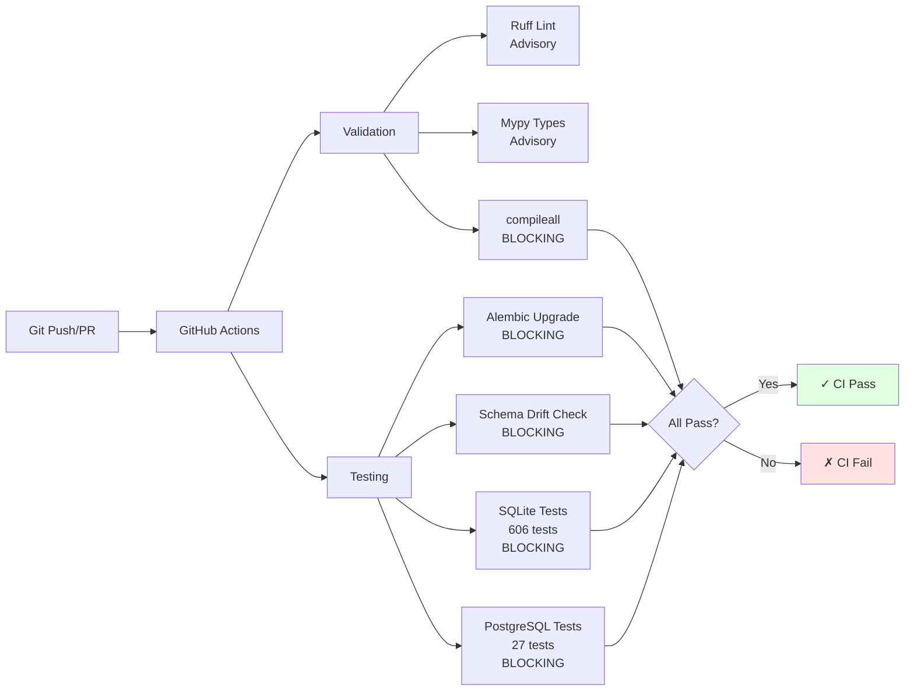

# Irtiqa Intelligence

[](https://github.com/Luffyz/irtiqa-intelligence/actions/workflows/ci.yml)
[](https://github.com/Luffyz/irtiqa-intelligence)
[](https://www.python.org/)
[](https://fastapi.tiangolo.com/)

**Production-grade lead intelligence platform for B2B sales teams.**

Irtiqa Intelligence automates lead discovery, enrichment, and prioritization through intelligent web scraping, technographic analysis, intent signal detection, and personalized outreach generation. Built with FastAPI, SQLAlchemy, and a modular agent-based architecture.

---

## What is Irtiqa?

Irtiqa transforms raw company data into actionable sales intelligence through a **multi-agent pipeline**:

1. **Discover** companies matching your ideal customer profile (ICP)
2. **Scrape** and analyze company websites for technology signals
3. **Detect** buying intent from hiring, funding, and technology changes
4. **Score** leads using multi-factor intelligence scoring
5. **Personalize** outreach messages based on company intelligence

**Result:** Prioritized, scored leads with context-aware outreach recommendations.

---

## Architecture



**[📖 Complete Architecture Guide](docs/architecture_overview.md)**

---

## Features

### 🔐 Authentication & Multi-Tenancy
- **RS256 JWT Authentication** with JWKS endpoint for secure API access
- **Email Verification** and password reset workflows
- **Organization Management** with role-based access control (Owner, Admin, Member, Viewer)
- **Tenant Isolation** across all data and API endpoints
- **Rate Limiting** with database-backed tracking

**[📖 Authentication Design](docs/authentication_multitenancy_v2_design.md)**

### 🔍 Lead Discovery Engine



- **ICP Search Management**: Define and save ideal customer profile criteria
- **Multi-Source Discovery**: Automated searches across SEC EDGAR, Google News RSS, and OpenCorporates
- **Smart Deduplication**: Domain-based duplicate detection with fuzzy matching
- **Discovery Scoring**: Lightweight match quality scores (0.0-1.0) for prioritization
- **Evidence Provenance**: Full audit trail of discovery sources

**[📖 Discovery Engine Design](docs/lead_discovery_engine_final.md)**

### 🤖 Intelligence Pipeline

```mermaid
flowchart LR
    Input[Company Domain] --> DS[Deep Scraper<br/>Web Extraction]
    DS -->|HTML + Text| Tech[Technographic<br/>Tech Detection]
    Tech -->|40+ Signatures| Intent[Intent Signal<br/>Buying Signals]
    Intent -->|8 Signal Types| Score[Intelligence Scoring<br/>Multi-Factor]
    Score -->|Weighted Score| Person[Personalization<br/>Outreach Generation]
    Person --> Output[Scored Lead<br/>+ Messages]
    
    style DS fill:#e1f5ff
    style Tech fill:#fff4e1
    style Intent fill:#ffe1e1
    style Score fill:#f0e1ff
    style Person fill:#e1ffe1
```



**6 Production Agents:**
1. **Deep Scraper Agent**: Web content extraction and parsing
2. **Technographic Agent**: Technology detection (40+ signatures across 8 categories)
3. **Intent Signal Agent**: Buying signal detection (8 signal families with deterministic rules)
4. **Intelligence Scoring Agent**: Multi-factor lead scoring (fit, intent, technographic, engagement)
5. **Personalization Agent**: Multi-variant outreach message generation
6. **Discovery Agent**: ICP-based company discovery from external sources

**[📖 Agent System](docs/agents.md)** | **[📖 Workflow System](docs/workflows.md)**

### 📊 Lead Retrieval API
- **Aggregated Intelligence**: Single endpoint returns companies with technologies, intent signals, scores, and outreach messages
- **Smart Filtering**: Filter by minimum score, pagination support
- **Tenant-Scoped**: Automatic organization isolation
- **N+1 Prevention**: Batch loading strategy for optimal performance

### ⚙️ Background Job System
- **Async Execution**: Agent and workflow scheduling with status tracking
- **Retry Policies**: Exponential backoff with configurable limits
- **Job Management**: Schedule, cancel, retry, and monitor background tasks

**[📖 Background Jobs Design](docs/background_job_foundation_design.md)**

### 📈 Evidence Records
- **Provenance Tracking**: Full audit trail for all intelligence data
- **Source Linking**: Evidence tied to agent runs, URLs, and API responses
- **Confidence Scoring**: Evidence quality metrics

### 🔄 Workflow Orchestration
- **Score Refresh**: Deterministic intelligence score recomputation
- **Intelligence Pipeline**: End-to-end enrichment (scrape → analyze → score → personalize)
- **Discovery Pipeline**: Company discovery orchestration (search → discover → deduplicate → create)

---

## Database Schema



**19 Tables:**
- 8 core intelligence tables (companies, contacts, websites, technologies, intent_signals, intelligence_scores, outreach_messages, evidence_records)
- 2 system tables (agent_runs, jobs)
- 2 discovery tables (discovery_searches, discovery_runs)
- 3 auth tables (users, organizations, memberships)
- 4 token tables (refresh_tokens, email_verification_tokens, password_reset_tokens, failed_login_attempts)

**[📖 Database Design](docs/database.md)** | **[📖 Entity Relationships](docs/entity_relationships.md)**

---

## Project Structure

```
irtiqa-intelligence/
├── app/
│   ├── agents/              # 6 production agents
│   │   ├── deep_scraper/    # Web scraping & content extraction
│   │   ├── technographic/   # Technology detection (40+ signatures)
│   │   ├── intent_signal/   # Buying signal detection (8 families)
│   │   ├── intelligence_scoring/  # Lead scoring
│   │   ├── personalization/ # Outreach generation
│   │   └── discovery/       # Company discovery (3 sources)
│   ├── api/                 # REST API endpoints (70+)
│   ├── core/                # Configuration, logging, errors
│   ├── database/            # Engine, session management
│   ├── jobs/                # Background job system
│   ├── models/              # SQLAlchemy ORM models (19 tables)
│   ├── repositories/        # Data access layer (15 repositories)
│   ├── schemas/             # Pydantic request/response schemas
│   ├── services/            # Business logic layer (15 services)
│   └── workflows/           # Multi-agent orchestration (3 workflows)
├── database/
│   └── migrations/          # Alembic migration scripts (8 revisions)
├── docs/                    # Architecture & design documentation
├── tests/
│   ├── integration/         # End-to-end tests
│   └── unit/                # Component tests
└── README.md
```

---

## Tech Stack

| Layer | Technology | Purpose |
|-------|-----------|---------|
| **Framework** | FastAPI 0.115+ | Async web framework with OpenAPI |
| **ORM** | SQLAlchemy 2.0 | Database abstraction & query building |
| **Migrations** | Alembic 1.18+ | Schema versioning & evolution |
| **Validation** | Pydantic v2 | Request/response schemas |
| **Database (Dev)** | SQLite 3.x | Local development with WAL mode |
| **Database (Prod)** | PostgreSQL 18+ | Production-grade relational database |
| **HTTP Client** | httpx | Async HTTP for external API calls |
| **Parsing** | BeautifulSoup4, feedparser | HTML & RSS feed parsing |
| **Testing** | pytest, pytest-asyncio | Test framework with async support |
| **CI/CD** | GitHub Actions | Automated testing & validation |

---

## Testing



**633 Tests** (606 SQLite, 27 PostgreSQL compatibility)  
**100% Pass Rate** on main branch

**Test Coverage:**
- Unit tests for agents, services, schemas, workflows
- Integration tests for API endpoints, repositories, pipelines
- Database tests for migrations, constraints, transactions
- PostgreSQL compatibility verification

---

## Development

### Installation

```bash
# Clone repository
git clone https://github.com/Luffyz/irtiqa-intelligence.git
cd irtiqa-intelligence

# Create virtual environment
python -m venv .venv
source .venv/bin/activate  # Linux/Mac
.venv\Scripts\activate      # Windows

# Install dependencies
pip install -e .[dev]

# For PostgreSQL support
pip install "psycopg[binary]>=3.2.0"

# Configure environment
cp .env.example .env
# Edit .env with your settings
```

### Run Migrations

```bash
# Apply database schema
python -m alembic upgrade head

# Check for schema drift
python -m alembic check
```

### Run Development Server

```bash
# Start FastAPI server
uvicorn app.main:app --reload --host 0.0.0.0 --port 8000
```

**API Documentation:**
- Swagger UI: http://localhost:8000/docs
- ReDoc: http://localhost:8000/redoc

### Run Tests

```bash
# Execute full test suite
python -m pytest

# Run with coverage
python -m pytest --cov=app --cov-report=html

# Run specific test categories
python -m pytest tests/unit/
python -m pytest tests/integration/
```

---

## Documentation Map

### Getting Started
- **[README](README.md)** — This file (overview, setup, quick start)
- **[Architecture Overview](docs/architecture_overview.md)** — System layers, request lifecycle, patterns

### Core Systems
- **[Database Design](docs/database.md)** — Schema, tables, constraints, migrations
- **[Entity Relationships](docs/entity_relationships.md)** — FK relationships, cascade rules
- **[Agent System](docs/agents.md)** — All 6 agents, responsibilities, lifecycles
- **[Workflow System](docs/workflows.md)** — Workflow orchestration, implementations
- **[Background Jobs](docs/background_job_foundation_design.md)** — Async execution, retry policies

### Features
- **[Discovery Engine](docs/lead_discovery_engine_final.md)** — ICP search, external sources, deduplication
- **[Authentication](docs/authentication_multitenancy_v2_design.md)** — JWT, multi-tenancy, RBAC
- **[Evidence System](docs/evidence_records_system_design.md)** — Provenance tracking

### Specialized Documentation
- **[Agent Interface Design](docs/agent_interface_design.md)** — BaseAgent pattern details
- **[Deep Scraper Design](docs/deep_scraper_design.md)** — Web scraping architecture
- **[Technographic Agent Design](docs/technographic_agent_design.md)** — Technology detection
- **[Intent Signal Agent Design](docs/intent_signal_agent_design.md)** — Buying signal rules
- **[Personalization Agent Design](docs/personalization_agent_design.md)** — Outreach generation

---

## Roadmap

### ✅ Current Status: Backend Complete

The backend is production-ready with all planned features implemented:
- ✅ Authentication & multi-tenancy
- ✅ Lead discovery engine
- ✅ Intelligence pipeline (6 agents)
- ✅ Workflow orchestration
- ✅ Background job system
- ✅ REST API (70+ endpoints)
- ✅ 633 automated tests

### 🎯 Next Milestones

**Phase 1: Frontend Development**
- React/Vue.js web application
- ICP search builder UI
- Discovery run monitoring dashboard
- Lead review & enrichment interface
- Intelligence score visualization

**Phase 2: Production Deployment**
- Docker containerization
- PostgreSQL database migration
- Kubernetes/cloud deployment manifests
- CI/CD pipeline for releases
- Monitoring & observability (Grafana, Prometheus)

**Phase 3: Advanced Features**
- Scheduled discovery runs (daily/weekly ICP searches)
- ML-based lead scoring models
- CRM integrations (Salesforce, HubSpot)
- Email automation & outreach tracking
- Advanced analytics & reporting

---

## Contributing

Contributions are welcome! Please follow these guidelines:

1. Fork the repository
2. Create a feature branch (`git checkout -b feature/amazing-feature`)
3. Make your changes with tests
4. Ensure all tests pass (`python -m pytest`)
5. Check for schema drift (`python -m alembic check`)
6. Commit with descriptive messages
7. Push to your fork and submit a pull request

---

## License

This project is proprietary software. All rights reserved.

---

## Acknowledgments

Built with:
- [FastAPI](https://fastapi.tiangolo.com/) — Modern Python web framework
- [SQLAlchemy](https://www.sqlalchemy.org/) — Python SQL toolkit
- [Alembic](https://alembic.sqlalchemy.org/) — Database migrations
- [Pydantic](https://docs.pydantic.dev/) — Data validation
- [pytest](https://pytest.org/) — Testing framework

---

**Production-Ready Backend · 633 Tests · 19 Database Tables · 6 Intelligence Agents · 70+ API Endpoints**
