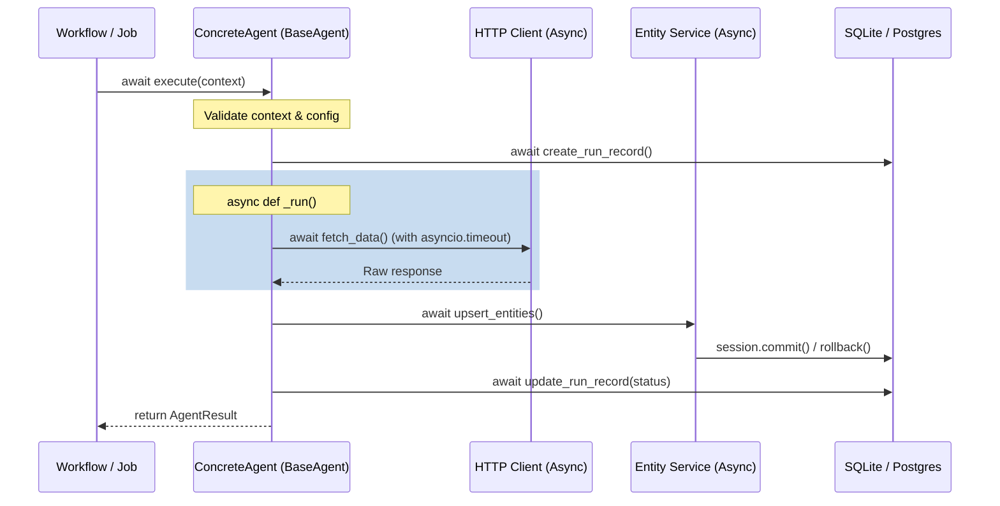

# Agent Interface Foundation: Refined Architectural Design

This document details the refined architectural design for the **Agent Interface Foundation** of Irtiqa Intelligence, incorporating the architectural decisions made for async execution, run observability, and evidence capture.

---

## 1. Asynchronous Execution Architecture

All agents operate on a fully asynchronous execution model to maximize throughput during IO-bound scraping and third-party API operations.



### Async Base Agent Design

```python
from abc import ABC, abstractmethod
import asyncio
import time
from app.core.errors import IrtiqaError, AgentExecutionError, AgentValidationError

class BaseAgent(ABC):
    """
    Abstract Base Class for all Irtiqa agents, enforcing a fully 
    asynchronous execution lifecycle and structured auditing.
    """

    def __init__(self, name: str, version: str):
        self.name = name
        self.version = version

    async def execute(self, context: AgentContext) -> AgentResult:
        """
        Public entrypoint. Orchestrates async validation, audit setup, 
        core execution, error translation, and final persistence.
        """
        start_time = time.perf_counter()
        agent_run_id = None
        
        try:
            # 1. Input Validation
            await self._validate_context(context)
            
            # 2. Record Running State
            agent_run_id = await self._initialize_run_record(context)
            
            # 3. Core Async Run
            # Concrete classes implement this abstract method
            output_ids, summary, stats = await self._run(context)
            
            # 4. Finalize Audit Trail as Succeeded
            duration = (time.perf_counter() - start_time) * 1000.0
            await self._finalize_run_record(
                context.db_session, 
                agent_run_id, 
                status="succeeded", 
                summary=summary, 
                stats=stats
            )
            
            return AgentResult(
                agent_run_id=agent_run_id,
                status="succeeded",
                output_ids=output_ids,
                summary=summary,
                duration_ms=duration,
                stats=stats
            )
            
        except Exception as exc:
            duration = (time.perf_counter() - start_time) * 1000.0
            structured_err = self._translate_exception(exc)
            
            # Ensure failure is saved in agent_runs even if execution fails
            if agent_run_id:
                await self._finalize_run_record(
                    context.db_session, 
                    agent_run_id, 
                    status="failed", 
                    summary=f"Failed: {structured_err.message}", 
                    error=structured_err
                )
                
            return AgentResult(
                agent_run_id=agent_run_id or UUID(int=0),
                status="failed",
                summary=structured_err.message,
                error=structured_err,
                duration_ms=duration
            )

    @abstractmethod
    async def _run(self, context: AgentContext) -> tuple[dict[str, list[UUID]], str, dict[str, Any]]:
        """
        To be implemented by concrete subclasses. Performs the actual agent intelligence.
        Returns:
            output_ids: Dictionary mapping tables to generated UUIDs.
            summary: Human-readable execution outline.
            stats: Metrics dictionary (e.g., bytes read, API tokens consumed).
        """
        pass
```

---

## 2. Telemetry and Run Observability

To minimize database schema complexity, **`agent_runs` is the sole tracking mechanism** for both workflows and agents:

1.  **Workflow Telemetry**:
    *   Parent workflows create a record in `agent_runs` with `workflow_name` set to the workflow name (e.g., `contact_intelligence`) and `agent_name` left `None` (or matching the overall policy).
    *   This serves as the root run ID.
2.  **Agent-Level Telemetry**:
    *   Each nested agent invocation creates a separate `agent_runs` record.
    *   The `agent_runs.workflow_name` acts as the pointer grouping related runs, while `agent_runs.agent_name` denotes the executing agent class (e.g., `deep_scraper`).
    *   `agent_runs.input_summary` records execution options (like `crawl_depth` or `intent_lookback_days`).

---

## 3. Asynchronous Concurrency & Timeout Handling

Agents must handle rate limits and non-responsive endpoints without blocking execution threads.

### Concurrency Controls
*   **Bounded Concurrency**: Agents processing multiple targets (e.g. the Scraper running multiple website scans) must use `asyncio.Semaphore` to cap active HTTP connections.
*   **Timeouts**: Core HTTP requests must employ explicit timeouts using `asyncio.timeout` or `asyncio.wait_for`.
*   **Async Exception Mapping**:
    *   `asyncio.TimeoutError` and HTTP connection errors are caught and converted to `AgentNetworkError` (inheriting from `IrtiqaError`).
    *   HTTP status `429` (Too Many Requests) is caught and raised as `AgentRateLimitError`.

---

## 4. Deferred Evidence Capture (Future Phase Blueprint)

As decided, unified evidence recording is deferred to a future phase. However, agents are designed to support this transition seamlessly.

### Future Schema Blueprint (`evidence_records` table)
```text
Table: evidence_records
+-----------------+---------------+---------------------------------------------+
| Column          | Type          | Purpose                                     |
+-----------------+---------------+---------------------------------------------+
| id              | String(36)    | Primary Key (UUID)                          |
| agent_run_id    | String(36)    | FK to agent_runs (ownership of collection)  |
| company_id      | String(36)    | FK to companies (context scope)             |
| source_type     | String(50)    | Origin: 'web_crawl', 'api_response', etc.   |
| source_url      | String(2083)  | Originating URL                             |
| raw_content     | Text / BLOB   | Unprocessed data (JSON payload or HTML)     |
| cleaned_content | Text          | Sanitized text/markdown extracted           |
| captured_at     | DateTime      | Time of observation                         |
+-----------------+---------------+---------------------------------------------+
```

### Current Migration Bridge
To prepare for this without creating the table:
*   Agents return an `evidence_summary` dictionary within `AgentResult.stats` capturing scraped URLs, API endpoints accessed, and key response hashes.
*   Upon creation of `evidence_records` in Phase 2, this return payload can be redirected from `stats` to the dedicated persistence layer without altering agent interface signatures.
