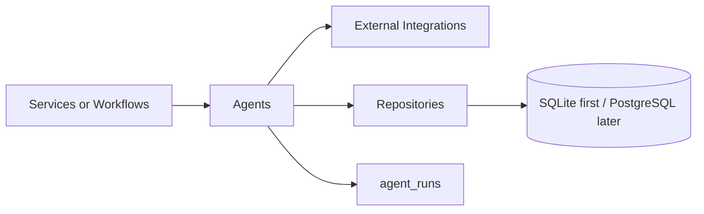
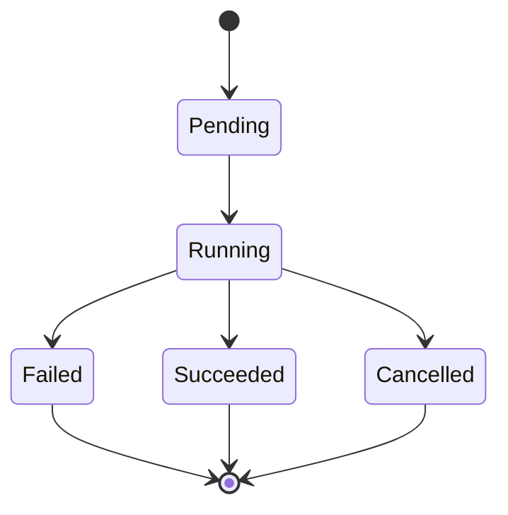
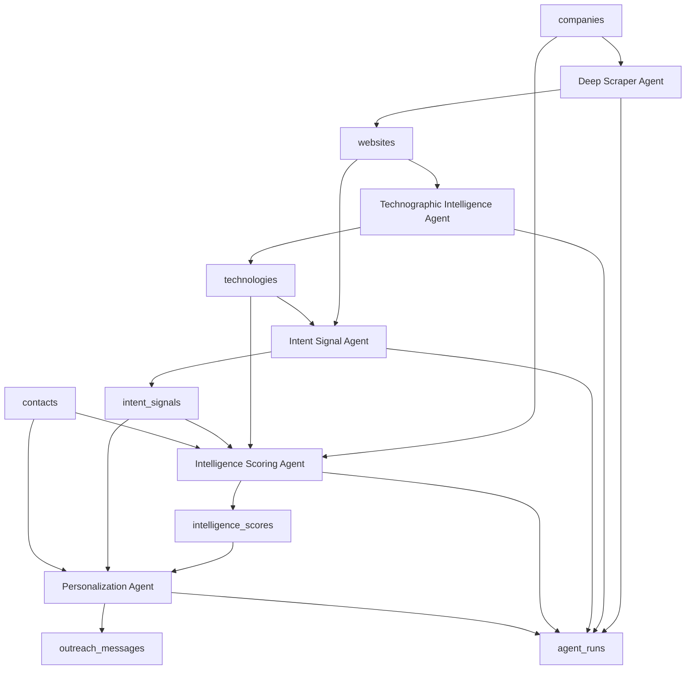

# Agent Architecture

Irtiqa Intelligence is designed around specialized agents that produce structured intelligence for companies and contacts. This document describes the intended agent responsibilities while staying aligned with the current implemented database schema.

All five core agents (Deep Scraper, Technographic Intelligence, Intent Signal, Intelligence Scoring, and Personalization) have been fully implemented. The `IntelligencePipelineWorkflow` chains all 5 agents into a single orchestrated run. The persistence layer supports agent outputs through these tables:

- `companies`
- `contacts`
- `websites`
- `technologies`
- `intent_signals`
- `intelligence_scores`
- `outreach_messages`
- `evidence_records`
- `agent_runs`
- `jobs`

## Agent Principles

- Each agent has one primary responsibility.
- Agents receive structured context and return structured results.
- Agents must create or update an `agent_runs` record for observability.
- Agents must expose confidence scores where intelligence is inferred.
- Agents must not create mock data.
- Agents must fail explicitly with actionable errors.
- Agents should be deterministic where practical and versioned when rules change.

## Agent Boundaries



Agents should not own API routing or frontend behavior. Agent output should be persisted through repositories and should map to the current schema.

## Shared Agent Contract

| Concept | Responsibility |
| --- | --- |
| Agent name | Stable name stored in `agent_runs.agent_name`. |
| Workflow name | Optional parent workflow stored in `agent_runs.workflow_name`. |
| Input context | Company, contact, website, technology, signal, score, or message context. |
| Validation | Reject missing or invalid required context before doing work. |
| Execution | Perform the agent-specific intelligence task. |
| Output | Return structured records matching current tables. |
| Confidence | Store confidence on technologies, intent signals, scores, and outreach messages. |
| Observability | Store run status, summaries, timestamps, and errors in `agent_runs`. |

## Agent Run Lifecycle



Supported `agent_runs.status` values:

- `pending`
- `running`
- `succeeded`
- `failed`
- `cancelled`

## Agent 1: Deep Scraper Agent

### Purpose

Discovers and extracts website evidence for a company.

### Responsibilities

- Normalize and validate target domains and URLs.
- Respect crawl limits and configured scraping policy.
- Discover and classify company pages.
- Persist discovered pages to `websites`.
- Update `websites.http_status` and `websites.last_scraped_at`.
- Summarize crawl results in `agent_runs.output_summary`.
- Store failures in `agent_runs.error_message`.

### Inputs

| Input | Required | Maps To |
| --- | --- | --- |
| company_id | Yes | `companies.id` |
| domain or url | Yes | `companies.domain`, `websites.url` |
| crawl_depth | Yes | Agent input summary |
| page_limit | Yes | Agent input summary |
| workflow_name | No | `agent_runs.workflow_name` |

### Outputs

| Output | Table |
| --- | --- |
| Discovered pages | `websites` |
| Crawl metadata | `agent_runs` |

## Agent 2: Technographic Intelligence Agent

### Purpose

Detects technologies used by a company from websites and other approved evidence sources.

### Responsibilities

- Detect technology names, categories, vendors, and detection methods.
- Associate detected technologies with `companies`.
- Optionally associate detections with `websites`.
- Store confidence scores.
- Track first and last detection timestamps.
- Store the producing run in `agent_runs`.

### Inputs

| Input | Required | Maps To |
| --- | --- | --- |
| company_id | Yes | `companies.id` |
| website_ids | Optional | `websites.id` |
| agent_run_id | Yes | `agent_runs.id` |

### Outputs

| Output | Table |
| --- | --- |
| Detected technology usage | `technologies` |
| Run status and summary | `agent_runs` |

## Agent 3: Intent Signal Agent

### Purpose

Identifies company-level or contact-level buying intent and trigger events.

### Responsibilities

- Extract hiring, growth, funding, technology change, pain, and content activity signals.
- Store commercial strength separately from evidence confidence.
- Associate signals with `companies`.
- Optionally associate signals with `contacts`, `websites`, and `technologies`.
- Store supporting URL in `intent_signals.source_url`.
- Store observation timestamp in `intent_signals.observed_at`.

### Inputs

| Input | Required | Maps To |
| --- | --- | --- |
| company_id | Yes | `companies.id` |
| contact_id | No | `contacts.id` |
| website_id | No | `websites.id` |
| technology_id | No | `technologies.id` |
| agent_run_id | Yes | `agent_runs.id` |

### Outputs

| Output | Table |
| --- | --- |
| Intent records | `intent_signals` |
| Run status and summary | `agent_runs` |

## Agent 4: Intelligence Scoring Agent

### Purpose

Scores companies and contacts using firmographic, technographic, intent, and engagement-readiness inputs.

### Responsibilities

- Calculate `fit_score`.
- Calculate `intent_score`.
- Calculate `technographic_score`.
- Calculate `engagement_score`.
- Calculate `total_score`.
- Store `confidence`, `score_version`, and `rationale`.
- Create append-only score history in `intelligence_scores`.

### Inputs

| Input | Required | Maps To |
| --- | --- | --- |
| company_id | Yes | `companies.id` |
| contact_id | No | `contacts.id` |
| technology_id | No | `technologies.id` |
| agent_run_id | Yes | `agent_runs.id` |
| scoring_policy_version | Yes | `intelligence_scores.score_version` |

### Outputs

| Output | Table |
| --- | --- |
| Versioned score | `intelligence_scores` |
| Run status and summary | `agent_runs` |

## Agent 5: Personalization Agent

### Purpose

Creates outreach-ready message drafts and personalization angles from current intelligence.

### Responsibilities

- Generate channel-specific outreach messages.
- Associate messages with `companies`.
- Optionally associate messages with `contacts`.
- Reference the `intelligence_scores` row used for generation when available.
- Store personalization angle, call to action, message body, confidence, and status.
- Avoid unsupported claims.

### Inputs

| Input | Required | Maps To |
| --- | --- | --- |
| company_id | Yes | `companies.id` |
| contact_id | No | `contacts.id` |
| intelligence_score_id | No | `intelligence_scores.id` |
| agent_run_id | Yes | `agent_runs.id` |
| channel | Yes | `outreach_messages.channel` |

### Outputs

| Output | Table |
| --- | --- |
| Outreach draft | `outreach_messages` |
| Run status and summary | `agent_runs` |

## Collaboration Model



## Evidence Recording

Every agent execution automatically creates `evidence_records` that link intelligence outputs to their source data. Evidence recording happens in `BaseAgent.execute()` after `_run()` succeeds.

### How It Works

1. An agent's `_run()` method returns an `AgentRunOutput` dict that may include an optional `evidence` key.
2. After `_run()` succeeds, `BaseAgent.execute()` calls `EvidenceService.record_evidence_batch()` with any returned evidence items.
3. The service injects `agent_run_id`, `company_id`, and `contact_id` from the agent context automatically.
4. If evidence recording fails, the agent execution is **not** affected — the error is logged as a warning and the agent continues.

### EvidenceItem Contract

```python
class EvidenceItem(TypedDict):
    source_type: str      # "website", "agent_run", "job"
    source_id: str        # UUID of the source entity
    source_detail: str    # Human-readable description
    evidence_type: str    # "html_snippet", "text_excerpt", "url_match",
                          # "signature_match", "computed_metric", "agent_summary"
    evidence_value: str   # The excerpt or computed value
    relationship_type: str  # "supports", "contradicts", "contributes_to", "generates"
    target_type: str      # "technology", "intent_signal", "intelligence_score",
                          # "outreach_message"
    target_id: str        # UUID of the output entity this evidence supports
    confidence: float     # 0.0–1.0
```

### Agent Requirements

- Agents **may** return evidence in their `AgentRunOutput`. The `evidence` key is optional.
- Agents that do not return evidence continue to work unchanged.
- Evidence is supplementary — it enhances auditability but is not required for correct agent execution.

### Storage

Evidence records are stored in the `evidence_records` table and are queryable through the evidence API endpoints.

## Confidence Model

| Field | Table | Meaning |
| --- | --- | --- |
| `confidence` | `technologies` | Certainty that a technology detection is correct. |
| `strength` | `intent_signals` | Commercial strength of the signal. |
| `confidence` | `intent_signals` | Reliability of the signal evidence. |
| `confidence` | `intelligence_scores` | Completeness and reliability of scoring inputs. |
| `confidence` | `outreach_messages` | Specificity and defensibility of the message. |

## Production Guardrails

- Agents must operate with explicit timeouts.
- External calls must use retry and rate-limit policies.
- Crawling must be bounded by domain, depth, and page count.
- Sensitive or uncertain claims must be marked through low confidence or review status.
- Agent outputs must map to the current database schema.
- Agent failures must update `agent_runs.status` and `agent_runs.error_message`.
