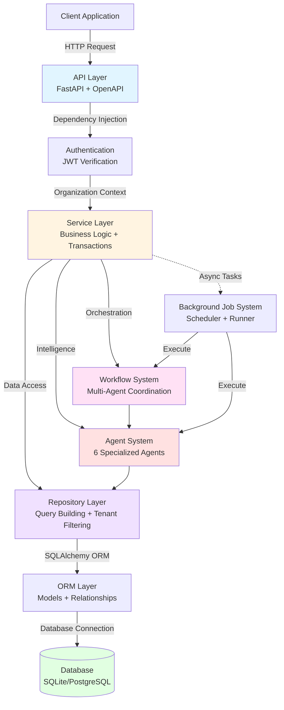
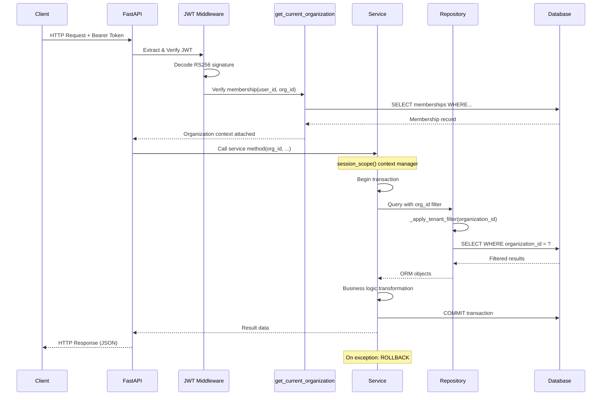
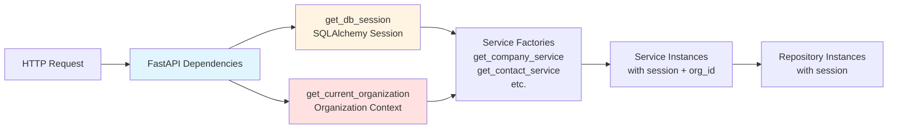
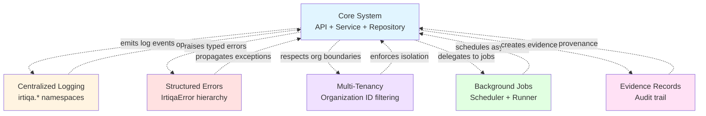
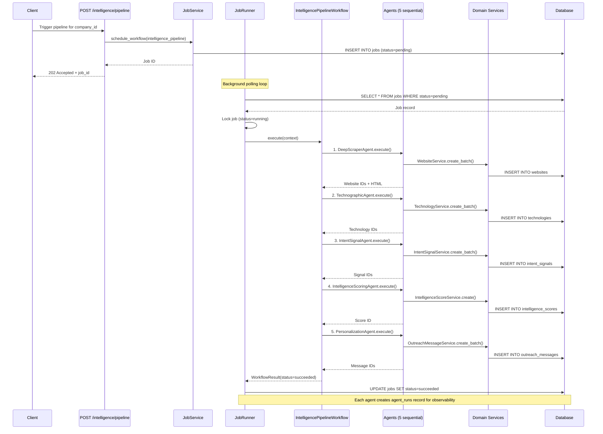
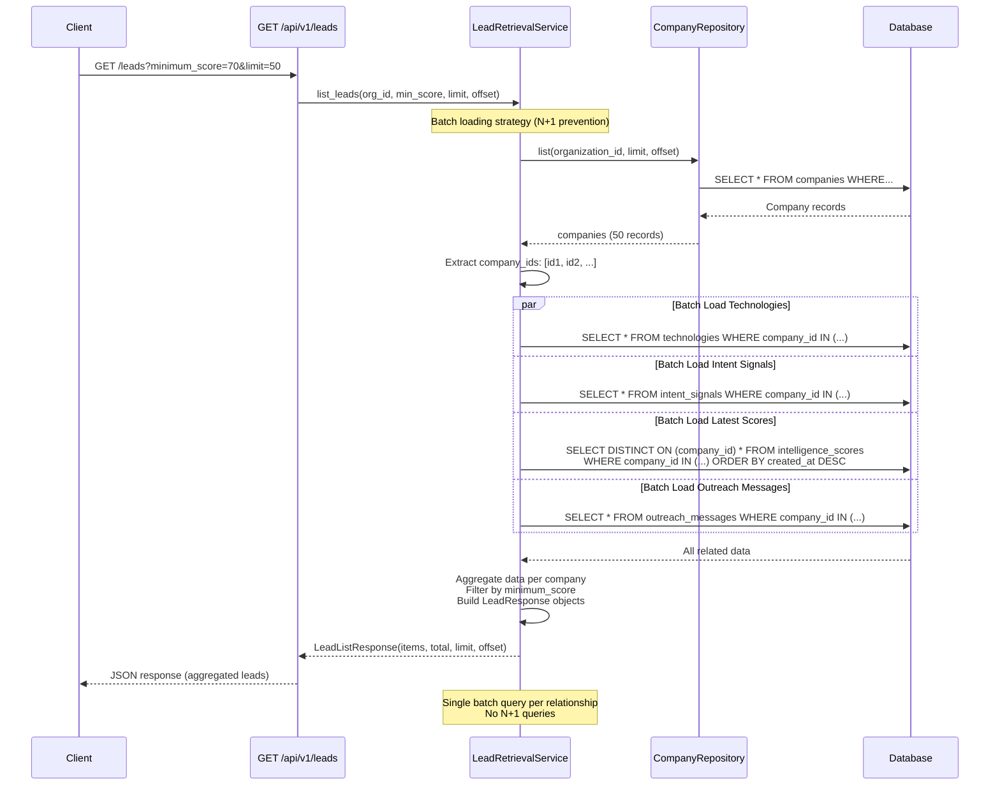
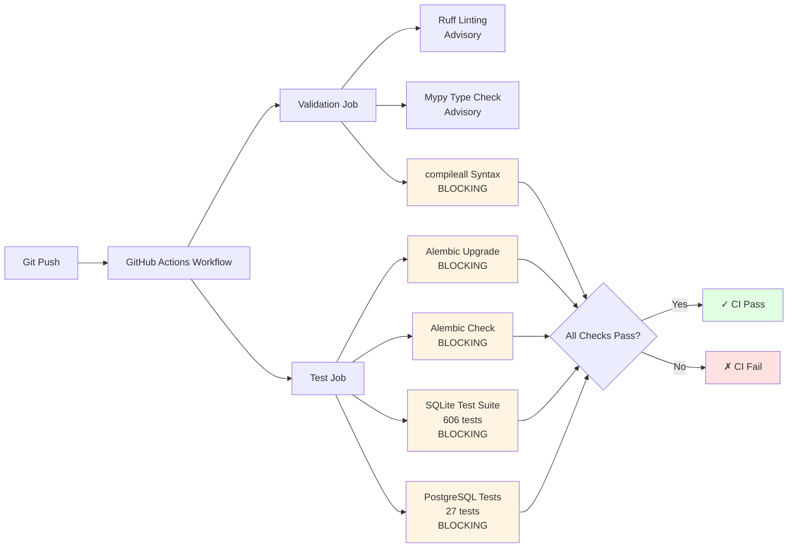

# Architecture Overview

High-level map of how all components in Irtiqa Intelligence connect.

> **Note:** This is the main architectural reference. For specific subsystems, see:
> - [Database Design](database.md) — Schema, relationships, migrations
> - [Agent System](agents.md) — Intelligence gathering components
> - [Workflow System](workflows.md) — Multi-agent orchestration
> - [Background Jobs](background_job_foundation_design.md) — Async execution
> - [Authentication](authentication_multitenancy_v2_design.md) — JWT and multi-tenancy

---

## Terminology

Key terms used throughout the documentation:

| Term | Definition |
|------|------------|
| **Company** | Organization entity (canonical business entity) |
| **Contact** | Person entity linked to a company |
| **Lead** | Company + Contact + Intelligence Score (scored prospect for retrieval) |
| **Organization** | User-facing tenant entity (multi-tenancy boundary) |
| **Tenant** | Technical term for organization in multi-tenancy context |
| **Agent Run** | Single execution of an agent (stored in `agent_runs` table) |
| **Workflow Context** | Input parameters passed to workflow execution |

---

## System Layers



### Layer Responsibilities

| Layer | Responsibility | Owns |
|-------|---------------|------|
| **API** | HTTP routing, request validation, OpenAPI docs | FastAPI routes, Pydantic schemas |
| **Service** | Business logic, transaction boundaries | Use case methods, `session_scope()` commits |
| **Workflow** | Multi-agent orchestration, step sequencing | Workflow definitions, error handling |
| **Agent** | Intelligence gathering, external API integration | Agent-specific logic, evidence recording |
| **Repository** | Query building, tenant filtering | SQLAlchemy queries, `_apply_tenant_filter()` |
| **ORM** | Object-relational mapping, relationships | Model definitions, foreign keys |
| **Database** | Data persistence, constraints, indexes | SQLite (dev), PostgreSQL (prod) |

---

## Request Lifecycle



### Transaction Boundaries

**Services own transaction boundaries:**
- Each service method wraps operations in `session_scope()` context manager
- Repositories **never commit** — they accept sessions and build queries
- API routes call services, not repositories directly
- Transactions commit on successful service method completion
- Transactions rollback automatically on exceptions

```python
# Service Layer Pattern
class CompanyService(BaseService):
    def create(self, organization_id: str, **values) -> Company:
        with session_scope() as session:  # Transaction boundary
            repository = self.repository(session)
            company = repository.create(**values)
            session.flush()  # Validate constraints
            return company  # Commit happens here automatically
```

---

## Dependency Injection



**Dependency Chain:**
1. `get_db_session()` → Provides SQLAlchemy session for database access
2. `get_current_organization()` → Verifies JWT, validates membership, returns org context
3. Service factories (e.g., `get_company_service()`) → Inject session + org context into services
4. Repositories instantiated by services → Receive session, apply tenant filters

---

## Multi-Tenancy Boundary Enforcement

```mermaid
flowchart TD
    JWT[JWT Token<br/>Claims: sub, org] --> Verify[JWT Middleware<br/>Verify Signature]
    Verify --> Membership[get_current_organization<br/>Verify Membership]
    Membership --> DBCheck{Membership<br/>Exists?}
    
    DBCheck -->|No| Reject[403 Forbidden]
    DBCheck -->|Yes| Context[Attach Organization Context<br/>organization_id]
    
    Context --> Service[Service Method Call<br/>service.method(org_id, ...)]
    Service --> Repo[Repository Query<br/>repository.list(org_id)]
    Repo --> Filter[_apply_tenant_filter<br/>Add WHERE clause]
    Filter --> SQL["SQL Query<br/>SELECT * FROM companies<br/>WHERE organization_id = ?"]
    SQL --> Result[Tenant-Scoped Results]
    
    style DBCheck fill:#ffe1e1
    style Filter fill:#fff4e1
    style SQL fill:#e1ffe1
```

### Enforcement Layers

| Layer | Enforcement Mechanism | Failure Mode |
|-------|----------------------|--------------|
| **JWT** | RS256 signature verification | 401 Unauthorized |
| **Membership** | Database lookup on every request | 403 Forbidden |
| **Repository** | `_apply_tenant_filter()` adds WHERE clause | Empty result set (silent) |
| **Database** | Foreign key constraints on `organization_id` | IntegrityError exception |

**Security Principle:** Trust nothing. Verify at every layer.

See [Authentication & Multi-Tenancy](authentication_multitenancy_v2_design.md) for complete security design.

---

## Cross-Cutting Concerns



### Integration Points

| Concern | How It Integrates |
|---------|------------------|
| **Logging** | Services and repositories emit structured logs via `get_logger()` |
| **Errors** | All layers raise `IrtiqaError` subclasses with error codes and details |
| **Multi-Tenancy** | Repository layer automatically filters by `organization_id` |
| **Background Jobs** | API routes schedule long-running work via `JobService` |
| **Evidence** | Agents record provenance via `BaseAgent.execute()` lifecycle |

---

## Intelligence Pipeline Flow



Each step creates an `agent_runs` record for observability. Pipeline stops on first agent failure.

---

## Lead Retrieval Flow



**Performance Strategy:**
- Single query for companies (paginated)
- Batch query for each relationship using `WHERE company_id IN (...)`
- Subquery for latest intelligence scores (DISTINCT ON pattern)
- Aggregation in memory (acceptable for paginated results)

---

## Key Patterns

| Pattern | Implementation | Location |
|---------|---------------|----------|
| **Multi-tenancy** | `organization_id` column on all domain tables, filtered via `_apply_tenant_filter()` | Repository layer |
| **Pagination** | `items`, `total`, `limit`, `offset` on all list responses | Service + API layer |
| **Error handling** | Structured `IrtiqaError` hierarchy with stable error codes | `app/core/errors.py` |
| **Logging** | Centralized via `irtiqa.*` logger namespaces | `app/core/logging.py` |
| **Testing** | pytest with temporary SQLite databases per test | `tests/conftest.py` |
| **Dependency Injection** | FastAPI `Depends()` for session, organization, services | `app/api/dependencies.py` |
| **Transaction Ownership** | Services own `session_scope()`, repositories never commit | Service layer |
| **Agent Template Method** | `BaseAgent.execute()` calls `_validate()`, `_run()`, `_record_evidence()` | `app/agents/base.py` |
| **Workflow Orchestration** | `WorkflowRunner` manages lifecycle, delegates to agents | `app/workflows/runner.py` |

---

## CI/CD Pipeline



**CI Strategy:**
- **Ruff & Mypy:** Advisory during debt reduction phase (continue-on-error: true)
- **Compileall:** BLOCKING (syntax errors fail build)
- **Migrations:** BLOCKING (schema drift fails build)
- **Tests:** BLOCKING (633 tests must pass)

GitHub Actions workflow: `.github/workflows/ci.yml`

---

## Related Documentation

- **[Database Design](database.md)** — Complete schema, relationships, migrations, backup procedures
- **[Entity Relationships](entity_relationships.md)** — Detailed FK relationships and constraints
- **[Agent System](agents.md)** — All 6 agents, responsibilities, lifecycles
- **[Agent Interface](agent_interface_design.md)** — BaseAgent pattern, AgentContext, AgentResult
- **[Workflow System](workflows.md)** — Workflow orchestration, concrete implementations
- **[Background Jobs](background_job_foundation_design.md)** — Async execution, retry policies
- **[Authentication](authentication_multitenancy_v2_design.md)** — JWT, multi-tenancy, RBAC
- **[Discovery Engine](lead_discovery_engine_final.md)** — ICP search, external sources, deduplication
- **[Evidence System](evidence_records_system_design.md)** — Provenance tracking, audit trail

---

**Last Updated:** 2026-07-01  
**Status:** Production-Ready Backend  
**Test Coverage:** 633 tests (100% pass rate)
