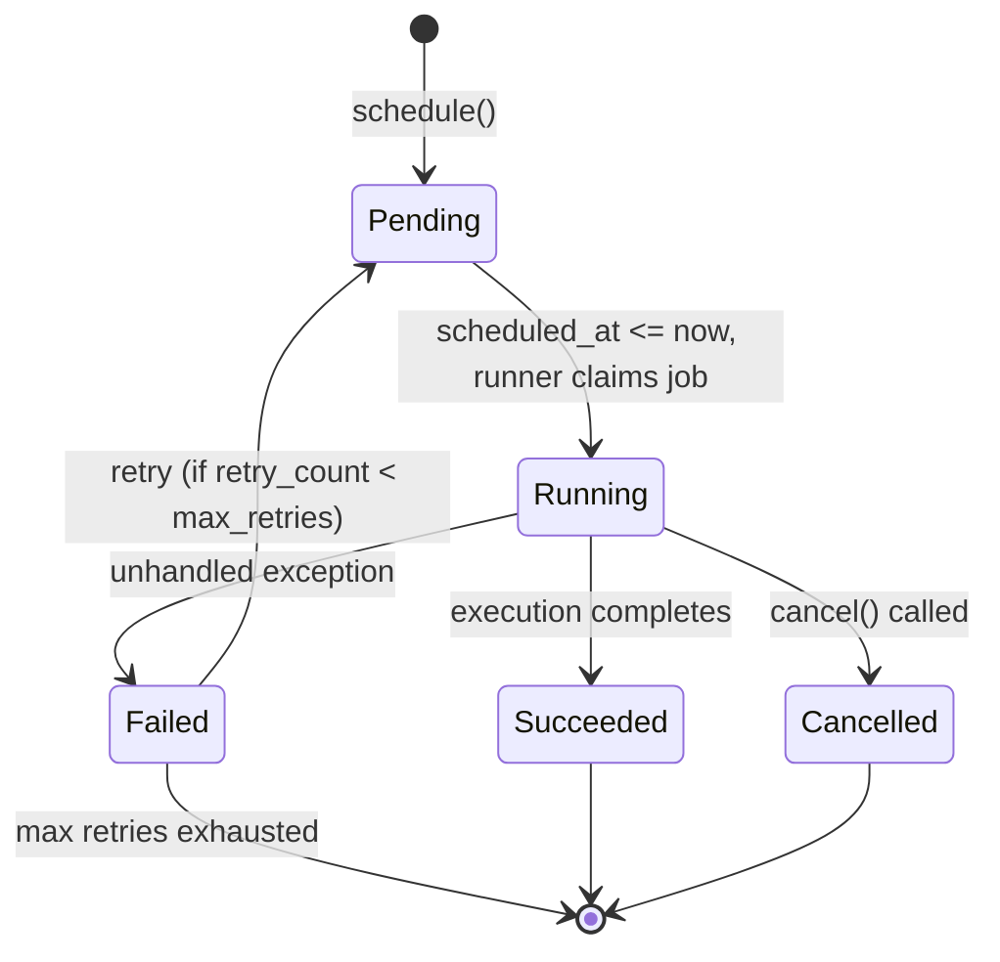

> **Status: IMPLEMENTED**

# Background Job Foundation Design

## 1. Purpose

Provide a minimal, in-process background execution layer for Irtiqa Intelligence. This layer schedules, runs, and monitors long-running **agent** and **workflow** invocations without introducing external queues, new agent frameworks, or parallel execution primitives.

## 2. Core Principles

| Principle | Decision |
|-----------|----------|
| **Reuse existing contracts** | Jobs delegate to `BaseAgent.execute()` and `WorkflowRunner.run()`. No new abstraction over agents or workflows. |
| **No external infrastructure** | First version is in-process, polling SQLite. No Celery, Redis, RabbitMQ, or Kafka. |
| **SQLite-first, PostgreSQL-ready** | All new models use SQLAlchemy portable types. No SQLite-only SQL. |
| **Single-threaded async** | Leverage existing `asyncio` patterns. No `multiprocessing`, no `ThreadPoolExecutor`. |
| **Observability via existing tables** | Jobs link to `agent_runs`. No separate event log table. |
| **Minimal schema additions** | One new table: `jobs`. One new Alembic migration. |

## 3. Architecture Overview

```
┌─────────────────────────────────────────────────────────────┐
│                    FastAPI Application                       │
│  ┌─────────────┐  ┌─────────────┐  ┌─────────────────────┐  │
│  │ Job API     │  │ JobService  │  │ JobRunner           │  │
│  │ (endpoints) │──│ (business)  │──│ (execution)         │  │
│  └─────────────┘  └──────┬──────┘  └──────────┬──────────┘  │
│                          │                    │             │
│  ┌───────────────────────┘                    │             │
│  │ JobRepository        ┌─────────────────────┘             │
│  └──────────────────────┤  AgentRegistry                     │
│                         │  WorkflowRunner                    │
│  ┌──────────────────────┤                                    │
│  │ SQLite (jobs table)  └─────────────────────┐              │
│  └──────────────────────────────────────────┤              │
│                                               │              │
│                              ┌────────────────┘             │
│                              ▼                                │
│                         ┌─────────────┐                       │
│                         │ agent_runs  │                       │
│                         └─────────────┘                       │
└─────────────────────────────────────────────────────────────┘
```

A background job is a scheduled, retryable, cancellable unit of work whose payload is either an **agent execution** (`job_type="agent"`) or a **workflow execution** (`job_type="workflow"`). The `JobRunner` polls the `jobs` table, locks a pending row, delegates to the existing `AgentRegistry` or `WorkflowRunner` respectively, and updates the job status. Observability is inherited from `agent_runs`.

## 4. Data Model

### 4.1 `jobs` Table

| Column | Type | Constraints | Notes |
|--------|------|-------------|-------|
| `id` | `String(36)` | PK | UUID, reused pattern from all models |
| `job_type` | `String(16)` | NOT NULL | `"agent"` or `"workflow"` |
| `target_name` | `String(128)` | NOT NULL | Agent `name` or workflow `name` |
| `payload` | `Text` | NOT NULL | JSON blob: `company_id`, `contact_id`, `options`, `workflow_context`, etc. |
| `status` | `String(16)` | NOT NULL | `pending`, `running`, `succeeded`, `failed`, `cancelled` |
| `scheduled_at` | `DateTime(timezone=True)` | NOT NULL | Earliest execution time |
| `started_at` | `DateTime(timezone=True)` | NULLABLE | Set when worker picks up job |
| `completed_at` | `DateTime(timezone=True)` | NULLABLE | Set on terminal state |
| `retry_count` | `Integer` | NOT NULL, default 0 | How many retries consumed |
| `max_retries` | `Integer` | NOT NULL, default 3 | Configurable per job |
| `last_error` | `Text` | NULLABLE | Structured error details on failure |
| `agent_run_id` | `String(36)` | FK → `agent_runs.id`, nullable | Links to the observability run |
| `created_at` | `DateTime(timezone=True)` | NOT NULL | Auto |
| `updated_at` | `DateTime(timezone=True)` | NOT NULL | Auto |

**Check constraints** (Alembic, portable):
- `status` ∈ `('pending','running','succeeded','failed','cancelled')`
- `job_type` ∈ `('agent','workflow')`
- `retry_count` ≤ `max_retries`
- `max_retries` ≥ 0

**Indexes**:
- `ix_jobs_status_scheduled_at` on `(status, scheduled_at)` — primary polling query
- `ix_jobs_target_name` on `(target_name)` — filtering by agent/workflow name
- `ix_jobs_agent_run_id` on `(agent_run_id)` — join to `agent_runs`

### 4.2 Relationships

- `jobs` → `agent_runs` (optional, nullable `agent_run_id`)
- No foreign key from `agent_runs` back to `jobs` — `agent_runs` remains the authoritative observability log

## 5. Job Lifecycle



**State meanings**:
- `pending` — created, waiting for `scheduled_at` eligibility and/or worker claim
- `running` — actively executing in the runner
- `succeeded` — terminal, successful
- `failed` — terminal, failed (may be retried)
- `cancelled` — terminal, manually cancelled

## 6. Component Design

### 6.1 `Job` (SQLAlchemy Model)

Located in `app/models/job.py`. Follows existing model conventions:
- Inherits from `Base` and `TimestampMixin`
- Uses `Mapped[...]` and `mapped_column`
- No business logic

### 6.2 `JobRepository` (`app/repositories/job_repository.py`)

Extends `BaseRepository[Job]`. Adds:

- `get_pending_jobs(self, *, limit: int = 10) -> Sequence[Job]` — fetch `pending` jobs with `scheduled_at <= now`, ordered by `scheduled_at` ascending.
- `get_job_by_agent_run_id(self, agent_run_id: str) -> Job | None` — reverse lookup.

### 6.3 `JobService` (`app/services/job_service.py`)

Extends `BaseService[JobRepository, Job]`. Owns transaction boundaries via `session_scope()`.

Methods:
- `schedule_agent(name: str, context: AgentContext, *, scheduled_at: datetime | None = None, max_retries: int = 3) -> Job` — schedule an agent job
- `schedule_workflow(name: str, context: WorkflowContext, *, scheduled_at: datetime | None = None, max_retries: int = 3) -> Job` — schedule a workflow job
- `list_jobs(self, *, status: str | None = None, target_name: str | None = None, limit: int = 50, offset: int = 0) -> Sequence[Job]` — paginated list
- `cancel_job(self, job_id: str) -> Job` — transition to `cancelled` if `pending`
- `retry_job(self, job_id: str) -> Job` — reset a `failed` job to `pending`, increment retry logic
- `get_next_jobs(self, *, limit: int = 10) -> Sequence[Job]` — fetch jobs eligible for execution
- `claim_job(self, job_id: str) -> Job | None` — atomic transition from `pending` to `running` with row-level optimistic concurrency (compare status on update)

### 6.4 `JobRunner` (`app/jobs/runner.py`)

A single asynchronous class that runs as a background task within the FastAPI application (via `asyncio.create_task` in lifespan) or as a standalone process.

```python
class JobRunner:
    def __init__(self, job_service: JobService, *, poll_interval: float = 5.0)

    async def start(self) -> None
    async def stop(self) -> None
    async def _poll_once(self) -> None
    async def _run_job(self, job: Job) -> None
```

Execution flow per job:
1. `claim_job(job_id)` — atomically transition to `running`, set `started_at`
2. Deserialize `payload` into `AgentContext` or `WorkflowContext`
3. Resolve target via `AgentRegistry` or `WorkflowRegistry`
4. Execute: `await agent.execute(context)` or `await runner.run(workflow, context)`
5. On success: transition to `succeeded`, set `completed_at`, store `agent_run_id`
6. On failure: capture exception, store `last_error`, transition to `failed` (or `pending` if retries remain)
7. `stop()` sets a shutdown event; current job is allowed to finish gracefully

**Concurrency model**: Single worker, single event loop. The existing async architecture already supports concurrent I/O (HTTP, DB). No `asyncio.TaskGroup` or background thread pool for job execution.

### 6.5 `JobScheduler` (`app/jobs/scheduler.py`)

Lightweight in-process scheduler. Simply a loop that sleeps and calls `JobRunner._poll_once()`.

```python
class JobScheduler:
    def __init__(self, runner: JobRunner, *, poll_interval: float = 5.0)
    async def run(self) -> None
    async def shutdown(self) -> None
```

Started in FastAPI lifespan:

```python
@asynccontextmanager
async def lifespan(app: FastAPI):
    job_runner = JobRunner(job_service=...)  # constructed from app state
    scheduler = JobScheduler(job_runner)
    task = asyncio.create_task(scheduler.run())
    yield
    scheduler.shutdown()
    await task
```

### 6.6 Retry Policy (`app/jobs/retry_policy.py`)

Pure function, no dependencies:

```python
def compute_next_scheduled_at(retry_count: int, base_delay_seconds: float = 60.0) -> datetime:
    """Exponential backoff with jitter."""
    delay = base_delay_seconds * (2 ** retry_count)
    jitter = random.uniform(0, delay * 0.1)
    return datetime.now(timezone.utc) + timedelta(seconds=delay + jitter)
```

Applied by `JobRunner._run_job()` when a job fails and `retry_count < max_retries`.

### 6.7 `JobContext` — Optional Pydantic Model

```python
class JobContext(BaseModel):
    company_id: str | None = None
    contact_id: str | None = None
    options: dict[str, Any] = Field(default_factory=dict)

    def to_agent_context(self) -> AgentContext: ...
    def to_workflow_context(self) -> WorkflowContext: ...
```

Stored in `job.payload` as JSON.

## 7. API Surface

Add to `app/api/v1/endpoints/`:

### Endpoints

| Method | Path | Description | Auth |
|--------|------|-------------|------|
| POST | `/jobs/schedule-agent` | Schedule a new agent job | — |
| POST | `/jobs/schedule-workflow` | Schedule a new workflow job | — |
| GET | `/jobs/` | List jobs (paginated, filterable by status/target) | — |
| GET | `/jobs/{job_id}` | Get job details | — |
| POST | `/jobs/{job_id}/cancel` | Cancel a pending job | — |
| POST | `/jobs/{job_id}/retry` | Manually retry a failed job | — |

### Request/Response Schemas (`app/schemas/job.py`)

```python
class JobCreate(BaseModel): ...
class JobRead(BaseModel): ...
class JobList(BaseModel): ...
class JobScheduleAgentRequest(BaseModel): ...
class JobScheduleWorkflowRequest(BaseModel): ...
```

## 8. Integration with Existing Components

| Existing Component | How Job Foundation Uses It |
|--------------------|---------------------------|
| `BaseAgent` / `AgentRegistry` | `JobRunner` resolves `target_name` → agent class via `AgentRegistry.resolve(target_name)`, calls `await agent.execute(context)` |
| `WorkflowRunner` / `WorkflowRegistry` | `JobRunner` resolves via `WorkflowRegistry.resolve(target_name)`, calls `await workflow_runner.run(workflow, context)` |
| `AgentResult` | On success, `output_ids` and `summary` can be logged; `agent_run_id` is linked to the job |
| `AgentRunService` | Jobs do not create `agent_runs` directly — agents/workflows still own that via `BaseAgent.execute()` and `WorkflowRunner.run()` |
| `Service` layer | `JobService` extends `BaseService`, uses `session_scope()`, calls `JobRepository` |
| `Repository` layer | `JobRepository` extends `BaseRepository`, receives `Session`, never commits |
| `IrtiqaError` hierarchy | `JobRunner` raises `JobSchedulingError`, `JobExecutionError`, `JobCancellationError` via existing patterns |
| `app/core/logging.py` | `irtiqa.jobs` logger namespace |

## 9. Error Handling

New error types in `app/core/errors.py` (or `app/jobs/errors.py` if preferred):

- `JobSchedulingError` — invalid target name, invalid payload, database failure on schedule
- `JobExecutionError` — runtime failure during job execution (wraps underlying agent/workflow error)
- `JobCancellationError` — attempt to cancel a non-cancellable job (already `running` with no interruption support)

All errors:
- Inherit from `IrtiqaError`
- Include `job_id`, `target_name`, `retry_count` in details
- Are logged via `irtiqa.jobs` logger

## 10. Cancellation

Two cancellation paths:

1. **Pre-execution cancel**: Job is `pending`. API call sets `status = cancelled`, `completed_at = now`. No agent/workflow is ever invoked.
2. **In-progress cancel**: Job is `running`. The scheduler receives a shutdown signal, stops polling, and allows the current running job to complete. The job result naturally transitions to terminal state. No `asyncio.Task.cancel()` is used (avoids partial state).

**No in-progress agent cancellation.** `BaseAgent` does not expose a cancellation hook, and adding one is out of scope. If a user needs to stop a long-running scrape mid-flight, they should restart the application (WAL-mode safe) or wait for completion.

## 11. SQLite-Specific Considerations

| Concern | Mitigation |
|---------|------------|
| **Row locking** | No `SELECT ... FOR UPDATE` in SQLite. Use atomic `UPDATE` with `WHERE status = 'pending'` and check `rowcount` to implement optimistic concurrency. |
| **WAL mode** | Already enabled in `app/database/engine.py`. Safe for concurrent reads while runner writes status. |
| **Busy timeout** | Already `5000` ms. Runner holds locks briefly. |
| **Single writer** | SQLite allows one writer at a time. Worker is single-threaded, so no contention. |

## 12. PostgreSQL Migration Path

| SQLite → Floors | PostgreSQL Upgrade |
|-------------------|---------------------|
| String(36) UUIDs | Can migrate to `UUID` type in a later Alembic revision |
| `json` text column | Already works as-is; can switch to `JSONB` in PostgreSQL revision |
| Single writer | Not a concern; PostgreSQL handles advisory locks, select-for-update will work |
| `DateTime(timezone=True)` | Compatible |

## 13. File Structure

```
app/
├── models/
│   └── job.py                        # New: Job ORM model
├── repositories/
│   └── job_repository.py           # New: JobRepository
├── services/
│   └── job_service.py               # New: JobService
├── schemas/
│   └── job.py                       # New: JobCreate, JobRead, JobList, etc.
├── jobs/                            # NEW PACKAGE
│   ├── __init__.py
│   ├── runner.py                    # JobRunner
│   ├── scheduler.py                 # JobScheduler
│   ├── retry_policy.py              # compute_next_scheduled_at
│   └── errors.py                    # JobExecutionError, etc.
└── api/v1/endpoints/
    └── jobs.py                      # New: job CRUD + schedule/cancel/retry endpoints
database/migrations/versions/
└── 20260609_0003_add_jobs_table.py  # New Alembic migration
tests/
├── unit/jobs/
│   ├── __init__.py
│   ├── test_runner.py               # Mock runner tests
│   ├── test_scheduler.py            # Loop / timing tests
│   ├── test_retry_policy.py         # Exponential backoff + jitter
│   └── test_errors.py               # Job error tests
└── integration/jobs/
    ├── __init__.py
    ├── test_job_api.py              # Full round-trip via TestClient
    └── test_job_lifecycle.py        # schedule → run → succeed/fail → retry
```

## 14. Testing Strategy

### Unit Tests

- **Retry policy**: deterministic backoff math, jitter bounded, max delay capped
- **Runner**: mock `JobService` and `AgentRegistry`, verify state transitions
- **Scheduler**: verify `run()` calls `poll_once()` in a loop, `shutdown()` breaks cleanly
- **Errors**: verify `JobExecutionError` serializes correctly via `to_dict()`

### Integration Tests

- **Full lifecycle**: schedule agent job → runner picks it up → job succeeds → `agent_runs` has entry → job links to it
- **Failure → retry**: inject failing agent, verify `failed` → retry count increments → rescheduled
- **Cancel**: schedule, cancel via API, verify `cancelled` and no agent execution
- **Polling**: insert two jobs with staggered `scheduled_at`, verify execution order
- **Concurrency safety**: two runner ticks in rapid succession must not pick up the same job (validate via atomic claim pattern)

## 15. Risks and Mitigations

| Risk | Mitigation |
|------|-----------|
| Single worker is a bottleneck | Documented as first-version limitation. Future: add multiple FastAPI workers or external queue (Celery/RQ). Architecture supports it because `JobRunner` is decoupled from scheduling. |
| Process restart loses in-memory state | Jobs are durable in SQLite. On restart, scheduler re-reads `pending` jobs and continues. |
| Long-running agent blocks all other jobs | Acceptable for first version. Document that agents should have explicit timeouts (already true for Deep Scraper). |
| SQLite write contention under load | Single writer, brief updates, WAL mode → acceptable for light-to-moderate load. |
| Payload serialization drift | Use Pydantic `JobContext` model; validate on deserialize. Store payload as `model.model_dump_json()`. |
| Job and agent_run become inconsistent | Job links to `agent_run_id`. If agent succeeds but runner crashes before updating job, the job can be reconciled by a future "heal" command or just retried (agents should be idempotent where possible). |

## 16. Summary of Additions

| Category | Count | Files |
|----------|-------|-------|
| ORM Models | +1 | `app/models/job.py` |
| Repositories | +1 | `app/repositories/job_repository.py` |
| Services | +1 | `app/services/job_service.py` |
| Schemas | +1 | `app/schemas/job.py` (4-5 class definitions) |
| API Endpoints | +1 | `app/api/v1/endpoints/jobs.py` (6 routes) |
| Jobs Package | +4 | `app/jobs/__init__.py`, `runner.py`, `scheduler.py`, `retry_policy.py`, `errors.py` |
| Migrations | +1 | `database/migrations/versions/20260609_0003_add_jobs_table.py` |
| Tests | +6 | unit + integration test files |

**No new dependencies** are required. The foundation leverages `asyncio`, existing service layer, and existing registry patterns already in the project.