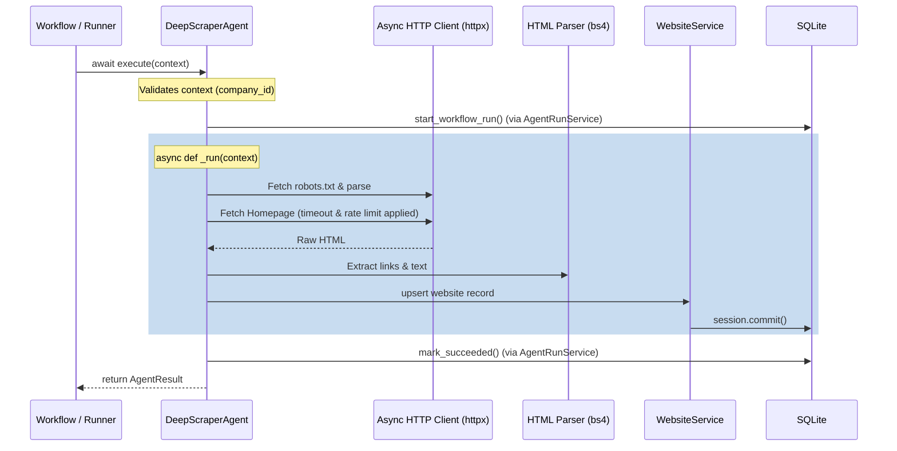

> **Status: IMPLEMENTED**

# Deep Scraper Agent: Architectural Design

This document details the architectural design for the **Deep Scraper Agent**, the first concrete agent implemented on top of the Agent Interface Foundation.

## 1. Architecture Overview

The Deep Scraper Agent is responsible for discovering, fetching, and parsing web pages related to a target company. It operates asynchronously to maximize I/O throughput, respects politeness policies (`robots.txt`), enforces concurrency limits, and stores results via the existing repository/service layer.

It inherits directly from `BaseAgent` and implements the abstract `_run(self, context: AgentContext) -> AgentRunOutput` method.

## 2. Agent Contract & Configuration

**Agent Identity:**
- `name`: `"deep_scraper"`
- `version`: `"1.0.0"`

**AgentContext Options:**
The agent expects the following optional keys in `context.options`:
- `crawl_depth` (int): Maximum depth of link traversal from the homepage (default: 1, meaning homepage only).
- `max_pages` (int): Maximum number of pages to scrape per run (default: 5).
- `concurrency_limit` (int): Maximum simultaneous HTTP requests (default: 3).
- `user_agent` (str): Custom User-Agent string (default: `"IrtiqaBot/1.0"`).
- `timeout_seconds` (float): HTTP request timeout (default: 10.0).

## 3. Core Logic & Execution Flow

1. **Target Resolution:** Use `CompanyService.get_required(context.company_id)` to retrieve the company and its primary `domain`.
2. **Robots.txt Enforcement:**
   - Fetch `https://{domain}/robots.txt` asynchronously.
   - Parse using Python's built-in `urllib.robotparser`.
   - Check `can_fetch(user_agent, url)` before fetching any URL.
3. **Async Crawling Strategy:**
   - Initialize an `asyncio.Semaphore(concurrency_limit)`.
   - Use an async HTTP client (e.g., `httpx.AsyncClient`).
   - Maintain a `visited` set to avoid infinite loops and deduplicate URLs.
   - Use `asyncio.TaskGroup` or `asyncio.gather` to process pages concurrently.
4. **Data Extraction:**
   - Extract raw HTML.
   - Extract outgoing links belonging to the same domain.
   - Categorize page type based on URL (e.g., `/pricing`, `/about`, `/contact`).
5. **Persistence:**
   - For each processed page, use `WebsiteService` to create or update a `Website` record.
   - `url`: The exact URL fetched.
   - `normalized_url`: Standardized format for unique indexing.
   - `page_type`: Categorization result.
   - `http_status`: HTTP status code returned.
   - `last_scraped_at`: UTC timestamp.
   - `raw_html`: The full HTML source.
   - `extracted_text`: Clean, visible text stripped of markup (e.g., Markdown).

## 4. Content Storage Strategy

**Recommendation: Store Both (Raw HTML and Extracted text)**

To serve the downstream agents effectively without duplicating I/O, the `websites` table must store both representations of the content:

1. **Why Raw HTML?** The **Technographic Agent** relies on structural and non-visible data (e.g., `<script src="...">`, `<meta name="generator">`, tracking IDs, and CSS classes). This data is completely lost if only text is stored.
2. **Why Extracted text?** The **Intent Signal Agent** and **Personalization Agent** rely on semantic understanding, often powered by LLMs or NLP. Passing raw HTML to these agents would waste token context windows on markup noise and degrade reasoning performance. They require clean, readable text.
3. **Why not Neither?** If the Deep Scraper does not persist the payload, the downstream agents would have to perform their own HTTP requests. This defeats the purpose of centralizing scraping logic (rate limiting, `robots.txt` compliance, concurrency, proxies) inside a dedicated agent.

*Note: Since the dedicated `evidence_records` table was deferred in the Agent Interface Foundation design, `raw_html` (Text/BLOB) and `extracted_text` (Text) columns should be added directly to the `websites` table in this phase. They can be migrated to `evidence_records` later.*

## 5. Dependencies

- **HTTP Client:** `httpx` (Fully async, supports HTTP/2, connection pooling, and timeouts).
- **HTML Parsing:** `beautifulsoup4` with `lxml` parser (Fast, robust against malformed HTML).
- **Concurrency:** Native `asyncio` (`Semaphore`, `TaskGroup`).
- **Robots Parsing:** `urllib.robotparser` (Standard library, populated with text fetched via `httpx`).

## 5. Database Interactions

The agent interacts exclusively with the database through the service layer, maintaining transaction boundaries:
- `CompanyService.get_required()`: Read company domain.
- `WebsiteService.create()` or `WebsiteService.update()`: Upsert website records.
- `AgentRunService` (Inherited from `BaseAgent`): Manages the `agent_runs` lifecycle.

**Output Mapping:**
The agent will return `AgentRunOutput` with `output_ids` populated mapping `"websites"` to the list of `Website.id` values created or updated during the run.

## 6. Error Handling Strategy

The agent leverages the structured error hierarchy introduced in the Agent Interface Foundation:
- **`httpx.TimeoutException`**: Caught and raised as `AgentTimeoutError`.
- **`httpx.ConnectError` / `httpx.ReadError`**: Caught and raised as `AgentNetworkError`.
- **HTTP 429 Too Many Requests**: Caught and raised as `AgentRateLimitError`.
- **Invalid Options**: Caught during `_validate_context` and raised as `AgentValidationError`.
- **Robots.txt Disallow**: Will not raise an error, but logs a warning and skips the URL. If the homepage is disallowed, the agent completes successfully but returns empty output IDs, noting the restriction in the `summary`.

## 7. Testing Strategy

1. **Unit Testing:**
   - Use `respx` or `pytest-httpx` to mock external HTTP responses (homepage, robots.txt, 404s, 429s).
   - Mock `CompanyService` and `WebsiteService` to verify persistence calls without hitting the database.
   - Verify concurrency logic (Semaphore limits) using mock delays.
2. **Integration Testing:**
   - Test against a local HTTP server (using Python's `http.server` or `pytest-httpserver`) to verify the full async HTTP lifecycle, parser extraction, and database persistence in a SQLite test database.

## 8. Risks & Mitigations

| Risk | Mitigation |
|------|------------|
| **Infinite crawling loops** (e.g., dynamic URLs) | Hardcap via `max_pages` and `crawl_depth`. Strict deduplication using `visited` set and URL normalization. |
| **IP Blocking / Rate Limiting** | Respect `robots.txt` `Crawl-delay`. Use a conservative default `concurrency_limit` (e.g., 3). Pass a descriptive User-Agent. |
| **Hanging HTTP Requests** | Strict `httpx.Timeout` applied to all outbound requests. |
| **Database Transaction Locks** (SQLite) | Asynchronous HTTP I/O is isolated from synchronous SQLAlchemy calls. Database operations execute briefly and release locks immediately. |
| **Malformed HTML Parsing blocking event loop** | `beautifulsoup4` parsing is CPU-bound. If parsing is heavy, it can be deferred to `asyncio.to_thread()`, though typically fast enough for typical B2B pages. |

---
## User Review Required

Please review the design for the Deep Scraper Agent. Let me know if you approve this architecture or if any modifications to dependencies (e.g., `httpx` vs `aiohttp`), crawl strategies, or persistence logic are required.
