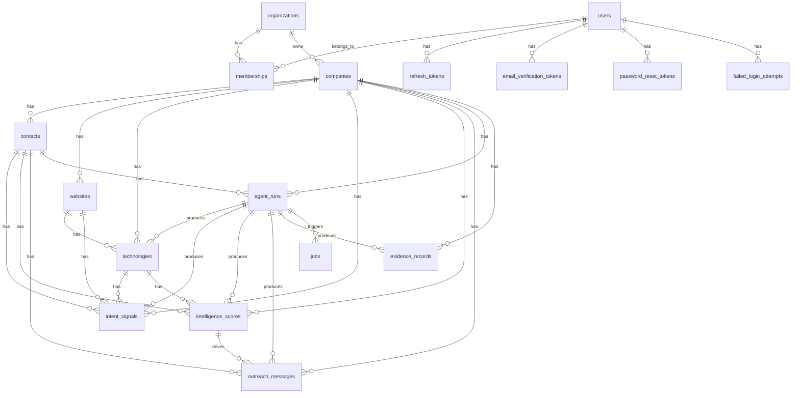

# Entity Relationships

Complete entity relationship documentation for all 17 tables.

## Relationship Diagram

## Table Purposes

### Core Intelligence Tables

| Table | Purpose |
|-------|---------|
| `companies` | Canonical company accounts. Primary lookup by domain. |
| `contacts` | People associated with companies. Replace the earlier planning term "leads". |
| `websites` | Company-related URLs discovered during enrichment. |
| `technologies` | Company-specific detected technology usage. |
| `intent_signals` | Buying intent, technology change, growth, and partnership signals. |
| `intelligence_scores` | Versioned score records for companies. Append-only. |
| `outreach_messages` | Outreach message drafts and personalization outputs. |
| `evidence_records` | Provenance links between intelligence outputs and source evidence. |

### System Tables

| Table | Purpose |
|-------|---------|
| `agent_runs` | Execution history for agents and workflows. |
| `jobs` | Scheduled background jobs for agent and workflow execution. |

### Auth & Multi-Tenancy Tables

| Table | Purpose |
|-------|---------|
| `users` | User accounts with email, password hash, display name. |
| `organizations` | Tenant organizations. |
| `memberships` | User-organization associations with roles (owner, admin, member, viewer). |
| `refresh_tokens` | Hashed refresh tokens for JWT renewal. |
| `email_verification_tokens` | Email verification tokens. |
| `password_reset_tokens` | Password reset tokens. |
| `failed_login_attempts` | Rate limiting records. |

## Foreign Key Relationships

### CASCADE Deletes (child owned by parent)

| Parent | Child | Column |
|--------|-------|--------|
| organizations | companies | organization_id |
| organizations | contacts | organization_id |
| organizations | intent_signals | organization_id |
| organizations | intelligence_scores | organization_id |
| organizations | outreach_messages | organization_id |
| organizations | evidence_records | organization_id |
| organizations | agent_runs | organization_id |
| companies | contacts | company_id |
| companies | technologies | company_id |
| companies | intent_signals | company_id |
| companies | intelligence_scores | company_id |
| companies | outreach_messages | company_id |
| companies | websites | company_id |
| websites | technologies | website_id |
| agent_runs | technologies | agent_run_id |
| agent_runs | intent_signals | agent_run_id |
| users | refresh_tokens | user_id |
| users | email_verification_tokens | user_id |
| users | password_reset_tokens | user_id |

### SET NULL on Delete (child survives parent)

| Parent | Child | Column |
|--------|-------|--------|
| contacts | intent_signals | contact_id |
| contacts | intelligence_scores | contact_id |
| contacts | outreach_messages | contact_id |
| websites | intent_signals | website_id |
| technologies | intent_signals | technology_id |
| technologies | intelligence_scores | technology_id |
| intelligence_scores | outreach_messages | intelligence_score_id |
| agent_runs | jobs | agent_run_id |

## Unique Constraints

| Table | Columns | Description |
|-------|---------|-------------|
| companies | organization_id, domain | One domain per organization |
| contacts | organization_id, email | One email per organization |
| technologies | company_id, name, category | Unique technology per company |
| organizations | slug | Global unique slug |

## Indexes

All domain tables have indexes on `organization_id` for tenant-scoped queries. Composite indexes exist for common query patterns:

- `intent_signals`: (organization_id, company_id, signal_type, observed_at)
- `intelligence_scores`: (organization_id, company_id, total_score)
- `outreach_messages`: (organization_id, company_id)
