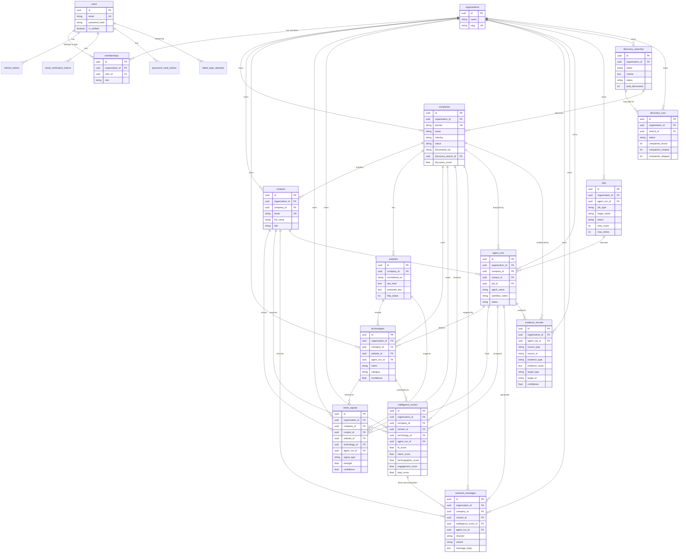
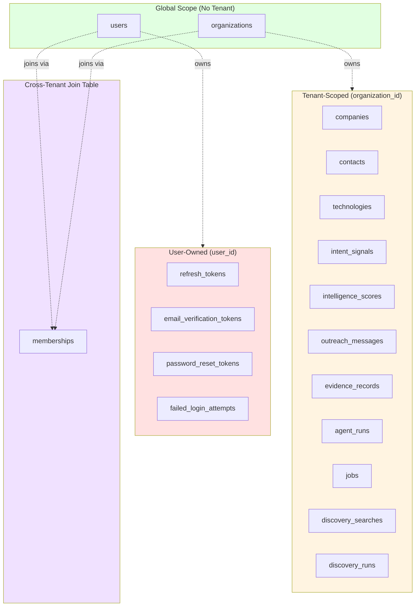
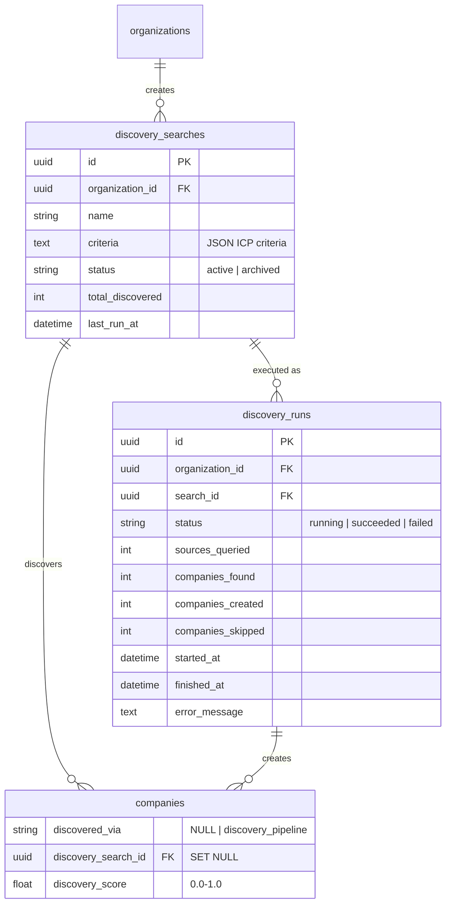

# Entity Relationships

Complete entity relationship documentation for all 19 tables in Irtiqa Intelligence.

> **Note:** For detailed table schemas, see [Database Design](database.md).

---

## Complete Entity Relationship Diagram

---

## Table Categories

### Core Intelligence Tables

| Table | Purpose | Owned By |
|-------|---------|----------|
| `companies` | Canonical company accounts. Primary lookup by domain. | Organization (tenant-scoped) |
| `contacts` | People associated with companies. | Organization (tenant-scoped) |
| `websites` | Company-related URLs discovered during enrichment. | Company |
| `technologies` | Company-specific detected technology usage. | Organization + Company |
| `intent_signals` | Buying intent, technology change, growth, partnership signals. | Organization + Company |
| `intelligence_scores` | Versioned score records for companies. Append-only. | Organization + Company |
| `outreach_messages` | Outreach message drafts and personalization outputs. | Organization + Company |
| `evidence_records` | Provenance links between intelligence outputs and source evidence. | Organization + Agent Run |

### System Tables

| Table | Purpose | Owned By |
|-------|---------|----------|
| `agent_runs` | Execution history for agents and workflows. | Organization |
| `jobs` | Scheduled background jobs for agent and workflow execution. | Organization |

### Discovery Engine Tables

| Table | Purpose | Owned By |
|-------|---------|----------|
| `discovery_searches` | Saved ICP search criteria for recurring or one-shot discovery. | Organization |
| `discovery_runs` | Execution history for discovery searches. | Organization + Search |

### Auth & Multi-Tenancy Tables

| Table | Purpose | Owned By |
|-------|---------|----------|
| `users` | User accounts with email, password hash, display name. | Global (not tenant-scoped) |
| `organizations` | Tenant organizations. | Global |
| `memberships` | User-organization associations with roles (owner, admin, member, viewer). | Organization + User |
| `refresh_tokens` | Hashed refresh tokens for JWT renewal. | User |
| `email_verification_tokens` | Email verification tokens. | User |
| `password_reset_tokens` | Password reset tokens. | User |
| `failed_login_attempts` | Rate limiting records. | User |

---

## Foreign Key Cascade Strategy

```mermaid
graph TD
    Org[organizations] -->|CASCADE| Companies[companies]
    Org -->|CASCADE| Contacts[contacts]
    Org -->|CASCADE| Technologies[technologies]
    Org -->|CASCADE| IntentSignals[intent_signals]
    Org -->|CASCADE| Scores[intelligence_scores]
    Org -->|CASCADE| Messages[outreach_messages]
    Org -->|CASCADE| Evidence[evidence_records]
    Org -->|CASCADE| AgentRuns[agent_runs]
    Org -->|CASCADE| Jobs[jobs]
    Org -->|CASCADE| Searches[discovery_searches]
    Org -->|CASCADE| Runs[discovery_runs]
    Org -->|CASCADE| Memberships[memberships]
    
    Companies -->|CASCADE| CompanyContacts[contacts]
    Companies -->|CASCADE| Websites[websites]
    Companies -->|CASCADE| CompanyTech[technologies]
    Companies -->|CASCADE| CompanySignals[intent_signals]
    Companies -->|CASCADE| CompanyScores[intelligence_scores]
    Companies -->|CASCADE| CompanyMessages[outreach_messages]
    
    Contacts -.->|SET NULL| ContactSignals[intent_signals.contact_id]
    Contacts -.->|SET NULL| ContactScores[intelligence_scores.contact_id]
    Contacts -.->|SET NULL| ContactMessages[outreach_messages.contact_id]
    
    AgentRuns -->|CASCADE| RunTech[technologies.agent_run_id]
    AgentRuns -->|CASCADE| RunSignals[intent_signals.agent_run_id]
    AgentRuns -.->|SET NULL| RunJobs[jobs.agent_run_id]
    
    Users -->|CASCADE| UserTokens[refresh_tokens]
    Users -->|CASCADE| UserVerification[email_verification_tokens]
    Users -->|CASCADE| UserReset[password_reset_tokens]
    Users -->|CASCADE| UserAttempts[failed_login_attempts]
    
    Searches -->|CASCADE| SearchRuns[discovery_runs]
    Searches -.->|SET NULL| SearchCompanies[companies.discovery_search_id]
    
    style Org fill:#e1f5ff
    style Companies fill:#fff4e1
    style Contacts fill:#f0e1ff
    style Users fill:#ffe1e1
    
    linkStyle 11,12,13 stroke:#ff6b6b,stroke-width:2px,stroke-dasharray: 5 5
    linkStyle 16 stroke:#ff6b6b,stroke-width:2px,stroke-dasharray: 5 5
    linkStyle 21 stroke:#ff6b6b,stroke-width:2px,stroke-dasharray: 5 5
```

**Legend:**
- **Solid arrows (→):** CASCADE delete — child records are deleted when parent is deleted
- **Dashed arrows (-.->):** SET NULL — child foreign key is set to NULL when parent is deleted

### CASCADE Deletes (Child Owned by Parent)

When the parent is deleted, all children are automatically deleted.

| Parent | Child | Column | Rationale |
|--------|-------|--------|-----------|
| `organizations` | `companies` | `organization_id` | Company belongs to organization |
| `organizations` | `contacts` | `organization_id` | Contact belongs to organization |
| `organizations` | `intent_signals` | `organization_id` | Signal belongs to organization |
| `organizations` | `intelligence_scores` | `organization_id` | Score belongs to organization |
| `organizations` | `outreach_messages` | `organization_id` | Message belongs to organization |
| `organizations` | `evidence_records` | `organization_id` | Evidence belongs to organization |
| `organizations` | `agent_runs` | `organization_id` | Agent run belongs to organization |
| `organizations` | `jobs` | `organization_id` | Job belongs to organization |
| `organizations` | `memberships` | `organization_id` | Membership belongs to organization |
| `organizations` | `discovery_searches` | `organization_id` | Search belongs to organization |
| `organizations` | `discovery_runs` | `organization_id` | Run belongs to organization |
| `companies` | `contacts` | `company_id` | Contact belongs to company |
| `companies` | `technologies` | `company_id` | Technology belongs to company |
| `companies` | `intent_signals` | `company_id` | Signal belongs to company |
| `companies` | `intelligence_scores` | `company_id` | Score belongs to company |
| `companies` | `outreach_messages` | `company_id` | Message belongs to company |
| `companies` | `websites` | `company_id` | Website belongs to company |
| `websites` | `technologies` | `website_id` | Technology detected on website |
| `agent_runs` | `technologies` | `agent_run_id` | Agent run produced technology |
| `agent_runs` | `intent_signals` | `agent_run_id` | Agent run produced signal |
| `users` | `refresh_tokens` | `user_id` | Token belongs to user |
| `users` | `email_verification_tokens` | `user_id` | Verification belongs to user |
| `users` | `password_reset_tokens` | `user_id` | Reset token belongs to user |
| `users` | `failed_login_attempts` | `user_id` | Attempt belongs to user |
| `discovery_searches` | `discovery_runs` | `search_id` | Run belongs to search |

### SET NULL on Delete (Child Survives Parent)

When the parent is deleted, the child's foreign key is set to NULL but the child record survives.

| Parent | Child | Column | Rationale |
|--------|-------|--------|-----------|
| `contacts` | `intent_signals` | `contact_id` | Signal may exist without specific contact attribution |
| `contacts` | `intelligence_scores` | `contact_id` | Score applies to company even if contact deleted |
| `contacts` | `outreach_messages` | `contact_id` | Message template survives contact deletion |
| `websites` | `intent_signals` | `website_id` | Signal may exist without specific website |
| `technologies` | `intent_signals` | `technology_id` | Signal may exist without technology link |
| `technologies` | `intelligence_scores` | `technology_id` | Score applies to company even if tech removed |
| `intelligence_scores` | `outreach_messages` | `intelligence_score_id` | Message template survives score recalculation |
| `agent_runs` | `jobs` | `agent_run_id` | Job record survives agent run cleanup |
| `discovery_searches` | `companies` | `discovery_search_id` | Company survives search deletion (provenance preserved) |

---

## Unique Constraints

Prevent duplicate data within tenant boundaries.

| Table | Columns | Description | Enforcement |
|-------|---------|-------------|-------------|
| `companies` | `(organization_id, domain)` | One domain per organization | Database UNIQUE constraint |
| `contacts` | `(organization_id, email)` | One email per organization | Database UNIQUE constraint |
| `technologies` | `(company_id, name, category)` | Unique technology per company | Database UNIQUE constraint |
| `organizations` | `slug` | Global unique slug | Database UNIQUE constraint |
| `users` | `email` | Global unique email | Database UNIQUE constraint |
| `memberships` | `(organization_id, user_id)` | One membership per user-org pair | Database UNIQUE constraint |

---

## Indexes for Performance

All domain tables have indexes on `organization_id` for tenant-scoped queries.

### Composite Indexes (Query Optimization)

| Table | Index Columns | Purpose |
|-------|--------------|---------|
| `intent_signals` | `(organization_id, company_id, signal_type, observed_at)` | Company signal timeline queries |
| `intelligence_scores` | `(organization_id, company_id, total_score)` | Lead retrieval with score filtering |
| `outreach_messages` | `(organization_id, company_id)` | Company outreach message lookup |
| `agent_runs` | `(organization_id, agent_name, status, created_at)` | Agent run history and monitoring |
| `jobs` | `(status, scheduled_at)` | Job scheduler polling query |
| `jobs` | `(target_name)` | Job filtering by agent/workflow name |
| `discovery_runs` | `(organization_id, search_id, status)` | Discovery run history queries |

---

## Data Ownership Model

### Ownership Rules

| Category | Tables | Access Pattern |
|----------|--------|----------------|
| **Global** | `users`, `organizations` | No tenant filter, globally unique |
| **Tenant-Scoped** | 11 domain tables | Always filtered by `organization_id` |
| **User-Owned** | 4 auth token tables | Filtered by `user_id`, no cross-user access |
| **Cross-Tenant** | `memberships` | Join table, filtered by both `organization_id` and `user_id` |

---

## Discovery Engine Relationships

Added in migration `20260618_0008`.

### Discovery Flow

1. User creates `discovery_search` with ICP criteria (industry, company size, technologies, keywords)
2. User triggers `discovery_run` for a search
3. `DiscoveryAgent` queries external sources (SEC EDGAR, Google News RSS, OpenCorporates)
4. `DiscoveryPipelineWorkflow` creates `companies` with:
   - `discovered_via = 'discovery_pipeline'`
   - `discovery_search_id` linking back to originating search
   - `discovery_score` (0.0-1.0) for prioritization
5. `discovery_run` updates statistics (companies_found, companies_created, companies_skipped)

See [Discovery Engine Design](lead_discovery_engine_final.md) for complete documentation.

---

## Related Documentation

- **[Database Design](database.md)** — Complete table schemas, column definitions, constraints
- **[Architecture Overview](architecture_overview.md)** — System layers, request lifecycle, multi-tenancy
- **[Agent System](agents.md)** — How agents create and link intelligence records
- **[Workflow System](workflows.md)** — How workflows orchestrate entity creation
- **[Authentication](authentication_multitenancy_v2_design.md)** — User, organization, membership design
- **[Discovery Engine](lead_discovery_engine_final.md)** — Discovery search and run lifecycle

---

**Last Updated:** 2026-07-01  
**Total Tables:** 19  
**Total Relationships:** 45+ foreign keys
