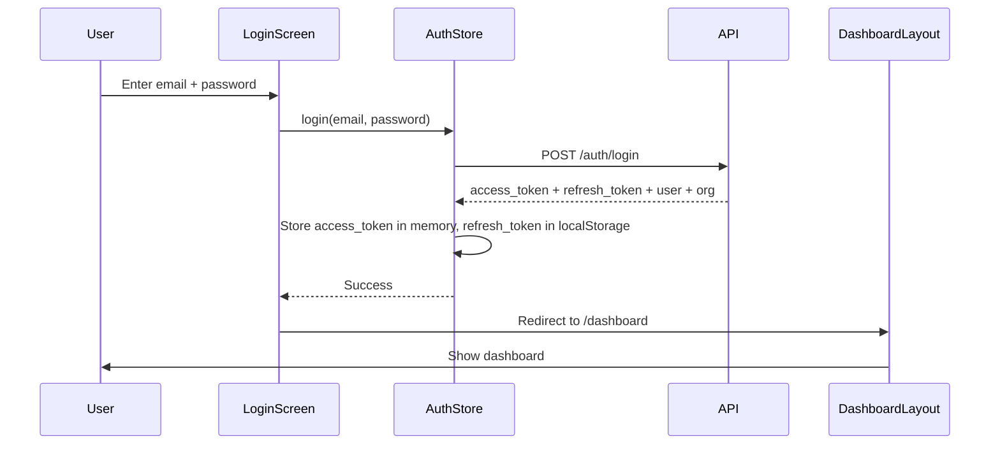
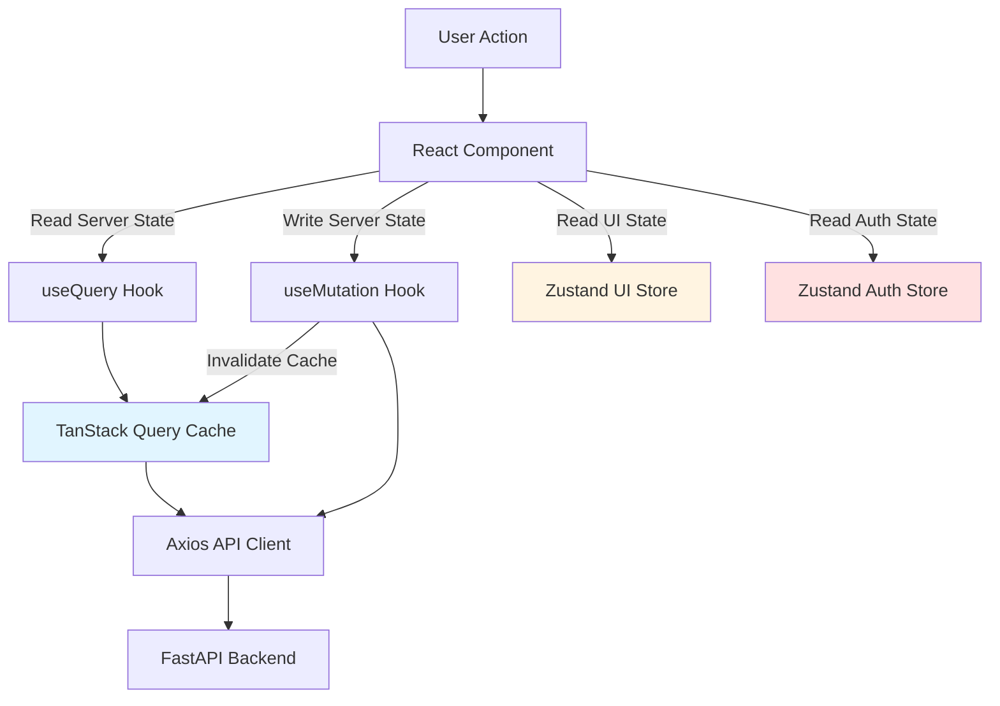

# Frontend Architecture — Irtiqa Intelligence MVP

> **Status:** Implementation Blueprint  
> **Created:** 2026-07-02  
> **Revision:** 2026-07-02 (contract-first corrections)  
> **Backend:** v0.1.0 — Production-ready multi-tenant REST API with RS256 JWT authentication. All endpoint contracts must be verified before implementation.

---

## 1. Product Goal & MVP User Journey

### Product Mission

Transform Irtiqa Intelligence from a headless backend into a self-service lead intelligence platform where sales teams can:

1. Define their ideal customer profile (ICP)
2. Discover companies matching that profile
3. Enrich discovered companies with intelligence
4. Review scored leads with buying signals
5. Generate personalized outreach

### MVP User Journey

```mermaid
flowchart LR
    Start[User arrives] --> Login[Login/Register]
    Login --> Dashboard[Dashboard Overview<br/>Scores & Stats]
    
    Dashboard --> Define[Define ICP Search<br/>Industry, Tech, Size]
    Define --> Discover[Run Discovery<br/>Background Job]
    Discover --> Review[Review Discovered<br/>Companies]
    
    Review --> Enrich{Trigger<br/>Enrichment?}
    Enrich -->|Yes| Pipeline[Intelligence Pipeline<br/>Background Job]
    Enrich -->|No| Review
    
    Pipeline --> Leads[Scored Leads List<br/>Filter by Score]
    Leads --> Detail[Company Detail<br/>Full Intelligence]
    
    Detail --> Outreach[Copy Outreach<br/>Messages]
    
    style Dashboard fill:#e1f5ff
    style Review fill:#fff4e1
    style Leads fill:#ffe1e1
    style Detail fill:#f0e1ff
```



**Core Loop:**  
Define ICP → Discover → Review → Enrich → Score → Copy Outreach

**Time to Value:** <5 minutes from signup to first scored lead

---

## 2. Route Map

### Public Routes (Unauthenticated)

| Path | Screen | Purpose |
|------|--------|---------|
| `/` | Login | Entry point, redirects to `/dashboard` if authenticated |
| `/register` | Registration | New account creation with email verification |
| `/verify-email?token={token}` | Email Verification | Confirms email, redirects to login |

### Authenticated Routes (Protected)

| Path | Screen | Auth Level | Purpose |
|------|--------|-----------|---------|
| `/dashboard` | Dashboard Overview | `viewer` | Stats, recent activity, quick actions |
| `/companies` | Companies List | `viewer` | All companies (manually added + discovered) |
| `/companies/{id}` | Company Detail | `viewer` | Full intelligence profile |
| `/leads` | Leads List | `viewer` | Scored leads only (filtered companies) |
| `/discovery/searches` | Discovery Searches | `viewer` | Saved ICP searches |
| `/discovery/searches/new` | Create Search | `member` | ICP builder form |
| `/discovery/searches/{id}` | Search Detail + Runs | `viewer` | Run history, trigger new run |
| `/discovery/runs/{id}` | Run Status | `viewer` | Live progress, discovered companies |
| `/jobs` | Background Jobs | `viewer` | All async tasks (discovery, pipeline) |
| `/jobs/{id}` | Job Detail | `viewer` | Job status (polling if running) |
| `/settings/profile` | User Profile | `viewer` | Display name, password change |

**Layout Structure:**

```text
/dashboard, /companies, /leads, /discovery, /jobs, /settings
  │
  └─> DashboardLayout (authenticated shell)
       ├─> Sidebar (navigation, collapsible on mobile)
       ├─> TopBar (org name, user menu)
       └─> <Page> (content area)

/, /register, /verify-email
  │
  └─> AuthLayout (public shell)
       └─> <Page> (centered card)
```

---

## 3. Dashboard Shell Layout

### Visual Structure

```text
┌────────────────────────────────────────────────────────────┐
│  TopBar                                                    │
│  ┌──────────────────┐  ┌─────────────┐  ┌──────────────┐ │
│  │ Irtiqa Logo      │  │ Org Name    │  │ User Menu    │ │
│  └──────────────────┘  └─────────────┘  └──────────────┘ │
├────────────────────────────────────────────────────────────┤
│                                                            │
│  ┌───────────┬──────────────────────────────────────────┐ │
│  │ Sidebar   │  Main Content Area                       │ │
│  │ (collaps. │                                           │ │
│  │  mobile)  │  <Route Component>                        │ │
│  │ Dashboard │                                           │ │
│  │ Leads     │  (Dashboard/Companies/Leads/Discovery/    │ │
│  │ Companies │   Jobs/Settings)                          │ │
│  │ Discovery │                                           │ │
│  │ Jobs      │  Data tables scroll horizontally on       │ │
│  │ Settings  │  narrow screens.                          │ │
│  │           │                                           │ │
│  └───────────┴──────────────────────────────────────────┘ │
│                                                            │
└────────────────────────────────────────────────────────────┘
```

### Sidebar Navigation

```typescript
// Navigation items grouped by concern
const navigation = [
  {
    label: "Overview",
    items: [
      { label: "Dashboard", href: "/dashboard", icon: "LayoutGrid" }
    ]
  },
  {
    label: "Intelligence",
    items: [
      { label: "Leads", href: "/leads", icon: "Target" },
      { label: "Companies", href: "/companies", icon: "Building2" },
      { label: "Discovery", href: "/discovery/searches", icon: "Search" }
    ]
  },
  {
    label: "System",
    items: [
      { label: "Jobs", href: "/jobs", icon: "Clock" },
      { label: "Settings", href: "/settings/profile", icon: "Settings" }
    ]
  }
];
```

### TopBar Components

#### Organization Display (Read-Only for MVP)

```typescript
// Shows current organization name from login response
<div className="flex items-center gap-2">
  <Building2 className="h-4 w-4 text-muted-foreground" />
  <span className="text-sm font-medium">{organization?.name || 'Personal'}</span>
</div>
```

**Behavior:**
- Displays organization name from the authenticated session response/store. Do not decode JWT claims for UI unless the token contract is explicitly verified.
- No switching in MVP — requires backend endpoint to list user's memberships
- Deferred to Phase 2: multi-org switcher with membership fetch

#### User Account Menu (Dropdown)

```text
┌─────────────────────────┐
│ user@example.com        │
│ Viewer @ Acme Corp      │
├─────────────────────────┤
│ Profile                 │
├─────────────────────────┤
│ Logout                  │
└─────────────────────────┘
```

**Note:** Organization Settings removed from MVP. See "Deferred UI" section below.

---

## 4. Initial Screens (Build Order)

### 4.1 Login Screen (`/`)

**Purpose:** Entry point for existing users.

**API Calls:**
- `POST /auth/login` — Returns access_token, refresh_token, user, organization

**UI Elements:**
- Email input (with validation)
- Password input (masked)
- "Login" button (primary)
- "Forgot password?" link (future — deferred to Phase 2)
- "Don't have an account? Register" link → `/register`

**State:**
- Form state: email, password
- Loading state: isLoggingIn
- Error state: loginError (from API 401/403/429)

**Success Flow:**
1. Store access_token in memory (Zustand store)
2. Store refresh_token in localStorage via Zustand persist middleware
3. Store user and organization in Zustand
4. Redirect to `/dashboard`

**Note:** Backend returns tokens in JSON response body (not httpOnly cookies). See Section 6 for authentication security limitations.

**Error Handling:**
- 401: "Invalid email or password"
- 429: "Too many login attempts. Try again in X minutes."
- 500: "Server error. Please try again."

---

### 4.2 Register Screen (`/register`)

**Purpose:** New user account creation.

**API Calls:**
- `POST /auth/register` — Returns user_id, email, message, organization (if org created)

**UI Elements:**
- Email input
- Password input (with strength indicator)
- Display name input
- "Create Account" button
- "Already have an account? Login" link → `/`

**Post-Registration:**
- Show success message: "Account created! Check your email to verify."
- Display verification token in dev mode (from API response message)
- Redirect to `/verify-email` with email pre-filled

**Validation:**
- Email: min 5, max 320, valid format
- Password: min 8, max 128, must include uppercase, lowercase, number
- Display name: min 1, max 200

---

### 4.3 Dashboard Overview (`/dashboard`)

**Purpose:** High-level stats and recent activity.

**API Calls:**
- `GET /leads?limit=5&minimum_score=70` — Top 5 recent leads
- `GET /discovery/runs?limit=5` — Recent discovery runs
- `GET /jobs?limit=5` — Recent background jobs

**UI Elements:**

```text
┌───────────────────────────────────────────────────────────┐
│  Welcome back, {display_name}                             │
├───────────────────────────────────────────────────────────┤
│  Top Leads (minimum score 70)                             │
│  ┌─────────────────────────────────────────────────────┐ │
│  │ Acme Corp | 89.2 | Hiring signals + HubSpot       │ │
│  │ Beta Inc  | 82.4 | Series A funding              │ │
│  │ ...                                                 │ │
│  └─────────────────────────────────────────────────────┘ │
├───────────────────────────────────────────────────────────┤
│  Recent Discovery Runs                                    │
│  ┌─────────────────────────────────────────────────────┐ │
│  │ Fintech Series A | 42 found | 12 new | 5 min ago  │ │
│  │ ...                                                 │ │
│  └─────────────────────────────────────────────────────┘ │
├───────────────────────────────────────────────────────────┤
│  Recent Background Jobs                                   │
│  ┌─────────────────────────────────────────────────────┐ │
│  │ Discovery: Fintech | running | started 2 min ago   │ │
│  │ ...                                                 │ │
│  └─────────────────────────────────────────────────────┘ │
└───────────────────────────────────────────────────────────┘
```

**Quick Actions:**
- "New Discovery Search" button → `/discovery/searches/new`
- "View All Leads" button → `/leads`

**Refresh Behavior:**
- Manual refresh only (no auto-polling)
- Data refetched on page navigation back to dashboard

---

### 4.4 Companies List (`/companies`)

**Purpose:** All companies (manual + discovered), filterable by status.

**API Calls:**
- `GET /companies?limit=50&offset=0` — Paginated companies

**UI Elements:**
- Table columns: Name, Domain, Industry, Status, Updated At, Actions
- Pagination: Previous/Next, Page size selector (25/50/100)
- "Add Company" button (member+) → Opens modal/drawer
- Table scrolls horizontally on narrow screens (mobile)

**Filtering/Sorting (requires verification):**
- Filter by status (all/active/needs_review/archived) — verify `?status=` parameter support
- Search by name/domain — verify backend query parameter support
- Sort by columns — verify backend `?order_by=` parameter support

**Row Actions:**
- View Details → `/companies/{id}`
- Trigger Enrichment (if status=needs_review) → Calls `POST /intelligence/pipeline`
- Archive (admin+) → `PATCH /companies/{id}` with `status=archived`

**Empty State:**
- "No companies yet. Run a discovery search to find companies matching your ICP."
- "Add Company Manually" button

---

### 4.5 Company Detail (`/companies/{id}`)

**Purpose:** Full intelligence profile for a single company.

**API Calls:**
- `GET /companies/{id}` — Company data (verified)
- `GET /technologies?company_id={id}` — Technologies filtered by company
- `GET /intent-signals?company_id={id}` — Intent signals filtered by company
- `GET /intelligence-scores?company_id={id}` — Scores filtered by company
- `GET /outreach-messages?company_id={id}` — Outreach filtered by company
- `GET /evidence/by-company/{id}` — Provenance trail (verified: uses path param `company_id`)

**UI Sections (Tabs):**

```text
┌─────────────────────────────────────────────────────────┐
│  Acme Corp                                  Status: Active│
│  acme.com | Fintech | 50-200 employees                  │
│                                                           │
│  [Overview] [Technologies] [Intent] [Outreach] [Evidence]│
├─────────────────────────────────────────────────────────┤
│  Overview:                                                │
│  - Intelligence Score: 89.2 / 100                         │
│    - Fit Score: 92.0 (industry + size match)             │
│    - Intent Score: 86.4 (hiring + funding signals)       │
│  - Description: {company.description}                     │
│  - LinkedIn: {company.linkedin_url}                       │
│                                                           │
│  Technologies (8):                                        │
│  [HubSpot] [Salesforce] [Stripe] [AWS] ...              │
│                                                           │
│  Intent Signals (3):                                      │
│  - Hiring Engineering Manager (0.92 confidence)          │
│  - Series A funding announced (0.88 confidence)          │
│  - Technology migration to cloud (0.76 confidence)       │
│                                                           │
│  Outreach (2 variants):                                   │
│  ┌───────────────────────────────────────────────────┐  │
│  │ Subject: Noticed your Series A — Congrats!       │  │
│  │ Body: Hi {first_name}, ...                        │  │
│  │ [Copy to Clipboard]                               │  │
│  └───────────────────────────────────────────────────┘  │
└─────────────────────────────────────────────────────────┘
```

**Actions:**
- "Trigger Re-Enrichment" (member+) → `POST /intelligence/pipeline` with company_id
- "Edit Company" (member+) → Inline edit or modal
- "Archive" (admin+) → `PATCH /companies/{id}` with `status=archived`

**Data Loading Strategy:**
- Show company header immediately (from initial fetch)
- Load tab data independently with skeleton loaders
- Technologies/signals/scores/outreach load in parallel (batch queries)
- Evidence tab loads on-demand (not pre-fetched)

---

### 4.6 Leads List (`/leads`)

**Purpose:** High-score companies with full intelligence (primary sales view).

**API Calls:**
- `GET /leads?limit=50&offset=0&minimum_score=70` — Aggregated leads

**UI Elements:**
- Score filter slider: Minimum Score (0-100, default 70) — uses `?minimum_score=` parameter (verified)
- Card grid or table:
  - Company Name, Domain, Industry
  - Score badges: Total / Fit / Intent
  - Top 3 technologies (icons or text)
  - Top 2 intent signals (truncated)
  - "View Details" button → `/companies/{id}`
- If using table: scrolls horizontally on narrow screens

**Sorting (requires verification):**
- Sort by Total Score, Updated At, Company Name — verify backend `?order_by=` support

**Empty State:**
- "No scored leads yet. Discover companies and trigger enrichment to generate leads."
- "Run Discovery" button → `/discovery/searches/new`

---

### 4.7 Discovery Searches List (`/discovery/searches`)

**Purpose:** Saved ICP search definitions.

**API Calls:**
- `GET /discovery/searches?limit=50&offset=0` — All searches

**UI Elements:**
- Table columns: Name, Criteria Summary, Last Run, Total Discovered, Actions
- "New Search" button (member+) → `/discovery/searches/new`
- Table scrolls horizontally on narrow screens

**Filtering/Sorting (requires verification):**
- Search by name — verify backend query parameter support
- Sort columns — verify `?order_by=` parameter support

**Row Actions:**
- View Details → `/discovery/searches/{id}`
- Run Search (member+) → `POST /discovery/searches/{id}/run` → redirects to `/discovery/runs/{run_id}`
- Edit (member+) → `/discovery/searches/new?id={id}` (pre-fill form)
- Archive (admin+) → `PATCH /discovery/searches/{id}` with `status=archived`

**Criteria Summary Display:**
- "Fintech | 50-200 employees | US | HubSpot, Salesforce"

---

### 4.8 Discovery Search Form (`/discovery/searches/new`)

**Purpose:** ICP builder for discovery criteria.

**API Calls:**
- `POST /discovery/searches` — Create new search
- `GET /discovery/searches/{id}` (if editing) — Pre-fill form

**Form Fields:**

```typescript
interface SearchForm {
  name: string;                    // "Fintech Series A"
  description?: string;            // Optional notes
  criteria: {
    industry: string;              // "Fintech" (required)
    company_size_min?: number;     // 50
    company_size_max?: number;     // 200
    geography?: string;            // "United States"
    technologies: string[];        // ["hubspot", "salesforce"]
    keywords: string[];            // ["Series A", "hiring"] (required, min 1)
    exclude_domains: string[];     // ["competitor.com"]
    sources: string[];             // ["sec_edgar", "google_news_rss", "opencorporates"]
  };
}
```

**UI Layout:**
- Section 1: Name & Description
- Section 2: Industry (required)
- Section 3: Company Size (min/max sliders)
- Section 4: Geography (text input or dropdown)
- Section 5: Technologies (multi-select tags input)
- Section 6: Keywords (multi-input, required)
- Section 7: Exclude Domains (multi-input)
- Section 8: Sources (checkboxes, all selected by default)
- "Save & Run" button (creates search + triggers run)
- "Save Draft" button (creates search with status=active but doesn't run)

**Validation:**
- Industry: required, max 150 chars
- Keywords: required, min 1 keyword
- Company size min ≤ max

---

### 4.9 Discovery Run Status (`/discovery/runs/{id}`)

**Purpose:** Live progress tracking for a discovery run.

**API Calls:**
- `GET /discovery/runs/{id}` — Run status (poll every 5s if status=running)

**UI Elements:**

```text
┌─────────────────────────────────────────────────────────┐
│  Discovery Run: Fintech Series A                        │
│  Status: Running | Started: 2 min ago                   │
├─────────────────────────────────────────────────────────┤
│  Sources Queried: 2                                      │
│  Companies Found: 42                                     │
│  Companies Created: 38                                   │
│  Companies Skipped: 4                                    │
└─────────────────────────────────────────────────────────┘

[View All Companies] → /companies
```

**Note:** Backend returns only aggregate counters (`sources_queried`, `companies_found`, `companies_created`, `companies_skipped`). Per-source progress (e.g., "SEC EDGAR ✓") is NOT available in the API. The UI must show aggregate numbers only.

**Polling:**
- Poll every 5s while status=running
- Stop polling when status=succeeded or status=failed
- Show error message if status=failed

**Success State:**
- "Run completed! 38 new companies discovered."
- "View All Companies" button → `/companies` (no filter — see Deferred UI section)
- "Run Again" button (member+)

---

### 4.10 Jobs List (`/jobs`)

**Purpose:** Background job monitoring (discovery + intelligence pipeline).

**API Calls:**
- `GET /jobs?limit=50&offset=0` — All jobs (verified: `status` and `target_name` filters supported)

**UI Elements:**
- Status filter: All / Running / Succeeded / Failed / Cancelled (verified: "pending", "running", "succeeded", "failed", "cancelled")
- Sort: Started At (desc), Status
- Table columns: Job Type, Target Name, Status, Started, Duration, Actions
- Refresh button (manual refresh only)

**Row Actions:**
- View Details → `/jobs/{id}`
- Cancel (if running, any org member) → `POST /jobs/{id}/cancel` (verified: no role check beyond org membership)
- Retry (if failed, any org member) → `POST /jobs/{id}/retry` (verified: no role check beyond org membership)

**Job Type Display:**
- `job_type=workflow` + `target_name=discovery_pipeline` → "Discovery"
- `job_type=workflow` + `target_name=intelligence_pipeline` → "Enrichment"

**Refresh Behavior:**
- Manual refresh only
- No auto-polling (users can manually refresh if monitoring active jobs)

---

### 4.11 Job Detail (`/jobs/{id}`)

**Purpose:** Detailed job status (polls if running).

**API Calls:**
- `GET /jobs/{id}` — Job record (poll every 5s if status=running or status=pending)

**UI Elements:**

```text
┌─────────────────────────────────────────────────────────┐
│  Job: Discovery Pipeline                                │
│  Status: Succeeded | Duration: 3m 42s                   │
├─────────────────────────────────────────────────────────┤
│  Details:                                                 │
│  - Type: workflow                                         │
│  - Target: discovery_pipeline                            │
│  - Started: 2026-07-02 14:32:18                          │
│  - Completed: 2026-07-02 14:36:00                        │
│  - Retry Count: 0 / 3 max                                │
│                                                           │
│  Payload (JSON):                                          │
│  {                                                        │
│    "workflow_name": "discovery_pipeline",                 │
│    "options": { "discovery_search_id": "..." }           │
│  }                                                        │
│                                                           │
│  Last Error: null                                         │
└─────────────────────────────────────────────────────────┘

[Retry] [Cancel] (verify endpoint requirements)
```

**Job Read Fields (verified):** `id`, `created_at`, `updated_at`, `job_type` (enum: "agent", "workflow"), `target_name`, `payload` (string — JSON payload), `status` (enum: "pending", "running", "succeeded", "failed", "cancelled"), `scheduled_at`, `started_at` (nullable), `completed_at` (nullable), `retry_count`, `max_retries`, `last_error` (nullable), `agent_run_id` (nullable)

**Polling Behavior:**
- Poll every 5s while `status=pending` or `status=running`
- Stop polling when `status=succeeded`, `status=failed`, or `status=cancelled`

**Note:** Agent run logs deferred — requires backend endpoint `GET /agent-runs?job_id={id}`

---

### 4.12 Settings: User Profile (`/settings/profile`)

**Purpose:** User account settings.

**API Calls:**
- `GET /auth/me` — Current user data
- `PATCH /auth/me` — Update display name
- `DELETE /auth/me` — Delete account (requires confirmation)

**UI Elements:**
- Display name input (editable)
- Email (read-only, verified badge)
- Password change section (future: `PATCH /auth/password`)
- "Save Changes" button
- "Delete Account" button (dangerous action, requires confirmation modal)

---

## 5. API Integration Map

### Screen → Endpoint Mapping

| Screen | Primary Endpoints | Secondary/Optional |
|--------|------------------|-------------------|
| **Login** | `POST /auth/login` | `POST /auth/refresh` |
| **Register** | `POST /auth/register` | `POST /auth/verify-email` |
| **Dashboard** | `GET /leads?limit=5` | `GET /discovery/runs?limit=5`, `GET /jobs?limit=5` |
| **Companies List** | `GET /companies` | `POST /companies`, `PATCH /companies/{id}`, `DELETE /companies/{id}` |
| **Company Detail** | `GET /companies/{id}`, `GET /technologies`, `GET /intent-signals`, `GET /intelligence-scores`, `GET /outreach-messages` | `GET /evidence/by-company/{id}`, `POST /intelligence/pipeline` |
| **Leads List** | `GET /leads` | - |
| **Discovery Searches** | `GET /discovery/searches` | `POST /discovery/searches`, `PATCH /discovery/searches/{id}`, `DELETE /discovery/searches/{id}` |
| **Search Form** | `POST /discovery/searches` | `GET /discovery/searches/{id}`, `POST /discovery/searches/{id}/run` |
| **Run Status** | `GET /discovery/runs/{id}` | - |
| **Jobs List** | `GET /jobs` | `POST /jobs/{id}/cancel`, `POST /jobs/{id}/retry` |
| **Job Detail** | `GET /jobs/{id}` | - |
| **Profile** | `GET /auth/me`, `PATCH /auth/me` | `DELETE /auth/me` |

**Note:** All endpoints must be verified against OpenAPI schema before implementation. Query parameter support (filters, sorting) must be confirmed per endpoint.

---

## 6. Authentication Strategy

### JWT Flow (Compatible with Backend RS256)

```mermaid
sequenceDiagram
    participant User
    participant Frontend
    participant API
    
    User->>Frontend: Enter credentials
    Frontend->>API: POST /auth/login
    API-->>Frontend: access_token + refresh_token + user + organization (nullable)
    Frontend->>Frontend: Store access_token in memory (Zustand)
    Frontend->>Frontend: Store refresh_token in localStorage via Zustand persist
    Frontend->>Frontend: Store user and organization in Zustand
    
    Note over Frontend: access_token not persisted; lost on page reload
    Note over Frontend: user/organization stored from login only; NOT returned by refresh
    
    Frontend->>API: GET /leads (with Bearer token)
    API-->>Frontend: 401 Unauthorized
    Frontend->>API: POST /auth/refresh (with refresh_token)
    API-->>Frontend: new access_token + new refresh_token (NO user/org)
    Frontend->>Frontend: Update tokens only (keep existing user/org)
    Frontend->>API: GET /leads (retry with new token)
    API-->>Frontend: Lead data
```

### Token Storage

| Token | Storage | Rationale |
|-------|---------|-----------|
| `access_token` | Memory (Zustand store) | Never persisted. Expires when page reloads — user must use refresh token to get a new access token. |
| `refresh_token` | localStorage (with Zustand persist middleware) | Backend returns refresh token as a string in JSON response body (not httpOnly cookie). Must be stored client-side for automatic token refresh. |

**MVP Authentication Limitations:**

The current backend returns tokens as JSON strings, not httpOnly cookies. This means:
- Refresh tokens are accessible to JavaScript (XSS risk if exploited)
- No CSRF protection from cookie SameSite attributes
- Tokens survive page reload via localStorage

**Future Hardening Path (Phase 2):**
- Backend sets refresh token as httpOnly, secure, SameSite=Strict cookie
- Frontend calls `/auth/refresh` with no body (cookie sent automatically)
- Remove localStorage persistence of refresh token
- Significantly reduces XSS/CSRF attack surface

### Token Refresh Strategy

```typescript
// Zustand auth store
interface AuthStore {
  accessToken: string | null;
  refreshToken: string | null;
  user: User | null;
  organization: Organization | null;
  authStatus: 'initializing' | 'authenticated' | 'unauthenticated';
  
  login: (email: string, password: string) => Promise<void>;
  logout: () => Promise<void>;
  refreshAccessToken: () => Promise<void>;
  bootstrap: () => Promise<void>; // Called on app hydration
}

// Axios interceptor pattern (architecture pseudocode — NOT production-ready)
// Implementation requirements:
// - Never refresh/retry /auth/refresh itself
// - Never refresh/retry /auth/logout
// - Never refresh/retry a request already marked _retry
// - Use a single shared in-flight refresh promise/lock so concurrent 401s wait for one refresh
// - If refresh fails, clear auth state and reject all queued/retried requests

let refreshPromise = null; // Shared lock for concurrent 401s

axios.interceptors.response.use(
  response => response,
  async error => {
    const originalRequest = error.config;
    const url = originalRequest.url || '';
    
    // Never retry refresh, logout, or already-retried requests
    if (url.includes('/auth/refresh') || url.includes('/auth/logout') || originalRequest._retry) {
      return Promise.reject(error);
    }
    
    // If 401 and not already retrying, refresh token
    if (error.response?.status === 401) {
      originalRequest._retry = true;
      
      try {
        // Use shared lock to prevent multiple simultaneous refresh calls
        if (!refreshPromise) {
          refreshPromise = authStore.refreshAccessToken().finally(() => {
            refreshPromise = null;
          });
        }
        await refreshPromise;
        
        originalRequest.headers.Authorization = `Bearer ${authStore.accessToken}`;
        return axios(originalRequest);
      } catch (refreshError) {
        // Refresh failed — clear auth state, reject this request and all queued
        authStore.logout();
        return Promise.reject(refreshError);
      }
    }
    
    return Promise.reject(error);
  }
);
```

### Organization Context

- Use `organization` object returned by `POST /auth/login` response (verified: `LoginResponse.organization` is `OrganizationSummary | null`)
- `POST /auth/refresh` does **NOT** return user or organization — only `access_token` + `refresh_token`
- Display organization name from the stored login response (not JWT claim decoding)
- Organization ID is NOT trusted for authorization — backend enforces all tenant boundaries
- Backend verifies membership on every request via `get_current_organization` dependency (decodes JWT, looks up membership in DB)
- `OrganizationSummary` fields: `id`, `name`, `slug`, `role` (all required strings)
- `UserResponse` fields: `id`, `email`, `display_name`, `is_active`, `created_at` — **no role field**

### Auth Bootstrap & Protected Routes

**Bootstrap Flow (on app load/page reload):**

```typescript
// lib/stores/auth-store.ts
export const useAuthStore = create<AuthStore>()(
  persist(
    (set, get) => ({
      accessToken: null,
      refreshToken: null,
      user: null,
      organization: null,
      authStatus: 'initializing',
      
      bootstrap: async () => {
        // Implementation requirement:
        // 1. Wait for Zustand persist hydration via a hydration flag or onRehydrateStorage callback
        // 2. Call bootstrap exactly once after hydration is complete
        // 3. Prevent multiple simultaneous refresh requests (use a flag or promise cache)
        // 4. Never intercept/retry the refresh endpoint itself, logout endpoint, or a request already marked as refresh retry
        
        const { refreshToken } = get();
        
        if (!refreshToken) {
          set({ authStatus: 'unauthenticated' });
          return;
        }
        
        try {
          // Try to refresh access token on app hydration
          const response = await apiClient.post('/auth/refresh', { refresh_token: refreshToken });
          set({
            accessToken: response.data.access_token,
            refreshToken: response.data.refresh_token,
            authStatus: 'authenticated',
          });
        } catch (error) {
          // Refresh failed — clear tokens and mark unauthenticated
          set({
            accessToken: null,
            refreshToken: null,
            user: null,
            organization: null,
            authStatus: 'unauthenticated',
          });
        }
      },
      
      // ... other methods
    }),
    {
      name: 'irtiqa-auth-state',
      partialize: (state) => ({
        refreshToken: state.refreshToken,
        user: state.user,
        organization: state.organization,
      }),
    }
  )
);
```

**Protected Route Component:**

```typescript
// app/(authenticated)/layout.tsx
export default function AuthenticatedLayout({ children }) {
  const { authStatus, bootstrap } = useAuthStore();
  const router = useRouter();
  
  useEffect(() => {
    // Run bootstrap on mount
    bootstrap();
  }, []);
  
  useEffect(() => {
    if (authStatus === 'unauthenticated') {
      router.push('/');
    }
  }, [authStatus]);
  
  if (authStatus === 'initializing') {
    return <LoadingSpinner />;
  }
  
  if (authStatus === 'unauthenticated') {
    return null; // Redirecting
  }
  
  return <DashboardLayout>{children}</DashboardLayout>;
}
```

**Note:** This pattern ensures users with valid refresh tokens stay logged in across page reloads. Access tokens are never persisted — they're fetched fresh on every app bootstrap.

---

## 7. Proposed Frontend Stack

### Core Framework

**Next.js (App Router) — latest stable version from create-next-app**

**Rationale:**
- Server Components reduce client bundle size
- Built-in routing with file-system convention
- MVP route protection is client-side after auth-store hydration and refresh bootstrap; server-side middleware/proxy cannot reliably validate a localStorage-held refresh token
- Optimized production builds
- Large ecosystem and deployment options

**Alternatives Rejected:**
- Vite + React Router: More config, no built-in SSR
- Remix: Excellent, but Next.js has broader adoption for this use case

---

### Language

**TypeScript — latest stable version**

**Rationale:**
- Type-safe API contracts
- Compile-time error detection
- Better IDE support (autocomplete, refactoring)
- Matches backend's type-heavy architecture

---

### Styling

**Tailwind CSS — latest stable version**

**Rationale:**
- Utility-first, rapid prototyping
- No CSS-in-JS runtime overhead
- Excellent design system integration with shadcn/ui
- Highly customizable through the generated Tailwind configuration or CSS-first theme conventions, depending on the installed version

**Alternatives Rejected:**
- Emotion/Styled Components: Runtime overhead, harder SSR
- Plain CSS: Too much boilerplate for MVP velocity

---

### Component Library

**shadcn/ui (Radix UI + Tailwind)**

**Rationale:**
- Copy-paste components (not a dependency) — full control
- Accessible by default (Radix primitives)
- Tailwind-native styling
- Covers 90% of UI needs: Button, Card, Table, Dialog, Dropdown, Input, Select, etc.

**Component Inventory for MVP:**
- Button, Input, Select, Checkbox, Textarea
- Card, Separator, Badge
- Dialog, Sheet (for modals/drawers)
- Table, Pagination
- Dropdown Menu, Command (for search)
- Toast (for notifications)
- Skeleton (for loading states)

**Alternatives Rejected:**
- Material-UI: Heavy bundle, opinionated styles
- Ant Design: Excellent, but harder to customize
- Headless UI: Good, but shadcn/ui is more batteries-included

---

### Data Fetching

**TanStack Query (React Query) v5+**

**Rationale:**
- Declarative data fetching with `useQuery`, `useMutation`
- Built-in caching, refetching, optimistic updates
- Automatic loading/error states
- Pagination support (`useInfiniteQuery`)
- Perfect fit for REST API consumption

**Query Key Strategy:**

```typescript
// Query keys namespace by entity
const queryKeys = {
  auth: {
    me: ['auth', 'me'],
  },
  companies: {
    all: ['companies'],
    list: (filters) => ['companies', 'list', filters],
    detail: (id) => ['companies', 'detail', id],
  },
  leads: {
    list: (filters) => ['leads', 'list', filters],
  },
  discovery: {
    searches: {
      all: ['discovery', 'searches'],
      list: (filters) => ['discovery', 'searches', 'list', filters],
      detail: (id) => ['discovery', 'searches', 'detail', id],
    },
    runs: {
      all: ['discovery', 'runs'],
      detail: (id) => ['discovery', 'runs', 'detail', id],
    },
  },
  jobs: {
    all: ['jobs'],
    list: (filters) => ['jobs', 'list', filters],
    detail: (id) => ['jobs', 'detail', id],
  },
};
```

**Alternatives Rejected:**
- SWR: Good, but TanStack Query has better pagination and cache invalidation
- RTK Query: Excellent with Redux, but we don't need Redux for this app

---

### Forms

**React Hook Form v7+ + Zod**

**Rationale:**
- Minimal re-renders (uncontrolled forms)
- Built-in validation with Zod schemas
- Excellent TypeScript support
- Field-level errors, dirty state tracking

**Example Form:**

```typescript
const searchFormSchema = z.object({
  name: z.string().min(1).max(255),
  description: z.string().optional(),
  criteria: z.object({
    industry: z.string().min(1).max(150),
    company_size_min: z.number().int().min(1).optional(),
    company_size_max: z.number().int().min(1).optional(),
    geography: z.string().max(150).optional(),
    technologies: z.array(z.string()),
    keywords: z.array(z.string()).min(1),
    exclude_domains: z.array(z.string()),
    sources: z.array(z.enum(['sec_edgar', 'google_news_rss', 'opencorporates'])),
  }),
});

type SearchForm = z.infer<typeof searchFormSchema>;

const form = useForm<SearchForm>({
  resolver: zodResolver(searchFormSchema),
  defaultValues: { ... },
});
```

**Alternatives Rejected:**
- Formik: Heavier, more re-renders
- Native form validation: Not type-safe, harder to customize

---

### State Management

**Zustand v4+ (for auth + UI state)**

**Rationale:**
- Minimal boilerplate (no actions/reducers)
- Small bundle size (~1KB)
- Works with React Context + hooks
- Persist middleware for localStorage sync

**Stores:**

```typescript
// Auth store (global)
interface AuthStore {
  accessToken: string | null;
  refreshToken: string | null;
  user: User | null;
  organization: Organization | null;
  login: (email: string, password: string) => Promise<void>;
  logout: () => Promise<void>;
  refreshAccessToken: () => Promise<void>;
}

// UI store (global)
interface UIStore {
  sidebarCollapsed: boolean;
  toggleSidebar: () => void;
}
```

**Server State: TanStack Query (not Zustand)**  
Companies, leads, jobs, etc. are cached by React Query, not Zustand.

**Alternatives Rejected:**
- Redux Toolkit: Overkill for this app's state complexity
- Jotai/Recoil: Atom-based is elegant, but Zustand is simpler for this use case

---

### HTTP Client

**Axios v1+**

**Rationale:**
- Interceptors for auth token injection and refresh
- Better error handling than `fetch`
- Request/response transformers
- Works with React Query

**Axios Setup:**

```typescript
const apiClient = axios.create({
  baseURL: process.env.NEXT_PUBLIC_API_URL || 'http://localhost:8000',
  timeout: 30000,
});

// Request interceptor: inject access token
apiClient.interceptors.request.use(config => {
  const token = authStore.getState().accessToken;
  if (token) {
    config.headers.Authorization = `Bearer ${token}`;
  }
  return config;
});

// Response interceptor: refresh token on 401 (architecture pseudocode — NOT production-ready)
// Implementation requirements:
// - Never refresh/retry /auth/refresh itself
// - Never refresh/retry /auth/logout
// - Never refresh/retry a request already marked _retry
// - Use a single shared in-flight refresh promise/lock so concurrent 401s wait for one refresh
// - If refresh fails, clear auth state and reject all queued/retried requests

let refreshPromise = null; // Shared lock for concurrent 401s

apiClient.interceptors.response.use(
  response => response,
  async error => {
    const originalRequest = error.config;
    const url = originalRequest.url || '';
    
    // Never retry refresh, logout, or already-retried requests
    if (url.includes('/auth/refresh') || url.includes('/auth/logout') || originalRequest._retry) {
      return Promise.reject(error);
    }
    
    if (error.response?.status === 401) {
      originalRequest._retry = true;
      
      try {
        // Use shared lock to prevent multiple simultaneous refresh calls
        if (!refreshPromise) {
          refreshPromise = authStore.getState().refreshAccessToken().finally(() => {
            refreshPromise = null;
          });
        }
        await refreshPromise;
        
        originalRequest.headers.Authorization = `Bearer ${authStore.getState().accessToken}`;
        return apiClient(originalRequest);
      } catch (refreshError) {
        // Refresh failed — clear auth state, reject this request and all queued
        authStore.getState().logout();
        return Promise.reject(refreshError);
      }
    }
    
    return Promise.reject(error);
  }
);
```

**Alternatives Rejected:**
- `fetch`: No interceptors, harder to set global defaults
- `ky`: Lighter, but Axios has better ecosystem support

---

## 8. Folder Structure (`frontend/src`)

```
frontend/
├── src/
│   ├── app/                          # Next.js App Router pages
│   │   ├── (auth)/                   # Route group: public auth pages
│   │   │   ├── layout.tsx            # AuthLayout (centered card)
│   │   │   ├── page.tsx              # Login (/)
│   │   │   ├── register/
│   │   │   │   └── page.tsx          # Register (/register)
│   │   │   └── verify-email/
│   │   │       └── page.tsx          # Email verification
│   │   │
│   │   ├── (authenticated)/          # Route group: protected dashboard pages
│   │   │   ├── layout.tsx            # DashboardLayout (sidebar + topbar)
│   │   │   ├── dashboard/
│   │   │   │   └── page.tsx          # Dashboard overview
│   │   │   ├── companies/
│   │   │   │   ├── page.tsx          # Companies list
│   │   │   │   └── [id]/
│   │   │   │       └── page.tsx      # Company detail
│   │   │   ├── leads/
│   │   │   │   └── page.tsx          # Leads list
│   │   │   ├── discovery/
│   │   │   │   ├── searches/
│   │   │   │   │   ├── page.tsx      # Searches list
│   │   │   │   │   ├── new/
│   │   │   │   │   │   └── page.tsx  # Search form
│   │   │   │   │   └── [id]/
│   │   │   │   │       └── page.tsx  # Search detail
│   │   │   │   └── runs/
│   │   │   │       └── [id]/
│   │   │   │           └── page.tsx  # Run status
│   │   │   ├── jobs/
│   │   │   │   ├── page.tsx          # Jobs list
│   │   │   │   └── [id]/
│   │   │   │       └── page.tsx      # Job detail
│   │   │   └── settings/
│   │   │       └── profile/
│   │   │           └── page.tsx      # User profile
│   │   │
│   │   ├── layout.tsx                # Root layout (globals, providers)
│   │   └── globals.css               # Tailwind imports
│   │
│   ├── components/                   # Reusable UI components
│   │   ├── ui/                       # shadcn/ui components (copy-pasted)
│   │   │   ├── button.tsx
│   │   │   ├── card.tsx
│   │   │   ├── input.tsx
│   │   │   ├── select.tsx
│   │   │   ├── table.tsx
│   │   │   ├── dialog.tsx
│   │   │   ├── dropdown-menu.tsx
│   │   │   └── ...
│   │   │
│   │   ├── layouts/                  # Layout components
│   │   │   ├── DashboardLayout.tsx   # Sidebar + TopBar shell
│   │   │   ├── AuthLayout.tsx        # Centered card shell
│   │   │   ├── Sidebar.tsx           # Navigation (collapsible on mobile)
│   │   │   ├── TopBar.tsx            # Org name + user menu
│   │   │   └── UserMenu.tsx          # Account dropdown
│   │   │
│   │   ├── features/                 # Feature-specific components
│   │   │   ├── auth/
│   │   │   │   ├── LoginForm.tsx
│   │   │   │   └── RegisterForm.tsx
│   │   │   ├── companies/
│   │   │   │   ├── CompanyCard.tsx
│   │   │   │   ├── CompanyTable.tsx
│   │   │   │   └── CompanyDetailTabs.tsx
│   │   │   ├── leads/
│   │   │   │   ├── LeadCard.tsx
│   │   │   │   └── LeadFilters.tsx
│   │   │   ├── discovery/
│   │   │   │   ├── SearchForm.tsx
│   │   │   │   ├── SearchCriteriaDisplay.tsx
│   │   │   │   └── RunProgressCard.tsx
│   │   │   └── jobs/
│   │   │       ├── JobTable.tsx
│   │   │       └── JobStatusBadge.tsx
│   │   │
│   │   └── shared/                   # Shared utility components
│   │       ├── LoadingSpinner.tsx
│   │       ├── ErrorBoundary.tsx
│   │       ├── EmptyState.tsx
│   │       ├── Pagination.tsx
│   │       └── ScoreBadge.tsx
│   │
│   ├── lib/                          # Utilities and configurations
│   │   ├── api/                      # API client setup
│   │   │   ├── client.ts             # Axios instance with interceptors
│   │   │   ├── endpoints/            # API endpoint functions
│   │   │   │   ├── auth.ts           # Auth endpoints (login, register, etc.)
│   │   │   │   ├── companies.ts      # Companies CRUD
│   │   │   │   ├── leads.ts          # Leads aggregation
│   │   │   │   ├── discovery.ts      # Discovery searches + runs
│   │   │   │   ├── jobs.ts           # Background jobs
│   │   │   │   └── intelligence.ts   # Intelligence pipeline
│   │   │   └── query-keys.ts         # TanStack Query key factory
│   │   │
│   │   ├── hooks/                    # Custom React hooks
│   │   │   ├── useAuth.ts            # Auth helpers (useLogin, useLogout)
│   │   │   ├── useCompanies.ts       # Companies queries
│   │   │   ├── useLeads.ts           # Leads queries
│   │   │   ├── useDiscovery.ts       # Discovery queries
│   │   │   └── useJobs.ts            # Jobs queries
│   │   │
│   │   ├── stores/                   # Zustand stores
│   │   │   ├── auth-store.ts         # Auth state (tokens, user, org)
│   │   │   └── ui-store.ts           # UI state (sidebar, theme)
│   │   │
│   │   ├── schemas/                  # Zod validation schemas
│   │   │   ├── auth.ts               # Login, register forms
│   │   │   ├── company.ts            # Company create/update
│   │   │   └── discovery.ts          # Discovery search form
│   │   │
│   │   ├── types/                    # TypeScript type definitions
│   │   │   ├── api.ts                # API response types (User, Company, Lead, etc.)
│   │   │   └── index.ts              # Re-exports
│   │   │
│   │   └── utils.ts                  # Utility functions (classnames, date formatting, etc.)
│   │
│   # Note: Route protection file location/convention is version-dependent;
│   # inspect generated Next.js structure after create-next-app@latest
│
├── public/                           # Static assets
│   ├── logo.svg
│   └── favicon.ico
│
├── .env.local                        # Environment variables
# Generated configuration files as produced by create-next-app@latest;
# inspect before modifying (may include next.config.js, next.config.mjs,
# next.config.ts, tailwind.config.js, tailwind.config.ts, .eslintrc.json,
# eslint.config.js, or newer formats)
├── tsconfig.json                     # TypeScript configuration
└── package.json                      # Dependencies
```

---

## 9. State Ownership Rules

### Server State (TanStack Query)

**What:**
- Companies, contacts, leads
- Discovery searches, runs
- Jobs, agent runs
- Intelligence scores, technologies, intent signals
- User profile, organization data

**Why:**
- Backend is the source of truth
- Needs caching, refetching, optimistic updates
- Multiple components need access

**Pattern:**

```typescript
// lib/hooks/useCompanies.ts
export function useCompanies(filters: CompanyFilters) {
  return useQuery({
    queryKey: queryKeys.companies.list(filters),
    queryFn: () => apiClient.getCompanies(filters),
    staleTime: 5 * 60 * 1000, // 5 minutes
  });
}

export function useCreateCompany() {
  const queryClient = useQueryClient();
  return useMutation({
    mutationFn: (data: CompanyCreate) => apiClient.createCompany(data),
    onSuccess: () => {
      queryClient.invalidateQueries({ queryKey: queryKeys.companies.all });
    },
  });
}
```

---

### Local UI State (Zustand)

**What:**
- Sidebar collapsed/expanded
- Theme preference (light/dark, future)
- Modal open/closed (for complex modals)

**Why:**
- Not persisted to backend
- Global UI preferences
- Needs to survive component unmount

**Note:** Organization switching is deferred from MVP; no organization ID stored in UI state.

**Pattern:**

```typescript
// lib/stores/ui-store.ts
export const useUIStore = create<UIStore>()(
  persist(
    (set) => ({
      sidebarCollapsed: false,
      toggleSidebar: () => set((state) => ({ sidebarCollapsed: !state.sidebarCollapsed })),
    }),
    {
      name: 'irtiqa-ui-state',
    }
  )
);
```

---

### Auth State (Zustand)

**What:**
- Access token (in-memory)
- Refresh token (localStorage via persist middleware)
- Current user (User object)
- Current organization (Organization object)

**Why:**
- Tokens used by Axios interceptor
- User/org displayed in TopBar
- Needs to survive page refresh (refresh token only)

**Pattern:**

```typescript
// lib/stores/auth-store.ts
export const useAuthStore = create<AuthStore>()(
  persist(
    (set, get) => ({
      accessToken: null,
      refreshToken: null,
      user: null,
      organization: null,
      
      login: async (email, password) => {
        const response = await apiClient.login(email, password);
        set({
          accessToken: response.access_token,
          refreshToken: response.refresh_token,
          user: response.user,
          organization: response.organization,
        });
      },
      
      logout: async () => {
        await apiClient.logout();
        set({
          accessToken: null,
          refreshToken: null,
          user: null,
          organization: null,
        });
      },
      
      refreshAccessToken: async () => {
        const { refreshToken } = get();
        if (!refreshToken) throw new Error('No refresh token');
        const response = await apiClient.refresh(refreshToken);
        set({
          accessToken: response.access_token,
          refreshToken: response.refresh_token,
        });
      },
    }),
    {
      name: 'irtiqa-auth-state',
      partialize: (state) => ({
        refreshToken: state.refreshToken, // Only persist refresh token
      }),
    }
  )
);
```

---

### Form State (React Hook Form)

**What:**
- Form field values
- Validation errors
- Dirty/touched state

**Why:**
- Component-local
- No need for global access
- React Hook Form manages efficiently

**Pattern:**

```typescript
const form = useForm<SearchForm>({
  resolver: zodResolver(searchFormSchema),
  defaultValues: {
    name: '',
    criteria: {
      industry: '',
      keywords: [],
      sources: ['sec_edgar', 'google_news_rss', 'opencorporates'],
    },
  },
});
```

---

## 10. Error, Loading, Empty-State, and Permission-Denied UX Rules

### Error States

**Inline Field Errors (Forms):**

```tsx
<Input
  {...form.register('name')}
  error={form.formState.errors.name?.message}
/>
// Displays red border + error message below input
```

**API Error Toast:**

```tsx
// On mutation error
const createCompany = useCreateCompany({
  onError: (error) => {
    toast({
      title: "Failed to create company",
      description: error.response?.data?.error?.message || "Unknown error",
      variant: "destructive",
    });
  },
});
```

**Full-Page Error (Route-Level):**

```tsx
// app/error.tsx (Next.js error boundary)
export default function ErrorPage({ error, reset }: ErrorPageProps) {
  return (
    <div className="flex flex-col items-center justify-center min-h-screen">
      <h1 className="text-2xl font-bold">Something went wrong</h1>
      <p className="text-muted-foreground">{error.message}</p>
      <Button onClick={reset}>Try again</Button>
    </div>
  );
}
```

**Network Error Banner:**

```tsx
// Persistent banner when offline
{!navigator.onLine && (
  <Alert variant="destructive">
    <WifiOff className="h-4 w-4" />
    <AlertTitle>You're offline</AlertTitle>
    <AlertDescription>Reconnect to continue.</AlertDescription>
  </Alert>
)}
```

---

### Loading States

**Query Loading (First Load):**

```tsx
const { data, isLoading } = useCompanies();

if (isLoading) return <CompanyTableSkeleton />;
```

**Mutation Loading (Button):**

```tsx
const createCompany = useCreateCompany();

<Button
  onClick={() => createCompany.mutate(data)}
  disabled={createCompany.isPending}
>
  {createCompany.isPending ? <Spinner /> : 'Create Company'}
</Button>
```

**Background Refetch (Subtle):**

```tsx
// Show spinner in top-right corner when refetching
{isFetching && !isLoading && (
  <div className="fixed top-4 right-4">
    <Spinner className="h-4 w-4" />
  </div>
)}
```

**Skeleton Loaders:**

```tsx
// CompanyTableSkeleton.tsx
export function CompanyTableSkeleton() {
  return (
    <Table>
      <TableBody>
        {Array.from({ length: 5 }).map((_, i) => (
          <TableRow key={i}>
            <TableCell><Skeleton className="h-4 w-[200px]" /></TableCell>
            <TableCell><Skeleton className="h-4 w-[150px]" /></TableCell>
            <TableCell><Skeleton className="h-4 w-[100px]" /></TableCell>
          </TableRow>
        ))}
      </TableBody>
    </Table>
  );
}
```

---

### Empty States

**No Data (First Time):**

```tsx
// EmptyState.tsx
interface EmptyStateProps {
  icon: React.ComponentType<{ className?: string }>;
  title: string;
  description: string;
  action?: { label: string; onClick: () => void };
}

export function EmptyState({ icon: Icon, title, description, action }: EmptyStateProps) {
  return (
    <div className="flex flex-col items-center justify-center py-12 text-center">
      <Icon className="h-12 w-12 text-muted-foreground mb-4" />
      <h3 className="text-lg font-semibold">{title}</h3>
      <p className="text-muted-foreground mb-6">{description}</p>
      {action && <Button onClick={action.onClick}>{action.label}</Button>}
    </div>
  );
}

// Usage in Companies List
{companies.length === 0 && (
  <EmptyState
    icon={Building2}
    title="No companies yet"
    description="Run a discovery search to find companies matching your ICP."
    action={{
      label: "New Discovery Search",
      onClick: () => router.push('/discovery/searches/new'),
    }}
  />
)}
```

**No Search Results (Filtered):**

```tsx
{companies.length === 0 && hasFilters && (
  <EmptyState
    icon={Search}
    title="No results found"
    description="Try adjusting your filters or search terms."
    action={{
      label: "Clear Filters",
      onClick: clearFilters,
    }}
  />
)}
```

---

### Permission-Denied States

**Insufficient Role (403):**

```tsx
// Interceptor catches 403, shows toast
axios.interceptors.response.use(
  response => response,
  error => {
    if (error.response?.status === 403) {
      toast({
        title: "Permission denied",
        description: "You don't have permission to perform this action.",
        variant: "destructive",
      });
    }
    return Promise.reject(error);
  }
);
```

**Disabled Button for Low Roles:**

```tsx
// Show button but disable if user lacks permission
// Role comes from LoginResponse.organization.role, NOT from UserResponse
// Backend role levels: viewer(10) < member(50) < admin(80) < owner(100)
// Verified from app/core/tenant.py ROLE_LEVELS
const canDelete = ['admin', 'owner'].includes(organization?.role);

<Button
  variant="destructive"
  onClick={handleDelete}
  disabled={!canDelete}
  title={!canDelete ? "Admin role required" : ""}
>
  Delete
</Button>
```

**Hidden Elements:**

```tsx
// Don't render at all if user lacks permission
// Only after backend role contracts are verified
// Verified: company delete requires admin+, company update requires member+
{['admin', 'owner'].includes(organization?.role) && (
  <Button onClick={handleDelete}>Delete</Button>
)}
```

**Verified Role Requirements (from source code):**

| Endpoint | Minimum Role | Source File:Line |
|----------|-------------|-----------------|
| `POST /companies` | member | `app/api/v1/endpoints/companies.py:20` |
| `PATCH /companies/{id}` | member | `app/api/v1/endpoints/companies.py:63` |
| `DELETE /companies/{id}` | admin | `app/api/v1/endpoints/companies.py:80` |
| `POST /discovery/searches` | member | `app/api/v1/endpoints/discovery.py:60` |
| `PATCH /discovery/searches/{id}` | member | `app/api/v1/endpoints/discovery.py:88` |
| `DELETE /discovery/searches/{id}` | admin | `app/api/v1/endpoints/discovery.py:103` |
| `POST /discovery/searches/{id}/run` | member | `app/api/v1/endpoints/discovery.py:122` |
| `POST /intelligence/pipeline` | (none — any org member) | `app/api/v1/endpoints/intelligence.py:36` |
| `POST /jobs/{id}/cancel` | (none — any org member) | `app/api/v1/endpoints/jobs.py:115` |
| `POST /jobs/{id}/retry` | (none — any org member) | `app/api/v1/endpoints/jobs.py:125` |

**Important:** Do not hide or disable actions based on client-side role assumptions before backend role contracts are verified. Backend 403 remains the authoritative permission decision even after frontend role checks exist.

---

## 11. Environment Variables

```bash
# .env.local

# API Backend
NEXT_PUBLIC_API_URL=http://localhost:8000

# Development
NEXT_PUBLIC_DEV_MODE=true
```

**Usage:**

```typescript
// lib/api/client.ts
const apiClient = axios.create({
  baseURL: process.env.NEXT_PUBLIC_API_URL || 'http://localhost:8000/api/v1',
});
```

**Note:** Token expiry times are controlled by the backend and decoded from JWT claims. Do not hardcode them in frontend environment variables.

---

## 12. Phased Implementation Plan

### Phase 0: Project Setup (1 commit)

**Commit:** `feat(frontend): initialize Next.js project with TypeScript and Tailwind`

**Files:**
- `frontend/package.json` — Dependencies from create-next-app
- `frontend/tsconfig.json` — TypeScript config
- Generated Next.js structure/configuration as produced by create-next-app@latest; inspect before modifying (may include next.config.js, next.config.mjs, next.config.ts, tailwind.config.js, tailwind.config.ts, .eslintrc.json, eslint.config.js, or newer formats)
- `frontend/src/app/layout.tsx` — Root layout
- `frontend/src/app/page.tsx` — Temporary home page
- `frontend/src/app/globals.css` — Tailwind imports
- `frontend/.env.local.example` — Environment variable template
- `frontend/.gitignore` — Node modules, build artifacts
- `frontend/README.md` — Setup instructions

**Setup Command:**

```bash
npx create-next-app@latest frontend --typescript --tailwind --app --eslint
```

**Additional Dependencies (install after project creation):**

```bash
cd frontend
npm install @tanstack/react-query axios zustand react-hook-form zod @hookform/resolvers date-fns clsx class-variance-authority lucide-react
```

**Verification Commands:**

```bash
npm run lint        # ESLint checks
npm run build       # Production build
npm run dev         # Dev server (verify at http://localhost:3000)
```

---

### Phase 1: Auth + Layout (3 commits)

**Commit 1.1:** `feat(auth): add Zustand auth store and Axios client with interceptors`

**Files:**
- `frontend/src/lib/stores/auth-store.ts` — Auth state (tokens, user, org)
- `frontend/src/lib/api/client.ts` — Axios instance with interceptors
- `frontend/src/lib/api/endpoints/auth.ts` — Auth API functions (login, register, refresh, logout)
- `frontend/src/lib/types/api.ts` — API response types (User, Organization, etc.)

**Commit 1.2:** `feat(auth): add login and register screens`

**Files:**
- `frontend/src/app/(auth)/layout.tsx` — AuthLayout (centered card)
- `frontend/src/app/(auth)/page.tsx` — Login screen
- `frontend/src/app/(auth)/register/page.tsx` — Register screen
- `frontend/src/components/features/auth/LoginForm.tsx` — Login form component
- `frontend/src/components/features/auth/RegisterForm.tsx` — Register form component
- `frontend/src/lib/schemas/auth.ts` — Zod schemas for login/register forms

**Commit 1.3:** `feat(layout): add dashboard layout shell with sidebar and topbar`

**Files:**
- `frontend/src/app/(authenticated)/layout.tsx` — DashboardLayout wrapper
- `frontend/src/components/layouts/DashboardLayout.tsx` — Sidebar + TopBar shell (responsive)
- `frontend/src/components/layouts/Sidebar.tsx` — Navigation sidebar (collapsible on mobile)
- `frontend/src/components/layouts/TopBar.tsx` — Org name display + user menu
- `frontend/src/components/layouts/UserMenu.tsx` — User account dropdown
- Generated files as produced by create-next-app@latest; inspect before modifying auth protection patterns (conventions are version-dependent)

---

### Phase 2: shadcn/ui Setup (1 commit)

**Commit 2.1:** `feat(ui): add shadcn/ui components`

**Files:**
- `frontend/src/components/ui/button.tsx`
- `frontend/src/components/ui/input.tsx`
- `frontend/src/components/ui/card.tsx`
- `frontend/src/components/ui/table.tsx`
- `frontend/src/components/ui/select.tsx`
- `frontend/src/components/ui/dialog.tsx`
- `frontend/src/components/ui/dropdown-menu.tsx`
- `frontend/src/components/ui/badge.tsx`
- `frontend/src/components/ui/skeleton.tsx`
- `frontend/src/components/ui/toast.tsx`
- `frontend/src/lib/utils.ts` — classnames helper (cn)

**Notes:**
- Copy components from shadcn/ui docs: https://ui.shadcn.com/docs/installation/next
- Install Radix UI dependencies as needed

---

### Phase 3: Dashboard + Companies (2 commits)

**Commit 3.1:** `feat(dashboard): add dashboard overview screen`

**Files:**
- `frontend/src/app/(authenticated)/dashboard/page.tsx` — Dashboard overview
- `frontend/src/lib/hooks/useLeads.ts` — useLeads hook (React Query)
- `frontend/src/lib/hooks/useDiscovery.ts` — useDiscoveryRuns hook
- `frontend/src/lib/hooks/useJobs.ts` — useJobs hook
- `frontend/src/lib/api/endpoints/leads.ts` — Leads API functions
- `frontend/src/lib/api/endpoints/jobs.ts` — Jobs API functions
- `frontend/src/lib/api/query-keys.ts` — Query key factory
- `frontend/src/components/shared/EmptyState.tsx` — Empty state component

**Commit 3.2:** `feat(companies): add companies list and detail screens`

**Files:**
- `frontend/src/app/(authenticated)/companies/page.tsx` — Companies list
- `frontend/src/app/(authenticated)/companies/[id]/page.tsx` — Company detail
- `frontend/src/lib/hooks/useCompanies.ts` — useCompanies hook
- `frontend/src/lib/api/endpoints/companies.ts` — Companies API functions
- `frontend/src/components/features/companies/CompanyTable.tsx` — Companies table
- `frontend/src/components/features/companies/CompanyDetailTabs.tsx` — Detail tabs
- `frontend/src/components/shared/Pagination.tsx` — Pagination component

---

### Phase 4: Leads (1 commit)

**Commit 4.1:** `feat(leads): add leads list screen`

**Files:**
- `frontend/src/app/(authenticated)/leads/page.tsx` — Leads list
- `frontend/src/components/features/leads/LeadCard.tsx` — Lead card component
- `frontend/src/components/features/leads/LeadFilters.tsx` — Score filter slider
- `frontend/src/components/shared/ScoreBadge.tsx` — Score badge component

---

### Phase 5: Discovery (3 commits)

**Commit 5.1:** `feat(discovery): add discovery searches list and detail screens`

**Files:**
- `frontend/src/app/(authenticated)/discovery/searches/page.tsx` — Searches list
- `frontend/src/app/(authenticated)/discovery/searches/[id]/page.tsx` — Search detail
- `frontend/src/lib/api/endpoints/discovery.ts` — Discovery API functions
- `frontend/src/components/features/discovery/SearchCriteriaDisplay.tsx` — Criteria summary

**Commit 5.2:** `feat(discovery): add search form screen`

**Files:**
- `frontend/src/app/(authenticated)/discovery/searches/new/page.tsx` — Search form
- `frontend/src/components/features/discovery/SearchForm.tsx` — ICP builder form
- `frontend/src/lib/schemas/discovery.ts` — Zod schema for search form

**Commit 5.3:** `feat(discovery): add run status screen`

**Files:**
- `frontend/src/app/(authenticated)/discovery/runs/[id]/page.tsx` — Run status
- `frontend/src/components/features/discovery/RunProgressCard.tsx` — Progress card with polling

---

### Phase 6: Jobs (1 commit)

**Commit 6.1:** `feat(jobs): add jobs list and detail screens`

**Files:**
- `frontend/src/app/(authenticated)/jobs/page.tsx` — Jobs list
- `frontend/src/app/(authenticated)/jobs/[id]/page.tsx` — Job detail
- `frontend/src/components/features/jobs/JobTable.tsx` — Jobs table
- `frontend/src/components/features/jobs/JobStatusBadge.tsx` — Status badge

---

### Phase 7: Settings (2 commits)

**Commit 7.1:** `feat(settings): add user profile screen`

**Files:**
- `frontend/src/app/(authenticated)/settings/profile/page.tsx` — User profile
- `frontend/src/lib/hooks/useAuth.ts` — useAuth hook (useMe, useUpdateProfile)

---

### Phase 8: Polish (1 commit)

**Commit 8.1:** `feat(ui): add loading states, error boundaries, and empty states`

**Files:**
- `frontend/src/app/error.tsx` — Global error boundary
- `frontend/src/app/loading.tsx` — Global loading fallback
- `frontend/src/components/shared/LoadingSpinner.tsx` — Spinner component
- `frontend/src/components/shared/ErrorBoundary.tsx` — Error boundary wrapper

---

### Phase 9: Testing (future phase)

**Commit 9.1:** `test: add Vitest + React Testing Library setup`

**Files:**
- `frontend/vitest.config.ts` — Vitest configuration
- `frontend/src/lib/test-utils.tsx` — Test utilities (render with providers)
- `frontend/src/components/__tests__/` — Component tests

**Coverage Goals:**
- Auth flows (login, register, token refresh)
- Form validation (discovery search, company create)
- API error handling
- Permission-based UI rendering

---

## Total Commit Plan: 14 commits

1. Project setup (with lint/build verification)
2. Auth store + Axios client
3. Login + register screens
4. Dashboard layout shell (responsive)
5. shadcn/ui components
6. Dashboard overview
7. Companies list + detail
8. Leads list
9. Discovery searches list + detail
10. Discovery search form
11. Discovery run status
12. Jobs list + detail
13. User profile settings
14. Loading states + error handling polish

---

## 13. Mermaid Diagrams

### Auth Flow



### Data Flow (React Query + Zustand)



---

## 14. Assumptions, Unknowns, and Decisions

### Assumptions

1. **Backend is stable:** API contracts (request/response shapes) will not change during frontend development.
2. **Single organization per user (for MVP):** No org switcher — login returns one organization context.
3. **No offline support:** App requires internet connection (no service worker or local DB caching).
4. **No real-time updates:** Polling is used only for active job/run detail screens; no WebSockets.
5. **Desktop-first with minimal responsive support:** Tables scroll horizontally on narrow screens; sidebar collapses to drawer on mobile.
6. **No analytics/monitoring:** No Sentry, PostHog, or Google Analytics in Phase 1.
7. **No CI/CD for frontend:** Manual builds for now; GitHub Actions for linting/type-checking is Phase 2.

### Approved MVP Decisions

| # | Decision | Rationale |
|---|----------|-----------|
| 1 | Light mode only | Dark mode deferred to Phase 2 |
| 2 | Numbered pagination | Standard for B2B data tables |
| 3 | No org invitations | Backend endpoint not yet available |
| 4 | No "Mark Contacted" | No backend tracking support |
| 5 | No bulk actions | Single-item actions sufficient for MVP |
| 6 | Show evidence provenance | Backend supports `GET /evidence/by-company/{id}` |
| 7 | No dashboard polling | Manual refresh only |
| 8 | No command palette | Search available per-list; defer to Phase 2 |

### Key Technical Decisions

| Decision | Rationale |
|----------|-----------|
| **Next.js App Router** | Modern React pattern with Server Components |
| **Zustand for auth + UI state, React Query for server state** | Clear separation: Zustand for client-only state, React Query for server cache |
| **shadcn/ui over Material-UI or Ant Design** | Copy-paste components give full control; Radix ensures accessibility |
| **Axios over fetch** | Interceptors for auth token injection are cleaner; better error handling |
| **TypeScript strict mode** | Matches backend's type-safety philosophy; catch bugs at compile time |
| **No GraphQL** | Backend is REST; adding GraphQL layer adds complexity for no MVP gain |
| **Refresh token in localStorage (MVP limitation)** | Backend returns tokens as JSON strings, not httpOnly cookies. See "MVP Authentication Limitations" in section 6. |
| **Numbered pagination** | Standard UX for B2B SaaS data tables |
| **Frontend tests in Phase 9** | Vitest + React Testing Library added after core features are stable |

---

## 15. First Implementation Commit

**Branch:** `feature/frontend-foundation`

**First Commit:** `feat(frontend): initialize Next.js project with TypeScript and Tailwind`

**Exact Commands:**

```bash
# From project root
npx create-next-app@latest frontend --typescript --tailwind --app --eslint

# When prompted by create-next-app:
# ✔ Would you like to use `src/` directory? Yes
# ✔ Would you like to use App Router? Yes
# ✔ Would you like to customize the default import alias? No

cd frontend

# Install additional dependencies
npm install @tanstack/react-query axios zustand react-hook-form zod @hookform/resolvers date-fns clsx class-variance-authority lucide-react

# Create environment file
cp .env.local.example .env.local
# Edit .env.local: NEXT_PUBLIC_API_URL=http://localhost:8000

# Verify setup
npm run lint
npm run build
npm run dev
# Open http://localhost:3000 — should see Next.js welcome page
```

**Files Created by create-next-app@latest:**
- **Inspect generated structure** — Latest Next.js may change file organization, config formats, or directory structure
- **Preserve all generated files** — Do not delete or restructure without understanding their purpose
- **Configuration files** — May include `next.config.js`, `next.config.mjs`, `next.config.ts`, or newer formats; `tailwind.config.js`, `tailwind.config.ts`, or newer; ESLint config may be `.eslintrc.json`, `eslint.config.js`, or newer flat config
- **Middleware** — Check generated project docs for current Next.js middleware patterns before adding auth route protection (patterns change between major versions)

**Next Steps After Verification:**
1. **Inspect generated project structure** — Confirm actual file names, config formats, and conventions
2. **Read generated README.md** — Follow any setup instructions specific to the generated version
3. **Do not add server middleware/proxy for authentication in this MVP** — Client-side protection occurs only after Zustand hydration and refresh bootstrap. Revisit server-side auth protection only if the backend moves to httpOnly cookies or another server-readable session mechanism.
4. Commit the initialized project
5. Begin Phase 1 (Auth + Layout) implementation
6. Follow the 14-commit phased plan

---

## 16. Summary

This architecture document defines a contract-first MVP frontend for Irtiqa Intelligence that:

1. **Verifies all backend contracts** — All endpoint paths, query parameters, and response shapes must be confirmed against OpenAPI schema before implementation
2. **Follows modern React best practices** — Next.js App Router, TanStack Query, Zustand, TypeScript
3. **Prioritizes user experience** — Clear error states, loading skeletons, empty states, permission checks, minimal responsive support
4. **Maintains architectural consistency** — Clear separation of server/UI/auth state, verified API endpoint mapping
5. **Delivers MVP features incrementally** — 14 commits, 12 screens, phased implementation plan

**Core User Journey:**  
Login → Dashboard → Define ICP → Run Discovery → Review Companies → Trigger Enrichment → View Scored Leads → Copy Outreach

**Time to First Value:** <5 minutes from signup to first scored lead.

**Next Step:** Verify all endpoint contracts in section 5 against `/openapi.json` before beginning implementation.

---

## 17. Deferred UI (Backend Support Missing)

The following features are **not included in MVP** because backend support is unverified or unavailable:

| Feature | Reason | Future Requirement |
|---------|--------|-------------------|
| **Organization Switcher** | No endpoint to list user's memberships across organizations | `GET /users/me/memberships` or similar |
| **Organization Settings Screen** | Endpoints exist but full workflow unverified for MVP | Defer to Phase 2 after multi-org is validated |
| **"Mark Contacted" Tracking** | No backend field or endpoint to track contacted status | Add `contacted_at` field to companies table |
| **Filter Companies by Discovery Run** | No query parameter support verified on `GET /companies` | Add `?discovery_search_id={id}` filter support |
| **Agent Run Logs in Job Detail** | No endpoint to fetch agent runs by job_id | `GET /agent-runs?job_id={id}` |
| **Dashboard Stats Aggregation** | No dedicated stats endpoint; client-side aggregation is expensive | `GET /stats/overview` with cached counts |

**Verification Required Before Implementation:**
- ~~Job cancel/retry endpoints: confirm auth requirements~~ ✅ Verified: any org member (no role check)
- ~~Discovery runs list: confirm `status` filter support~~ ✅ N/A — single endpoint, no list
- ~~Jobs list: confirm `status` and `target_name` filter support~~ ✅ Verified: both params supported
- ~~Companies list: confirm query parameters beyond `limit`/`offset`~~ ✅ Verified: only `limit`/`offset`
- ~~Discovery searches list: confirm search/sort query parameter support~~ ✅ Verified: only `limit`/`offset`
- ~~Leads list: confirm `?order_by=` parameter support~~ ✅ Verified: `order_by` not supported, client-side sorting only
- ~~CORS middleware added~~ ✅ Done. `CORSMiddleware` in `app/main.py` via `CORSSettings`.
- ~~Company detail sub-resource filters~~ ✅ Done. All four endpoints support `?company_id=`.

---

## 18. Implementation-Ready Checklist

**Before writing any frontend code, verify these facts against the repository:**

### Verification Evidence

**Verification date:** 2026-07-02 (updated post-patch)
**OpenAPI schema source:** `curl http://localhost:8000/openapi.json | jq . > /tmp/openapi_verified.json`
**Backend source files inspected:**
- `app/api/v1/endpoints/auth.py` — Auth endpoints
- `app/api/v1/endpoints/companies.py` — Company CRUD with role checks
- `app/api/v1/endpoints/jobs.py` — Job list, cancel, retry
- `app/api/v1/endpoints/discovery.py` — Discovery searches, runs, triggers
- `app/api/v1/endpoints/intelligence.py` — Intelligence pipeline trigger
- `app/api/v1/endpoints/leads.py` — Lead aggregation
- `app/api/v1/endpoints/technologies.py` — Technology list (now supports `?company_id=`)
- `app/api/v1/endpoints/intent_signals.py` — Intent signal list (now supports `?company_id=`)
- `app/api/v1/endpoints/intelligence_scores.py` — Intelligence score list (now supports `?company_id=`)
- `app/api/v1/endpoints/outreach_messages.py` — Outreach message list (now supports `?company_id=`)
- `app/api/dependencies.py` — Auth dependencies
- `app/core/tenant.py` — Role definitions
- `app/core/config.py` — Settings with `CORSSettings`
- `app/main.py` — App factory with `CORSMiddleware`

**Backend server command:** `DATABASE_URL="sqlite:///database/irtiqa.db" DEV_MODE=true LOG_CONSOLE_ENABLED=false LOG_FILE_ENABLED=false .venv/bin/uvicorn app.main:app --host 0.0.0.0 --port 8000`

---

### Contract Verification Matrix

| Area | Verified Contract | Evidence | Frontend Decision | Status |
|------|------------------|----------|-------------------|--------|
| **API base path** | No `/api/v1` prefix. All endpoints served at root (e.g., `/auth/login`). `NEXT_PUBLIC_API_URL=http://localhost:8000` | OpenAPI schema paths: `/auth/login`, `/companies`, `/leads` — no `/api/v1` prefix. `curl http://localhost:8000/auth/me` returns `401`. `curl http://localhost:8000/api/v1/auth/me` returns `404`. | Set `NEXT_PUBLIC_API_URL=http://localhost:8000` (no `/api/v1` suffix). | ✅ Verified — **must fix** |
| **CORS** | `CORSMiddleware` configured in `app/main.py` via `CORSSettings` in `app/core/config.py`. Allows `http://localhost:3000` origin with `Authorization` and `Content-Type` headers. `allow_credentials=True`. Config-driven via env vars (`CORS_ALLOWED_ORIGINS`, `CORS_ALLOW_CREDENTIALS`, `CORS_ALLOW_METHODS`, `CORS_ALLOW_HEADERS`). Production safe: only explicit origins, no wildcards. | OPTIONS preflight to `/auth/login` and `/companies` returns `200` with `Access-Control-Allow-Origin: http://localhost:3000`, `Access-Control-Allow-Credentials: true`. Tests pass. | Frontend at `localhost:3000` can call backend at `localhost:8000`. Axios `withCredentials` should be `true` if needed. | ✅ Verified |
| **POST /auth/login** | Request: `{email: string, password: string}` (both required). Response 200: `LoginResponse` with `access_token`, `refresh_token`, `token_type` (default "bearer"), `user: UserResponse` (required), `organization: OrganizationSummary \| null` (nullable). | OpenAPI schema `LoginRequest` (required: email, password), `LoginResponse` (required: access_token, refresh_token, user; organization nullable). Source: `app/api/v1/endpoints/auth.py:61-84`. | Store access_token in memory, refresh_token in localStorage. Store user and organization from response. | ✅ Verified |
| **POST /auth/refresh** | Request: `{refresh_token: string}` (required, minLength=1). Response 200: `RefreshTokenResponse` with `access_token`, `refresh_token` (rotated), `token_type`. **NO user/organization in response.** | OpenAPI schema `RefreshTokenRequest` (required: refresh_token), `RefreshTokenResponse` (required: access_token, refresh_token). Source: `app/api/v1/endpoints/auth.py:97-106`, `app/services/auth_service.py:257-298` (revokes old, issues new). | On refresh: update access_token and refresh_token only. **Do NOT clear user/org from store** — they remain from the login response. | ✅ Verified — **must fix doc** |
| **Refresh token rotation** | Backend revokes old token, issues new one on every refresh call. | Source: `app/services/auth_service.py:281-296` — old token set `revoked_at`, new token created. | Update stored refresh_token on every refresh response. | ✅ Verified |
| **POST /auth/logout** | Request: `{refresh_token: string}` (required). Response: `204 No Content` (no body). Requires `Authorization: Bearer` header. Server-side: revokes the refresh token in DB. | OpenAPI schema: `RefreshTokenRequest`, status 204. Source: `app/api/v1/endpoints/auth.py:87-94`, `app/services/auth_service.py:240-253` (sets `revoked_at`). | Send refresh_token in body + access_token in header. Clear all auth state on success. | ✅ Verified |
| **GET /auth/me** | Response 200: `UserResponse` with fields: `id`, `email`, `display_name`, `is_active`, `created_at`. **NO role field. NO organization/membership info.** Requires `Authorization: Bearer` header. | OpenAPI schema `UserResponse` (5 required fields). Source: `app/api/v1/endpoints/auth.py:109-119`. | Use for profile screen only. Role data comes from `LoginResponse.organization.role`, not `/auth/me`. | ✅ Verified — **must fix doc** |
| **GET /companies** | Query params: `limit` (default 100, 1–500), `offset` (default 0, ≥0). Response: `CompanyList` with `total`, `limit`, `offset`, `items: CompanyRead[]`. No `?status=`, `?search=`, `?order_by=` params. | OpenAPI schema. Source: `app/api/v1/endpoints/companies.py:25-38`. | Pagination is offset-based. `total` is the full count. Client-side filtering by status only. | ✅ Verified |
| **CompanyRead fields** | `id`, `created_at`, `updated_at`, `name`, `domain`, `industry` (nullable), `company_size` (nullable), `headquarters` (nullable), `description` (nullable), `linkedin_url` (nullable), `status` (enum: "active", "needs_review", "archived"). All required. | OpenAPI schema `CompanyRead`. | All fields available for display. Status is a required string enum. | ✅ Verified |
| **GET /leads** | Query params: `limit` (default 100, 1–500), `offset` (default 0, ≥0), `minimum_score` (number 0–100, nullable). No `?order_by=` param. Response: `LeadListResponse` with `total`, `limit`, `offset`, `items: LeadResponse[]`. | OpenAPI schema. Source: `app/api/v1/endpoints/leads.py:14-20`. | `minimum_score` filter is verified. Client-side sorting only. | ✅ Verified |
| **LeadResponse fields** | `company_id`, `company_name`, `domain`, `industry` (nullable), `status` (enum), `technologies[]` ({name, category}), `intent_signals[]` ({signal_type, confidence 0–1}), `latest_intelligence_score` (nullable: {total_score 0–100, opportunity_score 0–100, urgency_score 0–100}), `outreach_messages[]` ({channel, subject nullable, message_body}), `updated_at`. All required. | OpenAPI schemas `LeadResponse`, `LeadTechnologyResponse`, `LeadIntentSignalResponse`, `LeadIntelligenceScoreResponse`, `LeadOutreachMessageResponse`. | Full lead aggregation is available. Score field names are `opportunity_score`/`urgency_score` (not `fit_score`/`intent_score` as the doc suggests — the schema description maps them semantically). | ✅ Verified — **must fix doc** |
| **GET /jobs** | Query params: `status` (string, nullable), `target_name` (string, nullable), `limit` (default **50**, 1–500), `offset` (default 0, ≥0). Response: `JobList` with `total`, `limit`, `offset`, `items: JobRead[]`. | OpenAPI schema. | Jobs list supports `?status=` and `?target_name=` filters. Default limit is 50 (not 100). | ✅ Verified |
| **JobRead fields** | `id`, `created_at`, `updated_at`, `job_type` (enum: "agent", "workflow"), `target_name`, `payload` (string), `status` (enum: "pending", "running", "succeeded", "failed", "cancelled"), `scheduled_at`, `started_at` (nullable), `completed_at` (nullable), `retry_count`, `max_retries`, `last_error` (nullable), `agent_run_id` (nullable). All required. | OpenAPI schema `JobRead`. | `completed_at` (not `finished_at`). `payload` is a JSON string. `job_type` enum: "agent" / "workflow". | ✅ Verified — **must fix doc** |
| **GET /discovery/searches** | Query params: `limit` (default 100, 1–500), `offset` (default 0, ≥0). Response: `DiscoverySearchList` with `total`, `limit`, `offset`, `items: DiscoverySearchRead[]`. No `?status=`, `?search=`, `?order_by=` params. | OpenAPI schema. | Client-side filtering/sorting only. | ✅ Verified |
| **GET /discovery/runs/{run_id}** | Response: `DiscoveryRunRead` with `id`, `created_at`, `updated_at`, `organization_id`, `search_id`, `status` (enum: "running", "succeeded", "failed"), `sources_queried`, `companies_found`, `companies_created`, `companies_skipped`, `started_at`, `finished_at` (nullable), `error_message` (nullable). **No per-source progress — only aggregate counters.** | OpenAPI schema `DiscoveryRunRead`. | Run status UI shows aggregate progress. `sources_queried` is a single integer, not a per-source breakdown. The run status detail UI mockup showing per-source progress (SEC EDGAR ✓, Google News RSS ✓, OpenCorporates ⏳) does NOT match the backend contract. | ✅ Verified — **must fix doc** |
| **GET /technologies** | Optional `company_id` query param. Response: `TechnologyList` (total, limit, offset, items: TechnologyRead[]). Without `company_id`: returns all org-scoped records. With `company_id`: returns only that company's records, with correct filtered total. | OpenAPI schema + backend patch + tests passing. | Use `GET /technologies?company_id={id}` for company detail tabs. | ✅ Verified |
| **GET /intent-signals** | Optional `company_id` query param. Same envelope pattern. | OpenAPI schema + backend patch + tests passing. | Use `GET /intent-signals?company_id={id}` for company detail tabs. | ✅ Verified |
| **GET /intelligence-scores** | Optional `company_id` query param. Same envelope pattern. | OpenAPI schema + backend patch + tests passing. | Use `GET /intelligence-scores?company_id={id}` for company detail tabs. | ✅ Verified |
| **GET /outreach-messages** | Optional `company_id` query param. Same envelope pattern. | OpenAPI schema + backend patch + tests passing. | Use `GET /outreach-messages?company_id={id}` for company detail tabs. | ✅ Verified |
| **GET /evidence/by-company/{company_id}** | Path param: `company_id` (string). Query: `target_type` (nullable), `limit` (default 100), `offset`. Response: `EvidenceList` (total, limit, offset, items: EvidenceRead[]). | OpenAPI schema. | This endpoint DOES support company-specific data via path param. Evidence tab works. | ✅ Verified |
| **POST /jobs/{id}/cancel** | Requires authenticated user + org membership (`get_current_organization`). **No role check** — any member can cancel. | Source: `app/api/v1/endpoints/jobs.py:112-119` — `Depends(get_current_organization)` only, no `require_role()`. | Show cancel button to all authenticated users in same org. Backend 403 is not expected from role check. | ✅ Verified |
| **POST /jobs/{id}/retry** | Same as cancel — `get_current_organization` only, **no role check**. | Source: `app/api/v1/endpoints/jobs.py:122-129`. | Same decision. | ✅ Verified |
| **PATCH /companies/{id}** | `require_role("member", ...)` — member or above. No admin-only restriction for archiving. | Source: `app/api/v1/endpoints/companies.py:56-71` — single `require_role("member", ...)`. | Any member+ can archive. Frontend should check role ≥ "member". | ✅ Verified — **doc must fix** |
| **DELETE /discovery/searches/{id}** | `require_role("admin", ...)` — admin or owner only. | Source: `app/api/v1/endpoints/discovery.py:97-108`. | Only show delete to admin/owner users. | ✅ Verified |
| **POST /discovery/searches/{id}/run** | `require_role("member", ...)` — member or above. | Source: `app/api/v1/endpoints/discovery.py:111-122`. | Any member+ can trigger a run. | ✅ Verified |
| **POST /intelligence/pipeline** | `get_current_organization` only — **no explicit role check**. | Source: `app/api/v1/endpoints/intelligence.py:34-54`. | Any authenticated org member can trigger. | ✅ Verified |
| **DELETE /companies/{id}** | `require_role("admin", ...)` — admin or owner only. | Source: `app/api/v1/endpoints/companies.py:74-88`. | Only show delete to admin/owner. | ✅ Verified |

### GO Criteria

**Frontend implementation is allowed only after all of the following are satisfied:**

1. **CORS middleware added to `app/main.py`** — ✅ Done. `CORSMiddleware` configured via `CORSSettings` in `app/core/config.py`, allowing `http://localhost:3000` with credentials.

2. **Authentication Contracts** — ✅ All verified and recorded above.

3. **List Endpoints** — ✅ All verified and recorded above.

4. **Company Detail Sub-Resource Filters** — ✅ Done. All four endpoints now support optional `?company_id=` query parameter. Behavior:
   - Omitted: returns all org-scoped records (existing behavior preserved)
   - Supplied: returns only that company's records with correct filtered total
   - Nonexistent or cross-org `company_id`: returns empty paginated list (no cross-tenant leakage)

5. **Role-Based Permissions** — ✅ All verified and recorded above.

6. **API Path Base** — ✅ Frontend uses `http://localhost:8000` (no `/api/v1` prefix).

**Status:** ✅ **GO** — All blockers resolved. Frontend foundation may begin.

---

### Known MVP Limitations

⚠️ **Authentication Security:**
- Backend returns tokens as JSON strings (not httpOnly cookies)
- Frontend stores `refresh_token` in localStorage via Zustand persist
- Access token stored in memory only (lost on page reload)
- Phase 2: migrate to httpOnly secure cookies

⚠️ **CORS:**
- **CORS middleware is now configured** via `CORSSettings` in `app/core/config.py`.
- Allows `http://localhost:3000` origin with `Authorization` and `Content-Type` headers.
- Configurable via env vars: `CORS_ALLOWED_ORIGINS`, `CORS_ALLOW_CREDENTIALS`, `CORS_ALLOW_METHODS`, `CORS_ALLOW_HEADERS`.
- Production safe: only explicit origins allowed, no wildcards.

⚠️ **Responsive Design:**
- Desktop-first MVP
- Sidebar collapses to drawer on mobile (<768px)
- Tables scroll horizontally on narrow screens
- No separate mobile UI or native app

⚠️ **Polling:**
- No WebSockets or SSE
- Poll only on detail pages: `GET /discovery/runs/{id}` and `GET /jobs/{id}` every 5s while status=running/pending
- Dashboard, lists, and other pages: manual refresh only

⚠️ **Testing:**
- No frontend tests in Phase 1-8
- Phase 9: Vitest + React Testing Library added after core features stable

⚠️ **Company Detail Tabs:**
- All four sub-resource endpoints now support `?company_id={id}` server-side filtering.
- `GET /technologies?company_id={id}`, `GET /intent-signals?company_id={id}`, `GET /intelligence-scores?company_id={id}`, `GET /outreach-messages?company_id={id}`

⚠️ **Discovery Run Progress UI:**
- Backend returns only aggregate counters (`sources_queried`, `companies_found`, etc.) — no per-source status.
- The Section 4.9 mockup showing per-source progress (SEC EDGAR ✓, Google News RSS ✓) does NOT match the backend contract. Must simplify to show aggregate numbers only.

### Verified Endpoint Paths (OpenAPI)

All endpoints confirmed at root level (no `/api/v1` prefix):

**Auth:** `/auth/login` (POST), `/auth/register` (POST), `/auth/verify-email` (POST), `/auth/refresh` (POST), `/auth/logout` (POST), `/auth/me` (GET/PATCH/DELETE)
**Companies:** `/companies` (GET/POST), `/companies/{company_id}` (GET/PATCH/DELETE)
**Leads:** `/leads` (GET)
**Discovery:** `/discovery/searches` (GET/POST), `/discovery/searches/{search_id}` (GET/PATCH/DELETE), `/discovery/searches/{search_id}/run` (POST), `/discovery/searches/{search_id}/runs` (GET), `/discovery/runs/{run_id}` (GET)
**Jobs:** `/jobs` (GET), `/jobs/{job_id}` (GET), `/jobs/{job_id}/cancel` (POST), `/jobs/{job_id}/retry` (POST)
**Intelligence:** `/intelligence/pipeline` (POST), `/intelligence/pipeline/{job_id}` (GET)
**Sub-resources:** `/technologies` (GET/POST), `/intent-signals` (GET/POST), `/intelligence-scores` (GET/POST), `/outreach-messages` (GET/POST)
**Evidence:** `/evidence/by-company/{company_id}` (GET)
**Other:** `/.well-known/jwks.json` (GET), `/health` (GET)

---

**GO — Frontend foundation may begin. All blockers resolved: CORS configured, company_id filters implemented, API base is http://localhost:8000.**
