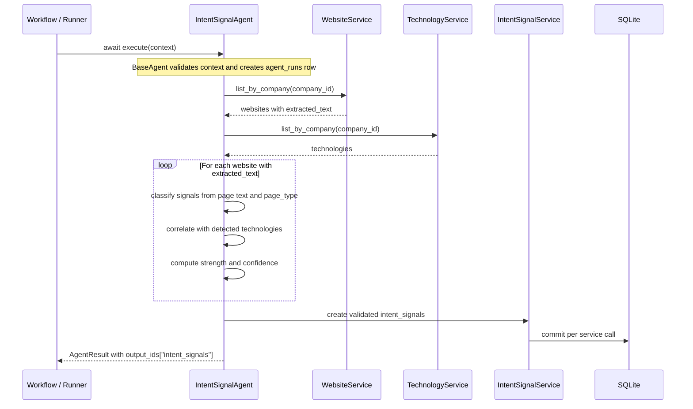

> **Status: IMPLEMENTED**

# Intent Signal Agent: Architectural Design

This document designs the Intent Signal Agent for Irtiqa Intelligence. It was checked against the current architecture before writing:

- `BaseAgent`, `AgentContext`, `AgentResult`, and `AgentRegistry` exist under `app.agents`.
- Deep Scraper Agent persists `websites.raw_html` and `websites.extracted_text`.
- Technographic Agent persists company-specific `technologies` from scraped HTML.
- `intent_signals` already exists with `company_id`, optional `contact_id`, `website_id`, `technology_id`, `agent_run_id`, `signal_type`, `signal_name`, `signal_value`, `strength`, `confidence`, `source_url`, and `observed_at`.
- Service-owned transactions are the current boundary. Agents should use services, not repositories or raw sessions.
- `agent_runs` is the current observability mechanism for agents and workflows.

No schema changes are required for the first production version of this agent.

## 1. Purpose

The Intent Signal Agent identifies commercial buying signals and business intent indicators from already-scraped website text and already-detected technologies. Its job is to convert evidence in `websites.extracted_text` and `technologies` into structured `intent_signals` records that can be consumed by scoring, prioritization, and personalization workflows.

The agent must be evidence-only:

- It must not invent signals.
- It must not create mock or seed data.
- It must not call websites directly; crawling remains owned by the Deep Scraper Agent.
- It must not duplicate technographic detection; technology detection remains owned by the Technographic Agent.
- It must preserve source provenance through `website_id`, `technology_id` when relevant, `source_url`, and `agent_run_id` where the agent framework supports it.

## 2. Architecture Overview

The agent inherits from `BaseAgent` and implements:

```text
IntentSignalAgent._run(context: AgentContext) -> AgentRunOutput
```

Recommended identity:

```text
name = "intent_signal"
version = "1.0.0"
```

Execution flow:



The first version should be a deterministic rules and pattern engine. LLM-based enrichment can be added later behind explicit configuration, but it should not be required for the core agent because persisted website text and technology detections are already sufficient for a production-grade first pass.

## 3. Agent Inputs

Primary context:

| Input | Required | Source | Notes |
| --- | --- | --- | --- |
| `company_id` | Yes | `AgentContext.company_id` | Required by the base agent context. |
| `contact_id` | No | `AgentContext.contact_id` | Reserved for contact-scoped workflows; first version should primarily create company-level signals. |
| `workflow_name` | No | `AgentContext.workflow_name` | Stored in `agent_runs` by `BaseAgent`. |
| `correlation_id` | No | `AgentContext.correlation_id` | Used only for observability. |

Persisted data inputs:

| Input | Service | Required | Notes |
| --- | --- | --- | --- |
| Scraped pages | `WebsiteService.list_by_company(company_id)` | Yes | Use only records with non-empty `extracted_text`. |
| Detected technologies | `TechnologyService.list_by_company(company_id)` | No | Used to strengthen or specialize signals. The agent can still run without technologies. |

Recommended `AgentContext.options`:

| Option | Type | Default | Purpose |
| --- | --- | --- | --- |
| `min_confidence` | `float` | `0.35` | Minimum confidence required for persistence. |
| `min_strength` | `float` | `0.25` | Minimum commercial strength required for persistence. |
| `signal_types` | `list[str] | None` | `None` | Optional filter for selected signal categories. |
| `max_signals_per_type` | `int` | `5` | Prevents noisy pages from producing excessive records. |
| `require_source_url` | `bool` | `True` | Ensures every persisted signal has page provenance where possible. |

Validation rules:

- `min_confidence` and `min_strength` must be between `0.0` and `1.0`.
- `max_signals_per_type` must be a positive bounded integer, for example `1` to `25`.
- `signal_types`, when provided, must be a list of supported taxonomy keys.

## 4. Agent Outputs

The agent returns:

```text
AgentRunOutput:
    output_ids:
        intent_signals: list[str]
    summary: str
    stats: dict[str, Any]
```

Persisted `intent_signals` mapping:

| Column | Mapping |
| --- | --- |
| `company_id` | `context.company_id` |
| `contact_id` | `context.contact_id` only when the signal is explicitly contact-relevant |
| `website_id` | Website record that supplied the strongest evidence |
| `technology_id` | Related technology record when the signal depends on or is strengthened by a detected technology |
| `agent_run_id` | Current run id when available through the agent framework |
| `signal_type` | Stable taxonomy key, for example `hiring_activity` |
| `signal_name` | Human-readable signal label, for example `Hiring for RevOps roles` |
| `signal_value` | Short evidence summary or extracted phrase |
| `strength` | Commercial relevance from `0.0` to `1.0` |
| `confidence` | Evidence quality from `0.0` to `1.0` |
| `source_url` | Website URL that supports the signal |
| `observed_at` | Prefer `website.last_scraped_at`; fall back to current UTC time |

Recommended stats:

```text
pages_considered
pages_scanned
pages_skipped_no_text
technologies_considered
candidate_signals_detected
signals_persisted
signals_below_threshold
signals_deduplicated
min_confidence
min_strength
```

## 5. Signal Taxonomy

Use stable `signal_type` values so downstream scoring can rely on them. `signal_name` can be more specific and human-readable.

| Signal Type | Purpose | Example Signal Names |
| --- | --- | --- |
| `hiring_activity` | Indicates investment in teams or operational capacity. | Hiring for sales roles, Hiring for engineering roles, Hiring for RevOps roles, Hiring for customer success roles |
| `growth_activity` | Indicates business momentum or scaling. | Rapid team growth, Customer growth claims, Revenue growth claims, Market traction |
| `expansion_activity` | Indicates new geographies, offices, verticals, or segments. | New market expansion, New office launch, International expansion, Enterprise segment expansion |
| `funding_indicator` | Indicates fresh capital or investor-backed growth. | Funding announcement, Investor mention, Series funding page mention, Acquisitive growth mention |
| `product_launch_indicator` | Indicates new product, feature, platform, or service movement. | New product launch, Beta launch, Feature release, Platform rollout |
| `partnership_indicator` | Indicates ecosystem development or channel motion. | Strategic partnership, Integration partnership, Marketplace listing, Channel partner program |
| `enterprise_readiness` | Indicates maturity for larger deals or enterprise sales. | SOC 2 mention, SSO support, Enterprise pricing, SLA mention, Procurement-ready language |
| `digital_transformation` | Indicates modernization, automation, migration, or data initiatives. | Cloud migration language, Automation initiative, AI adoption language, Data platform investment |

Technology-linked sub-signals:

| Technology Context | Possible Signal |
| --- | --- |
| CRM or marketing automation detected plus hiring for sales/RevOps | Go-to-market scaling |
| Analytics or data tools detected plus data hiring or dashboard language | Data maturity investment |
| Cloud/CDN/frontend framework detected plus product launch language | Digital product investment |
| Ecommerce/payment technology detected plus expansion language | Commerce growth motion |
| Chat/support tools detected plus customer success hiring | Customer experience scaling |

## 6. Detection Strategy

The first implementation should use a deterministic signal registry similar in spirit to the Technographic Agent's signature registry, but optimized for cleaned text instead of HTML signatures.

Recommended components:

```text
IntentSignalRule:
    signal_type: str
    signal_name: str
    patterns: list[TextPattern]
    page_type_boosts: dict[str, float]
    technology_boosts: list[TechnologyBoost]
    base_strength: float
    base_confidence: float
```

```text
TextPattern:
    pattern: str
    is_regex: bool
    weight: float
    evidence_window_chars: int
```

Detection steps:

1. Load websites for `company_id`.
2. Skip pages without `extracted_text`.
3. Normalize text for matching while preserving a source snippet for `signal_value`.
4. Apply taxonomy rules to each page.
5. Add page-type context, for example `careers` pages strengthen hiring signals, `pricing` pages strengthen enterprise readiness, and `blog` pages strengthen product launch or partnership signals.
6. Correlate with technologies to strengthen relevant signals.
7. Convert matched candidates into normalized signal candidates.
8. Deduplicate candidates by `(company_id, signal_type, signal_name, website_id, technology_id)` within the run.
9. Apply confidence and strength thresholds.
10. Persist accepted records through `IntentSignalService`.

Recommended detection sources:

| Source | Use |
| --- | --- |
| `website.extracted_text` | Primary semantic evidence. |
| `website.page_type` | Contextual weighting. |
| `website.url` | Source provenance and weak context hints. |
| `website.last_scraped_at` | Preferred `observed_at`. |
| `technologies.name`, `category`, `confidence` | Correlation and strength boosts. |

Avoid broad keyword-only signals. A single generic word such as "growth", "AI", or "enterprise" should not create a persisted signal unless supported by stronger phrase context, page context, or technology correlation.

## 7. Confidence Scoring Model

Separate `confidence` from `strength`:

- `confidence` measures how reliable the evidence is.
- `strength` measures how commercially meaningful the signal is.

Per-candidate confidence:

```text
pattern_score = min(sum(matched_pattern.weight), 1.0)
page_context_score = page_type_boost for matching page type, capped at 0.2
technology_context_score = related technology confidence * boost weight, capped at 0.2

confidence = (
    0.65 * pattern_score
    + 0.20 * page_context_score_normalized
    + 0.15 * technology_context_score_normalized
)
confidence = round(clamp(confidence, 0.0, 1.0), 4)
```

Per-candidate strength:

```text
base_strength = rule.base_strength
specificity_boost = score for specific terms, numbers, role names, compliance labels, product names, or geography names
technology_boost = score for relevant technology correlation
recency_factor = 1.0 if recently scraped, otherwise reduced by staleness policy

strength = (base_strength + specificity_boost + technology_boost) * recency_factor
strength = round(clamp(strength, 0.0, 1.0), 4)
```

Recommended interpretation:

| Range | Confidence Meaning | Strength Meaning |
| --- | --- | --- |
| `0.80-1.00` | Strong direct evidence | High commercial urgency or maturity |
| `0.55-0.79` | Clear evidence with some context | Meaningful but not urgent |
| `0.35-0.54` | Weak or partial evidence | Low-to-moderate commercial value |
| `< 0.35` | Insufficient evidence | Do not persist by default |

Deduplication and aggregation:

- If multiple pages support the same signal, persist the strongest candidate first.
- Additional pages can be summarized in `signal_value` only if the current schema can hold the summary cleanly.
- Do not create many near-identical signals from repeated navigation/footer text.

## 8. Database Interactions

Read interactions:

- `WebsiteService.list_by_company(company_id)` for scraped pages.
- `TechnologyService.list_by_company(company_id)` for detected technology context.

Write interactions:

- `IntentSignalService.create(...)` for accepted signal candidates.

No repositories should be used directly by the agent.

No database migration is required. The existing `intent_signals` table is sufficient.

Idempotency guidance:

- The current schema has no unique constraint for intent signal deduplication. The agent should deduplicate within a single run.
- Cross-run duplicate suppression can be added later with a service-level query method or a deliberate schema change if repeated refreshes become noisy.
- Until then, appending refreshed signals is acceptable because `observed_at`, `source_url`, and `agent_run_id` preserve historical context.

Agent run association:

- `BaseAgent.execute()` currently creates the `agent_runs` row before `_run()`, but `_run()` is not passed the generated run id.
- Recommended implementation order should first adjust the base agent contract in a backward-compatible way, for example by exposing the active run id to `_run()` through a protected context property or by extending `AgentContext` deliberately.
- If that framework change is deferred, the first implementation may persist signals with `agent_run_id=None`, matching the nullable schema, but the production-preferred path is to associate all produced signals with the run that created them.

## 9. Service Layer Integrations

Required services:

| Service | Purpose |
| --- | --- |
| `WebsiteService` | Load company websites and scraped text. |
| `TechnologyService` | Load detected technologies for correlation. |
| `IntentSignalService` | Persist accepted signals. |
| `AgentRunService` | Managed by `BaseAgent` for lifecycle observability. |

Recommended future service methods:

- `IntentSignalService.find_recent_duplicate(...)` if cross-run deduplication becomes necessary.
- `WebsiteService.list_text_pages_by_company(...)` if filtering pages with `extracted_text` in service code becomes common.

Those methods are optional. The first implementation can use existing service methods.

## 10. Agent Framework Integrations

The agent should follow the existing concrete agent pattern:

- Subclass `BaseAgent`.
- Declare stable `name` and `version`.
- Override `_validate_context()` for option validation.
- Implement `_run()` for detection and persistence.
- Return `AgentRunOutput`.
- Log start, completion, skipped pages, thresholds, and persisted counts through `irtiqa.agents.intent_signal`.
- Raise `AgentValidationError` for invalid options.
- Allow unexpected persistence or service failures to be translated by `BaseAgent` into structured `AgentExecutionError` results.

Recommended file structure for implementation, when approved later:

```text
app/agents/intent_signal/
|-- __init__.py
|-- agent.py
|-- rules.py
|-- scoring.py
`-- normalization.py

tests/unit/agents/intent_signal/
|-- __init__.py
|-- test_agent.py
|-- test_rules.py
|-- test_scoring.py
`-- test_normalization.py
```

This document does not implement those files.

## 11. Testing Strategy

Unit tests:

- Validate supported taxonomy keys and rule definitions.
- Verify each rule matches representative positive text and rejects unrelated text.
- Verify confidence and strength calculations are bounded and deterministic.
- Verify page-type boosts work as expected.
- Verify technology correlation boosts only apply to relevant technologies.
- Verify option validation rejects invalid thresholds, invalid signal types, and invalid limits.
- Verify empty website lists return a succeeded result with no outputs.
- Verify pages without `extracted_text` are skipped and counted.
- Verify below-threshold candidates are not persisted.
- Verify deduplication within a run.

Agent tests:

- Mock `WebsiteService`, `TechnologyService`, and `IntentSignalService`.
- Use small, focused text fixtures from realistic page types such as careers, pricing, blog, security, integrations, and partners pages.
- Assert `IntentSignalService.create()` receives the correct company, website, technology, signal type, strength, confidence, source URL, and observed timestamp.
- Assert `output_ids["intent_signals"]` contains created IDs.

Integration tests, when implementation begins:

- Use the existing SQLite test setup.
- Create real company, website, technology, and agent run records through services.
- Execute the agent with an `AgentContext`.
- Assert persisted `intent_signals` are readable through `IntentSignalService.list_by_company()`.

No external HTTP, no live websites, and no mock business records should be required beyond focused test fixtures.

## 12. Risks and Edge Cases

| Risk | Mitigation |
| --- | --- |
| Generic marketing language creates false positives | Require specific phrases, page context, or technology correlation before persistence. |
| Repeated header/footer text creates duplicates | Strip or down-rank boilerplate-like repeated text and deduplicate candidates within the run. |
| Stale scraped content produces stale intent | Use `website.last_scraped_at` for `observed_at` and apply a recency factor to strength. |
| Missing `extracted_text` | Skip gracefully and count in stats. Do not fall back to raw HTML for semantic matching in the first version. |
| Missing technologies | Run without technology boosts. Do not fail if Technographic Agent has not run. |
| Technology false positives amplify intent | Weight technology boosts lower than text evidence and cap their contribution. |
| Ambiguous funding or partnership mentions | Require phrase context such as "raised", "Series", "partnered with", "integration with", or named investor/partner patterns. |
| No evidence table exists | Store best provenance in `website_id`, `technology_id`, `source_url`, `signal_value`, and `agent_run_id`. |
| Cross-run duplicates | Accept append behavior initially, then add service-level duplicate checks if operational data shows noise. |
| Contact-specific attribution | Only set `contact_id` when the signal explicitly relates to the supplied contact; otherwise keep signals company-level. |

## 13. Recommended Implementation Order

1. Define taxonomy constants and validation rules.
2. Define the deterministic rule registry for the eight required signal families.
3. Implement text normalization and source-snippet extraction as pure functions.
4. Implement confidence and strength scoring as pure functions.
5. Implement candidate generation and in-run deduplication.
6. Implement `IntentSignalAgent._validate_context()`.
7. Implement `IntentSignalAgent._run()` using `WebsiteService`, `TechnologyService`, and `IntentSignalService`.
8. Address agent run id propagation so persisted signals can reference the producing `agent_runs` row.
9. Add focused unit tests for rules, scoring, normalization, and agent behavior.
10. Add an integration test with persisted company, website, technology, and intent signal records.
11. Register/export the agent through the existing agent package pattern.
12. Update broader project documentation only after implementation is complete and verified.
