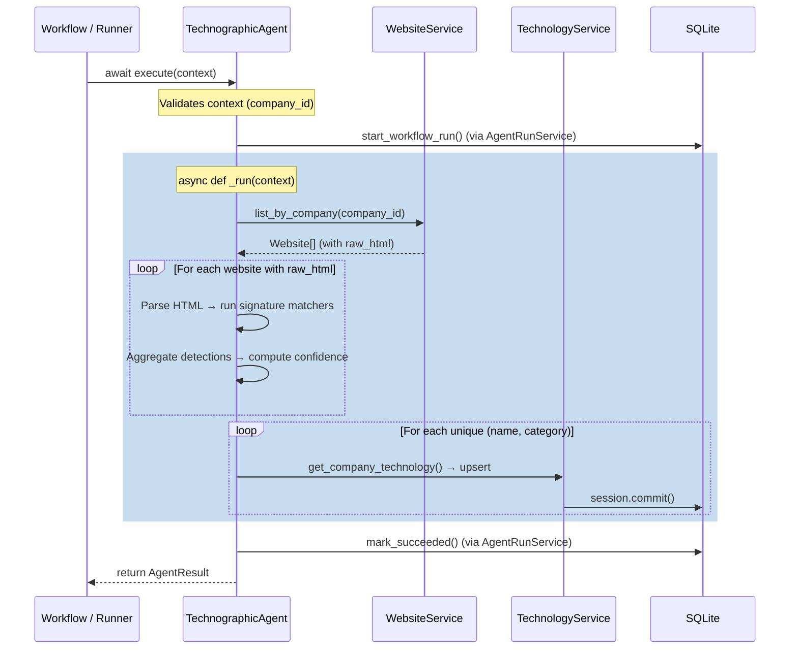

> **Status: IMPLEMENTED**

# Technographic Agent: Architectural Design

This document details the architectural design for the **Technographic Intelligence Agent**, the second concrete agent implemented on the Agent Interface Foundation.

---

## 1. Architecture Overview

The Technographic Agent consumes the `raw_html` persisted by the Deep Scraper Agent and applies **signature-based pattern matching** to detect technologies, platforms, and tools embedded in a company's web pages. It operates entirely offline against already-scraped data — no HTTP requests, no LLM calls, no external APIs.

It inherits from `BaseAgent` and implements `_run(self, context: AgentContext) -> AgentRunOutput`.



### Key Design Decisions

1. **No HTTP Requests**: The agent reads from the `websites.raw_html` column populated by the Deep Scraper. This avoids duplicating rate-limiting, robots.txt, and concurrency logic.
2. **Signature-Only Detection**: All detection is based on static pattern matching against HTML source, `<script>` tags, `<meta>` tags, HTTP header artifacts, and inline identifiers. No LLM or external AI is used.
3. **Aggregation Across Pages**: Technologies are detected per-page, then aggregated to produce a single set of company-level `technologies` records with confidence scores reflecting the breadth of evidence.

---

## 2. Agent Contract & Configuration

**Agent Identity:**
- `name`: `"technographic"`
- `version`: `"1.0.0"`

**AgentContext Options:**
- `min_confidence` (float): Minimum confidence threshold to persist a detection (default: `0.3`). Technologies below this threshold are logged but not saved.
- `categories` (list[str] | None): Optional filter to restrict detection to specific categories (default: `None`, meaning detect all).

---

## 3. Detection Strategy

### 3.1 Signature Registry

The core of the detection engine is a **signature registry** — a static, declarative data structure mapping technology names to their detection signatures. Each signature entry contains:

```text
TechnologySignature:
    name: str               # e.g. "Google Analytics"
    category: str           # e.g. "analytics"
    vendor: str | None      # e.g. "Google"
    patterns: list[SignaturePattern]
```

Each `SignaturePattern` specifies:

```text
SignaturePattern:
    source: "script_src" | "meta_tag" | "html_content" | "inline_script" | "link_href" | "html_comment"
    pattern: str            # Regex pattern or literal substring
    is_regex: bool          # Whether `pattern` is a regex (default: False)
    weight: float           # Contribution to confidence (0.0–1.0)
```

### 3.2 Detection Sources

The agent scans six distinct signal sources within each page's `raw_html`:

| Source | What it examines | Example detections |
|--------|------------------|--------------------|
| **`script_src`** | `<script src="...">` URLs | Google Analytics (`gtag.js`), Segment, HubSpot |
| **`meta_tag`** | `<meta name="..." content="...">` | WordPress (`generator`), Shopify |
| **`html_content`** | Full HTML body substrings | Drift chat widget, Intercom, Crisp |
| **`inline_script`** | `<script>` tag text content | Google Tag Manager (`GTM-`), Facebook Pixel (`fbq`) |
| **`link_href`** | `<link href="...">` stylesheet/preconnect URLs | Bootstrap CSS, Tailwind, Cloudflare CDN |
| **`html_comment`** | `<!-- ... -->` comment blocks | WordPress theme signatures, build tool fingerprints |

### 3.3 Technology Categories

The signature registry covers these categories (matching the user requirements):

| Category | Examples |
|----------|----------|
| `cms` | WordPress, Drupal, Joomla, Wix, Squarespace, Ghost |
| `analytics` | Google Analytics, Mixpanel, Amplitude, Heap, Plausible, Matomo |
| `frontend_framework` | React, Vue.js, Angular, Next.js, Nuxt, Svelte |
| `marketing_pixel` | Facebook Pixel, Google Ads, LinkedIn Insight, Twitter Pixel |
| `hosting` | AWS, Azure, Google Cloud, Netlify, Vercel, Heroku |
| `cdn` | Cloudflare, Fastly, Akamai, CloudFront, Cloudinary |
| `chat_widget` | Intercom, Drift, Zendesk, Crisp, LiveChat, Tawk.to |
| `ecommerce` | Shopify, Magento, WooCommerce, BigCommerce, Stripe |

### 3.4 HTML Parsing Strategy

For each website record with non-null `raw_html`, the agent:

1. Parses the HTML once using `BeautifulSoup(raw_html, "lxml")`.
2. Pre-extracts the six signal sources into a `PageSignals` structure:
   - `script_srcs: list[str]` — all `<script src>` attribute values
   - `meta_tags: list[tuple[str, str]]` — all `(name, content)` pairs
   - `link_hrefs: list[str]` — all `<link href>` attribute values
   - `inline_scripts: str` — concatenated text of all `<script>` tags without `src`
   - `html_comments: list[str]` — all comment nodes
   - `full_html: str` — the raw HTML itself (for broad substring matching)
3. Iterates the signature registry, matching each `SignaturePattern` against the appropriate source field.

This parse-once-match-many approach avoids redundant DOM traversals.

---

## 4. Confidence Scoring Model

Confidence is computed **per technology per company**, not per page. This reflects that seeing a technology on multiple pages strengthens the detection.

### 4.1 Per-Page Match Score

Each page match for a technology produces a raw score:

```
page_score = sum(pattern.weight for pattern in matched_patterns)
page_score = min(page_score, 1.0)  # Cap at 1.0
```

### 4.2 Company-Level Aggregation

After scanning all pages, the agent aggregates per-technology:

```
detections = list of page_scores across all pages where detected
pages_detected = len(detections)
pages_total = total pages scanned

# Best single-page evidence
max_page_score = max(detections)

# Breadth factor: detection across multiple pages increases confidence
breadth_factor = min(pages_detected / pages_total, 1.0) if pages_total > 0 else 0.0

# Final confidence
confidence = 0.7 * max_page_score + 0.3 * breadth_factor
confidence = round(min(confidence, 1.0), 4)
```

**Rationale:**
- **70% weight on best evidence**: A single strong signal (e.g., `gtag.js` script tag) is the primary indicator.
- **30% weight on breadth**: Seeing Google Analytics on 5 out of 5 pages is stronger than seeing it on 1 out of 5.
- **Capped at 1.0**: Confidence is a probability-like score.

### 4.3 Confidence Thresholds

| Range | Interpretation |
|-------|----------------|
| `0.8–1.0` | High confidence — strong, specific patterns matched on multiple pages |
| `0.5–0.8` | Medium confidence — clear pattern on at least one page |
| `0.3–0.5` | Low confidence — weak or generic pattern, single page |
| `< 0.3` | Below threshold — not persisted by default |

---

## 5. Database Interactions

### 5.1 Input: Website Records

```
WebsiteService.list_by_company(company_id) → Sequence[Website]
```

The agent filters for records where `raw_html IS NOT NULL`. Pages without scraped HTML are skipped with a debug log.

### 5.2 Output: Technology Records

The `technologies` table already has the exact schema needed:

| Column | Source |
|--------|--------|
| `company_id` | From `AgentContext.company_id` |
| `website_id` | The ID of the page with the strongest detection (highest `page_score`) |
| `agent_run_id` | The current agent run ID (set by `BaseAgent`) |
| `name` | From the matched `TechnologySignature.name` |
| `category` | From the matched `TechnologySignature.category` |
| `vendor` | From the matched `TechnologySignature.vendor` |
| `detection_method` | `"signature"` (constant for this agent) |
| `confidence` | The aggregated confidence score |
| `first_detected_at` | UTC now (for new records) or preserved from existing record |
| `last_detected_at` | UTC now (always updated) |

### 5.3 Upsert Strategy

The `technologies` table has a unique constraint on `(company_id, name, category)`. The agent uses the existing service API:

1. **Check**: `TechnologyService.get_company_technology(company_id, name, category)`
2. **If exists**: `TechnologyService.update(id, ...)` — updates `confidence`, `last_detected_at`, `website_id`, `agent_run_id`, and `vendor`. Preserves `first_detected_at`.
3. **If not exists**: `TechnologyService.create(...)` — sets both `first_detected_at` and `last_detected_at` to UTC now.

This avoids `EntityConflictError` from the `_before_create` hook.

---

## 6. Testing Strategy

### 6.1 Unit Tests: Signature Matching (`test_signatures.py`)

- Verify each signature pattern matches its expected HTML fragment.
- Verify non-matching HTML does not trigger false positives.
- Test regex patterns vs literal patterns.
- Test that weight values are in valid range.

### 6.2 Unit Tests: Confidence Scoring (`test_scoring.py`)

- Single-page single-pattern detection.
- Multi-page aggregation with breadth factor.
- Confidence capping at 1.0.
- Below-threshold filtering.
- Edge case: zero pages, pages with null `raw_html`.

### 6.3 Unit Tests: Agent Logic (`test_agent.py`)

- Mock `WebsiteService` and `TechnologyService`.
- Verify correct technology creation for known HTML patterns.
- Verify upsert behavior (update existing vs create new).
- Verify `output_ids["technologies"]` is populated correctly.
- Verify `min_confidence` filtering.
- Verify `categories` option filtering.
- Verify empty website list produces succeeded result with empty output.
- Verify `agent_run_id` is passed to created technology records.

### 6.4 Testing Approach

- All tests are synchronous-safe (no HTTP mocking needed since the agent makes no requests).
- Use `pytest.mark.asyncio` for the async agent tests.
- Mock services via `unittest.mock.MagicMock`.
- HTML fixtures are inline constants (small, focused HTML fragments).

---

## 7. Risks and Edge Cases

| Risk | Mitigation |
|------|------------|
| **False positives** from generic patterns (e.g., "analytics" substring) | Use specific URL patterns and attribute selectors rather than broad text matching. Assign low weights to generic patterns. |
| **Stale HTML** if Deep Scraper hasn't run recently | The agent processes whatever is in the database. Staleness is an orchestration concern, not a detection concern. Log `last_scraped_at` in stats for visibility. |
| **Large HTML payloads** causing memory pressure | BeautifulSoup processes one page at a time. No full-corpus loading. Pages are processed sequentially. |
| **Missing `raw_html`** on some website records | Skip gracefully with a debug log. Count in stats as `pages_skipped_no_html`. |
| **Signature drift** as vendors change their embed patterns | The signature registry is a pure data file. New patterns can be added without changing agent logic. |
| **Unique constraint violations** during concurrent runs | The upsert pattern (check-then-update/create) handles this. If two runs race, the last writer wins, which is acceptable since both produce valid confidence scores. |
| **Overwriting confidence** from a better prior run with a weaker run | Always update `last_detected_at` and `confidence` to reflect the most recent analysis. Older confidence is not preserved. |

---

## 8. Recommended File Structure

```text
app/agents/technographic/
├── __init__.py              # Exports TechnographicAgent
├── agent.py                 # TechnographicAgent class (inherits BaseAgent)
├── signatures.py            # Signature registry (data + TechnologySignature dataclass)
└── scoring.py               # Confidence aggregation logic

tests/unit/agents/technographic/
├── __init__.py
├── test_agent.py            # Agent lifecycle and integration tests
├── test_signatures.py       # Pattern matching correctness
└── test_scoring.py          # Confidence computation
```

**No new files outside this structure.** No database migrations, no model changes, no schema changes. The existing `technologies` table and `TechnologyService` API are sufficient.

---

## 9. Recommended Implementation Order

1. **Signatures**: Define `TechnologySignature` and `SignaturePattern` dataclasses in `signatures.py`. Populate the initial registry covering all 8 categories with at least 3–5 technologies per category.

2. **Scoring**: Implement `compute_confidence()` in `scoring.py`. This is a pure function with no dependencies — easy to test in isolation.

3. **Agent Core**: Implement `TechnographicAgent._run()` in `agent.py`. Wire up `WebsiteService` for input, signature matching, confidence scoring, and `TechnologyService` for upsert output.

4. **Agent Registration**: Export from `app/agents/technographic/__init__.py` and add to `app/agents/__init__.py`.

5. **Tests**: Write tests for signatures, scoring, and agent logic. All tests use mocks — no database or HTTP fixtures needed.

6. **Documentation**: Update `docs/project_state.md`, `docs/project_handoff.md`, and `docs/codex_bootstrap.md`.

---

## User Review Required

> [!IMPORTANT]
> Please review this design. Key decisions requiring your attention:
>
> 1. **Confidence model weights** (70/30 split between best evidence and breadth). Should these be adjustable via context options?
> 2. **Default min_confidence threshold** of 0.3. Is this appropriate for your use case?
> 3. **Signature registry scope**: The initial registry will cover ~30–40 technologies across 8 categories. Should the first version prioritize breadth (more technologies, fewer patterns each) or depth (fewer technologies, more robust patterns)?
