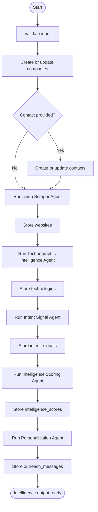
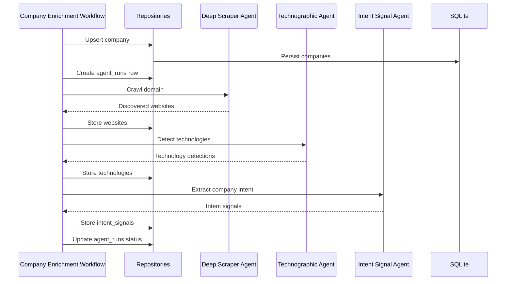
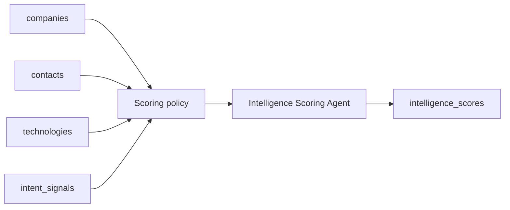
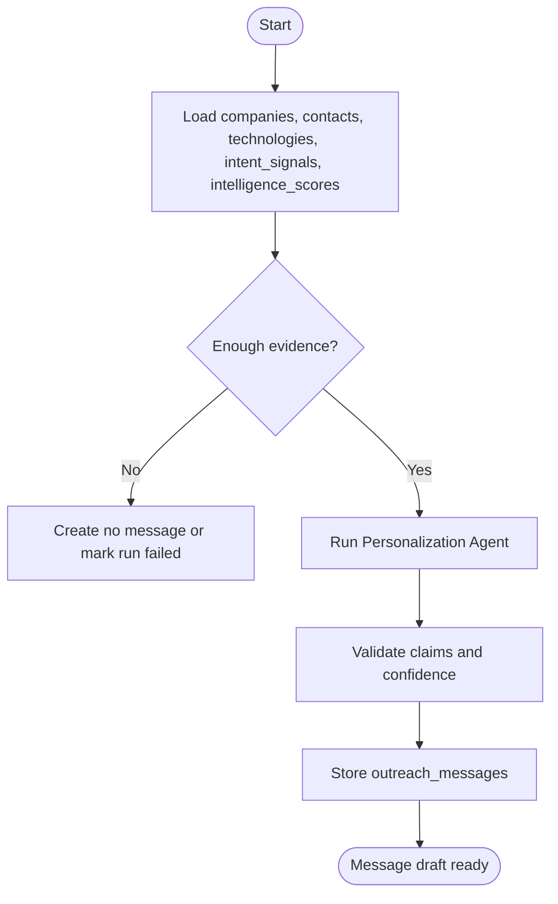
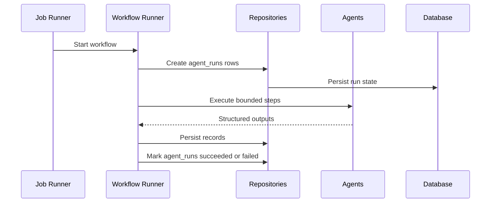
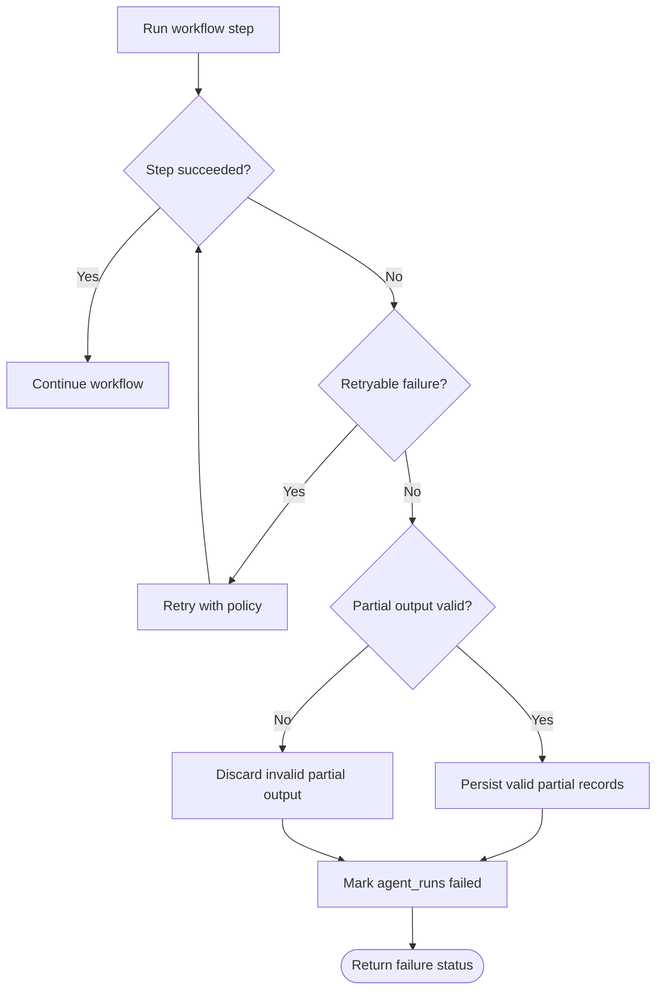
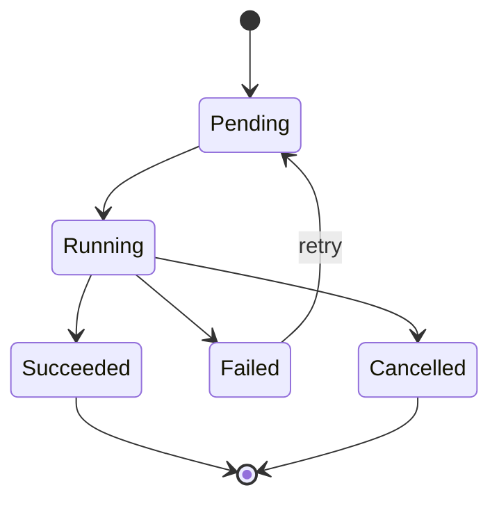
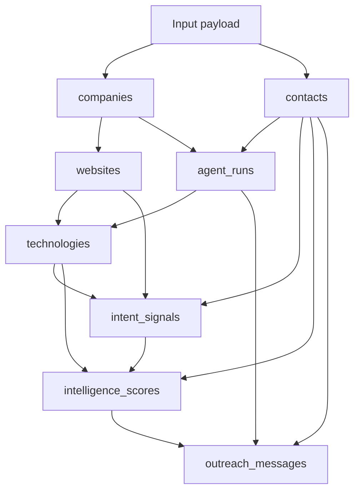

# Workflow Architecture

Workflows coordinate repositories and future agents into complete business processes. This document describes intended workflow behavior using the current implemented database schema.

Current tables:

- `companies`
- `contacts`
- `websites`
- `technologies`
- `intent_signals`
- `intelligence_scores`
- `outreach_messages`
- `evidence_records`
- `memberships`
- `organizations`
- `agent_runs`
- `jobs`
- `users`
- `refresh_tokens`
- `email_verification_tokens`
- `password_reset_tokens`
- `failed_login_attempts`

Workflow foundation is implemented. Two concrete executable workflows are available:

- `score_refresh` — deterministic scoring from existing data
- `intelligence_pipeline` — end-to-end orchestration chaining all 5 agents

Background Job Foundation is implemented with in-process scheduling, execution, and monitoring for agents and workflows.

## Workflow Principles

- Workflows orchestrate; agents specialize.
- Every agent invocation should create or update an `agent_runs` record.
- Partial failure should be visible and recoverable.
- Long-running workflows should be resumable.
- Scores and outreach messages should preserve history.
- Workflow persistence must use repositories and explicit transaction boundaries.

## Primary Workflow: Contact Intelligence

The contact intelligence workflow enriches a company and optional contact, detects technologies, identifies intent, scores the opportunity, and generates outreach messages.

### Inputs

| Input | Required | Maps To |
| --- | --- | --- |
| company_domain | Yes | `companies.domain` |
| company_name | No | `companies.name` |
| contact_full_name | No | `contacts.full_name` |
| contact_title | No | `contacts.title` |
| contact_email | No | `contacts.email` |
| linkedin_url | No | `companies.linkedin_url` or `contacts.linkedin_url` |
| workflow_options | No | `agent_runs.input_summary` |

### Outputs

| Output | Table |
| --- | --- |
| Company profile | `companies` |
| Contact profile | `contacts` |
| Website records | `websites` |
| Technology detections | `technologies` |
| Intent signals | `intent_signals` |
| Intelligence score | `intelligence_scores` |
| Outreach message | `outreach_messages` |
| Run history | `agent_runs` |

## Company Enrichment Workflow

The company enrichment workflow updates a company profile without requiring a contact.

### Success Criteria

- Company record exists.
- Relevant websites are stored or updated.
- Detected technologies are stored with confidence.
- Intent signals are stored with source URLs where available.
- Agent run status and timestamps are recorded.

## Contact Scoring Workflow

The contact scoring workflow calculates or refreshes intelligence scores for a company and optional contact.

### Score Components

| Component | Source |
| --- | --- |
| Fit score | Company size, industry, contact seniority, contact department. |
| Intent score | Recent and strong `intent_signals`. |
| Technographic score | Relevant `technologies`. |
| Engagement score | Outreach readiness based on contact and evidence completeness. |
| Total score | Weighted result from the active scoring policy. |

## Implemented Workflow: score_refresh

`score_refresh` creates a new append-only intelligence score from existing persisted data.

Implemented files:

- `app/workflows/score_refresh.py`
- `app/workflows/scoring_policy.py`

### Scope

The workflow uses only current database records:

- `companies`
- `contacts`
- `technologies`
- `intent_signals`
- `agent_runs`
- `intelligence_scores`

It does not call agents, jobs, scrapers, external APIs, or generated data.

### Inputs

The workflow runs through `WorkflowContext`:

| Field | Required | Behavior |
| --- | --- | --- |
| `workflow_name` | Yes | Must be `score_refresh`. |
| `company_id` | Required unless `contact_id` is provided | Scores a company-level target. |
| `contact_id` | Optional | Scores a contact-specific target and derives the company from the contact. |
| `options.intent_lookback_days` | Optional | Integer from 1 to 3650. Defaults to 90. |

If both `company_id` and `contact_id` are provided, the workflow validates that the contact belongs to the company.

### Execution

1. Load the target company and optional contact through services.
2. Create a running `agent_runs` record using `agent_name=score_refresh_policy` and `workflow_name=score_refresh`.
3. Load persisted technologies for the company.
4. Load persisted intent signals for the company or contact target.
5. Calculate deterministic `score_refresh.v1` scores.
6. Append a new `intelligence_scores` row.
7. Mark the `agent_runs` row as `succeeded`.
8. Return a `WorkflowResult` containing the created score id in `output_ids["intelligence_scores"]`.

On structured or unexpected failure after the run record is created, the workflow marks the `agent_runs` row as `failed` and raises a structured `WorkflowError` for the runner to convert into a failed workflow result.

### Scoring Policy

`score_refresh.v1` is deterministic and evidence-only.

Component weights:

| Component | Weight | Source |
| --- | ---: | --- |
| Fit score | 30% | Company completeness and optional contact role/completeness. |
| Intent score | 35% | Persisted intent signal strength, confidence, and recency. |
| Technographic score | 25% | Persisted technology confidence and category diversity. |
| Engagement score | 10% | Contactability and evidence readiness. |

Scores are clamped to database-supported ranges:

- component scores: `0.0` to `100.0`
- total score: `0.0` to `100.0`
- confidence: `0.0` to `1.0`

The policy records `score_version=score_refresh.v1` and a rationale summarizing the persisted evidence counts and component scores.

## Implemented Workflow: intelligence_pipeline

`intelligence_pipeline` chains all 5 agents into a single orchestrated run triggered via `POST /intelligence/pipeline`.

Implemented file:

- `app/workflows/intelligence_pipeline.py`

### Execution Steps

| Step | Agent | Input | Output |
|------|-------|-------|--------|
| 1 | Deep Scraper | company_id, crawl options | `websites` |
| 2 | Technographic Intelligence | company_id | `technologies` |
| 3 | Intent Signal | company_id | `intent_signals` |
| 4 | Intelligence Scoring | company_id, contact_id | `intelligence_scores` |
| 5 | Personalization | company_id, contact_id | `outreach_messages` |

Each step creates an `agent_runs` record. If any step fails, the workflow raises a `WorkflowError` and marks the corresponding `agent_runs` row as `failed`.

### Job Integration

The pipeline is triggered asynchronously through the Background Job Foundation:

- `POST /intelligence/pipeline` schedules a workflow job.
- `GET /intelligence/pipeline/{job_id}` returns the job status.
- The `JobRunner` dispatches the workflow to `IntelligencePipelineWorkflow`.

## Outreach Message Workflow

The outreach message workflow creates a reviewed draft from existing intelligence.

### Message Rules

- Do not generate unsupported claims.
- Prefer specific observed evidence over generic personalization.
- Include confidence.
- Use contact role, department, seniority, technology usage, and intent signals where available.
- Store drafts with `outreach_messages.status`, starting with `draft` or `ready_for_review`.

## Background Processing Workflow

Long-running enrichment should run through a job layer when that layer is implemented.

## Failure Handling

## Workflow States

Workflow state should be derived from `agent_runs.status` until a dedicated workflow table is introduced.

## Workflow-to-Agent Matrix

| Workflow | Deep Scraper | Technographic | Intent Signal | Scoring | Personalization |
| --- | --- | --- | --- | --- | --- |
| Contact Intelligence | Yes | Yes | Yes | Yes | Yes |
| Company Enrichment | Yes | Yes | Yes | Optional | No |
| Contact Scoring | No | Uses stored data | Uses stored data | Yes | Optional |
| Outreach Message | No | Uses stored data | Uses stored data | Uses stored data | Yes |
| Intelligence Refresh | Optional | Optional | Optional | Yes | Optional |

## Data Persistence Sequence

## Recommended Initial Workflows

1. Company enrichment from domain.
2. Contact intelligence from company domain plus contact details.
3. Score refresh for an existing company or contact.
4. Outreach message generation for an existing scored contact.
5. Intelligence refresh for stale companies.

## Operational Requirements

- Every workflow step must have a timeout.
- Every agent invocation must create an `agent_runs` row.
- Workflow outputs must be idempotent where possible.
- Long-running workflows should be resumable after failure.
- Agent outputs should be persisted only after validation.
- Historical scores and outreach messages should remain available for comparison.
